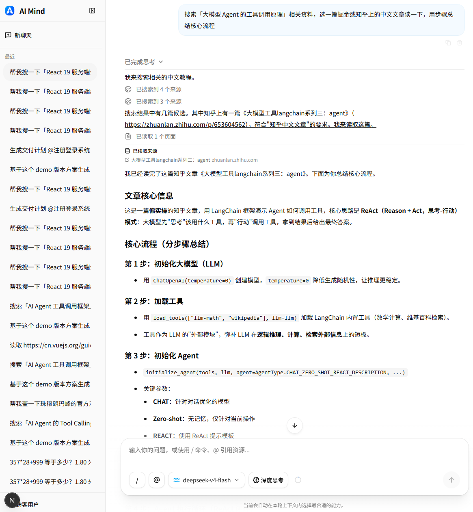
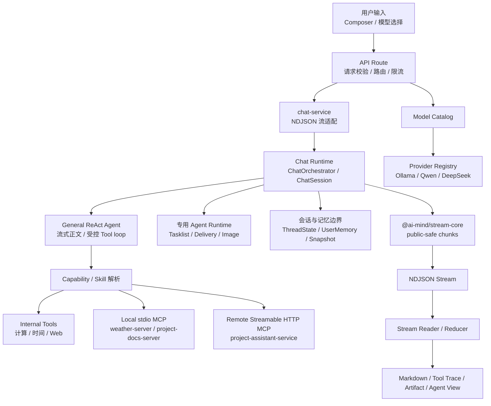

# AI Mind

AI Mind 是一个持续演进的 **AI Native Runtime Skeleton**。它通过一个可运行的 Web 应用，验证 AI 应用从单轮聊天走向能力接入、结构化流式协议、Skill Runtime、MCP 集成与受控 Agent 时，运行时应如何分层、约束和展示。

它不是普通 AI Chat Demo，也不是完整商业化 Agent 平台；当前处于 Runtime Skeleton / MVP 阶段，适合作为 AI Runtime、AI 应用前端、MCP 接入和可观察流式交互的技术探索样例。



> 当前代码版本为 v0.6.1 General ReAct Agent Streaming。本地验收收口已完成，尚未创建 Git tag 或 GitHub Release。

## 项目定位与边界

AI Mind 关注聊天框背后的工程问题：

- 当 Tool、Resource、Prompt、Skill 和 Agent 逐步进入应用后，Runtime 边界如何保持清晰。
- 如何用统一的结构化流承载公开文本、Tool、Resource、Prompt、Artifact 与错误，并让前端安全地展示执行事实。
- 如何把 local stdio MCP、remote Streamable HTTP MCP 和内置能力接入同一套 Capability 描述与运行时约束。
- 如何让 Agent 从明确入口、白名单能力、有限预算和可观察过程开始，而不是直接成为开放式自动化平台。

当前明确不做：

- 不替代 LangChain、LangGraph、Dify 或完整生产级 Agent 平台。
- 不开放任意文件访问、任意副作用 Tool、用户自定义编排或通用多 Agent 权限。
- 不公开 reasoning、原始 Provider 事件、原始 Tool payload、密钥或完整网页正文。

## 与 LangChain / LangGraph 的关系

AI Mind 使用 LangChain 和 LangGraph，但不试图替代它们：

- LangChain 负责模型、Tool 等 LLM 应用能力的集成；v0.6.x 的普通聊天通过 LangChain createAgent(version='v2') 进入受控 Tool loop。
- LangGraph 负责需要显式状态、分支和 checkpoint 的专用流程，例如 Tasklist Agent 与 Image Agent。
- AI Mind 的关注点更小：把 Runtime 边界、Capability、流式协议和用户可见的执行过程组织为可验证的产品工程。

## 快速阅读指南

- 想先判断项目是否适合你：阅读本页的“项目定位与边界”和“当前状态与能力”。
- 想理解调用链：阅读“架构总览”“核心设计”和“当前结构与关键入口”。
- 想看版本演进：阅读“当前大版本”和“版本演进”，再进入 [Versions](./docs/versions)。
- 想运行或参与开发：阅读“快速开始”“常用验证”和“项目文档与开发治理”。
- 想跟进设计复盘：访问 [AI Mind 系列博客](https://juejin.cn/column/7619152366395195401)。

## 架构总览



- API Route 只负责请求边界、模型白名单、路由识别与错误映射；chat-service 只创建并包装 NDJSON 流。
- Runtime 负责会话构建、上下文和记忆边界、受控执行路径以及安全终态。
- General ReAct 处理普通聊天；Tasklist、Delivery Chain 和 Image Agent 保持各自独立的入口与协议。
- Capability 层分别描述 Tool、Resource、Prompt 的来源与执行方式，MCP 不直接污染主 Runtime。
- stream-core 定义公开流协议；浏览器把事件归并为消息正文、Tool Trace、Agent 过程和 Artifact。

## 核心设计

### Runtime 与 Stream

- 主链保持 API Route -> chat-service -> Runtime -> stream-core -> UI 的单向分层。
- 普通聊天的 General ReAct 在自然且无 Tool 的模型轮次中直接流式形成最终正文；含 Tool 的公开说明、Tool 与安全来源按发生顺序展示。
- agent-text-_ 与既有 text-_、专用 Agent chunk 并存，前端不读取 raw reasoning 或 Provider payload。

### Capability、Skill 与 MCP

- Capability Model 统一描述 Tool、Resource、Prompt，不把不同能力强行变成同一种执行链。
- utility-skill 和 reader-skill 负责匹配受控能力；Skill 不获得额外 Agent 权限。
- 内置 Tool、local stdio MCP 与 remote Streamable HTTP MCP 都通过受控绑定、校验和公开安全投影进入 Runtime。

### Provider、会话与记忆

- Model Catalog 用稳定 modelId 完成白名单选择，Provider Registry 隔离 Ollama、Qwen 与 DeepSeek 的差异。
- 浏览器保存最近会话的 public-safe UI 快照；服务端 ThreadState 与 UserMemory 分别管理短期上下文和受限长期偏好。
- 只有符合安全收口条件的最终回答才进入可恢复记忆，过程文本与原始执行数据不会被写入公开状态。

## 当前状态与能力

| 领域               | 当前可用范围                                                                                                                                                                                    |
| ------------------ | ----------------------------------------------------------------------------------------------------------------------------------------------------------------------------------------------- |
| 普通聊天           | General ReAct Agent、流式 Markdown、public-safe Tool Trace、可恢复流、受控 normal / constrained 收口。                                                                                          |
| Tool 与 Capability | web-search、read-url、calculator、datetime、text-transform、unit-convert、city-weather；Tasklist scope 另有 validate_tasklist_structure，Reader scope 可使用 remote MCP check_doc_consistency。 |
| Skill 与 MCP       | utility-skill、reader-skill；local stdio MCP 与 remote Streamable HTTP MCP 的 Tool / Resource / Prompt 最小闭环。                                                                               |
| 专用 Agent         | Tasklist Agent、Controlled Delivery Manager 与 Image Generation Agent 均使用明确命令入口、有限步骤和独立运行时边界。                                                                            |
| 会话与记忆         | browser-session 会话恢复、服务器短期 ThreadState、token-aware compaction 与受限 UserMemory semantic retrieval。                                                                                 |
| 工程化             | pnpm + Turborepo workspace、stream-core 共享协议、数据库集成验证、容器化与 GitHub Actions 交付基线。                                                                                            |

桌面侧提供 Electron Desktop Host，支持 Windows x64 与 macOS arm64，并通过固定 Origin 承载在线 Webapp；公开预览为未签名实验版，不提供自动更新。

当前仍不包含开放式多 Agent 平台、分布式限流、Agent Trace 服务端历史库、可写副作用 Tool 或完整数据产品化能力。

## 项目文档与开发治理

- [Docs Overview](./docs)：架构、版本、发布记录和公开 tasklist 的统一入口。
- [Architecture](./docs/architecture) 与 [ADR](./docs/adr)：长期架构事实和决策。
- [Versions](./docs/versions) 与 [Releases](./docs/releases)：各版本的设计、边界和交付状态。
- [Constitution](./.specify/memory/constitution.md)、[AI Coding Workflow](./docs/architecture/ai-coding-workflow.md) 与 [Specs](./specs)：面向贡献者和 AI coding agent 的开发治理入口。

## 当前大版本：v0.6 General ReAct Agent

- **v0.6.0 General ReAct Agent MVP**：普通 routeType=chat 统一进入受控 General ReAct Runtime，建立固定 base tools、public-safe Trace、可恢复流和专用 Agent 隔离。
- **v0.6.1 General ReAct Agent Streaming**：自然无 Tool 正文在同一模型轮次直接成为最终回答；agent-text-\* 区分 pending、commentary、final answer，并以 normal / constrained 表达安全收口边界。

详细设计与交付记录见 [v0.6.0 Version](./docs/versions/v0.6.0-general-react-agent-mvp.md)、[v0.6.0 Release](./docs/releases/v0.6.0.md)、[v0.6.1 Version](./docs/versions/v0.6.1-general-react-agent-streaming.md)、[v0.6.1 Release](./docs/releases/v0.6.1.md) 和 [ADR-0019](./docs/adr/0019-general-react-agent-runtime.md)。

## 快速开始

### 前置条件

- Node.js 22.x
- pnpm 10.34.0
- Docker Desktop，用于本地 PostgreSQL
- 可选：Ollama，或服务端配置的 Qwen / DeepSeek Provider

首次克隆后，按下面的最小路径启动：

```bash
corepack prepare pnpm@10.34.0 --activate
pnpm install --frozen-lockfile
pnpm dev:db:setup
pnpm dev
```

配置模型与外部能力时，以 [apps/webapp/.env.example](./apps/webapp/.env.example) 为准；不要将 API Key 写入前端、提交到仓库或加入流式事件。

| 场景                                         | 命令               |
| -------------------------------------------- | ------------------ |
| 常规 Webapp + Project Assistant Service 开发 | pnpm dev           |
| 修改共享 package 时启动 watch                | pnpm dev:watch     |
| 只启动 Webapp 与本地数据库                   | pnpm dev:webapp:db |
| 启动桌面宿主开发环境                         | pnpm dev:desktop   |

部署、数据库和生产环境细节见 [Production Deployment](./docs/architecture/production-deployment.md)。

## 可以试试这些问题

- 现在广州天气怎么样？
- 搜索 AI Mind 的公开仓库，并概括它解决的运行时问题。
- 记住我喜欢吃桃子。新开会话后，再问我适合吃什么水果。
- 选择 /summary，引用 @demo://README.md，输入：帮我总结这个 demo workspace 的边界设计。
- 选择 /tasklist，引用 @demo://version-plans/v034-langsmith-observability.md，输入：基于这个版本方案生成 tasklist 草稿。
- 输入：/delivery-chain 帮我规划一个登录表单，支持手机号、密码、错误提示和加载状态。

/tasklist 只有配合 @demo://version-plans/\*.md 才进入受控 Agent；/check 当前是任务意图 hint，不等同于立即执行 remote Tool。

## 常用验证

日常开发和 CI 共享以下根命令，由 Turborepo 按 workspace 依赖图安排任务：

```bash
pnpm lint
pnpm typecheck
pnpm test:stable
pnpm test:integration
pnpm test
pnpm build
```

## 当前结构与关键入口

| Area               | Path                                                                                               | 阅读重点                                                   |
| ------------------ | -------------------------------------------------------------------------------------------------- | ---------------------------------------------------------- |
| General Runtime    | [apps/webapp/lib/ai/runtime/general-react-agent](./apps/webapp/lib/ai/runtime/general-react-agent) | 普通聊天的受控 Tool loop、流式文本和运行预算。             |
| 专用 Agent         | [apps/webapp/lib/ai/runtime](./apps/webapp/lib/ai/runtime)                                         | Tasklist、Delivery Chain、Image Agent 与记忆边界。         |
| Model Provider     | [apps/webapp/lib/ai/model-provider](./apps/webapp/lib/ai/model-provider)                           | Model Catalog、Provider Registry、错误标准化与使用量观测。 |
| Capability 与 Tool | [apps/webapp/lib/ai/capabilities](./apps/webapp/lib/ai/capabilities)                               | Capability catalog、selector 解析和 active Tool binding。  |
| MCP Integration    | [apps/webapp/lib/ai/mcp](./apps/webapp/lib/ai/mcp)                                                 | MCP client、server registry、transport 与 adapter。        |
| Composer           | [apps/webapp/components/chat/composer](./apps/webapp/components/chat/composer)                     | Tiptap 输入、命令、资源与模型选择。                        |
| Stream Core        | [packages/stream-core/src](./packages/stream-core/src)                                             | NDJSON chunk、lifecycle、error、artifact 与 Web writer。   |

## 版本演进

AI Mind 采用小版本渐进式演进，每个版本只解决一个明确的运行时问题。

| Version | Theme                                              | Key Changes                                                                                                                                                                     |
| ------- | -------------------------------------------------- | ------------------------------------------------------------------------------------------------------------------------------------------------------------------------------- |
| v0.0.4  | 本地聊天闭环                                       | 完成本地聊天、流式输出与 Streamdown 展示                                                                                                                                        |
| v0.0.5  | Tool Calling MVP                                   | 接入最小 Tool Calling 能力                                                                                                                                                      |
| v0.0.6  | Multi-Tool Runtime                                 | 支持多工具运行时与工具结果回传                                                                                                                                                  |
| v0.0.7  | Skill Runtime                                      | 引入第一层 Skill Runtime，完成 utility-skill                                                                                                                                    |
| v0.0.8  | Reader Skill                                       | 新增 reader-skill，支持文件读取与阅读类能力                                                                                                                                     |
| v0.0.9  | MCP Host MVP                                       | 接入本地 stdio MCP，验证 MCP Tool / Resource                                                                                                                                    |
| v0.0.10 | Runtime Refactor + Stream Core                     | 收口 chat-service 主链，抽离 @ai-mind/stream-core                                                                                                                               |
| v0.0.11 | Capability Model + Remote MCP                      | 建立 capability model / skill metadata，接入 remote MCP 单服务闭环                                                                                                              |
| v0.0.12 | Docs Resource + Composer + Capability Tool Runtime | 收紧 docs resource 边界，接入 Tiptap Composer V1，并用 capability selectors 驱动 Tool Runtime                                                                                   |
| v0.1.0  | Controlled Tasklist Agent                          | 引入受控单 Agent，基于显式 version plan 生成 tasklist 草稿并进行结构校验                                                                                                        |
| v0.1.1  | 一次受控规划决策                                   | 在受控 Agent 内增加一次白名单 Planning Decision、策略生成、warning 分流、修正效果评估和最终产物 Artifact 展示                                                                   |
| v0.2.0  | Controlled Agent Graph                             | 将受控 Tasklist Agent 编排层迁移到 LangGraph StateGraph，新增 graph events、Trace timeline、开发态 checkpoint 和脱敏 Debug Summary                                              |
| v0.2.1  | Online Demo & Model Provider Runtime               | 建立 Model Catalog 与 Ollama / Qwen / DeepSeek Provider Runtime，新增白名单模型选择、错误收口、限流和 usage 观测                                                                |
| v0.2.2  | Containerized Deployment & GitHub Actions Delivery | 完成容器化部署、生产环境配置和 GitHub Actions 交付链路                                                                                                                          |
| v0.2.3  | Tasklist Agent Graph Runtime Consolidation         | 删除 legacy runner 与 runtime switch，/tasklist 固定走 Graph Runtime                                                                                                            |
| v0.2.4  | Tasklist Agent Graph Single State Model            | GraphState 成为 Tasklist Agent 内部运行态事实源，旧 AgentState API 退出，graph nodes 返回合并式 GraphState patch                                                                |
| v0.3.0  | Tasklist Agent HITL Checkpoint Resume              | Strategy 必审、修订前条件式 HITL、最多两轮受控修订，并接入 Prisma AgentRun 与 LangGraph Postgres checkpoint resume                                                              |
| v0.3.1  | Spec Kit Governance Baseline                       | 新增 constitution、specs、ADR、AI coding workflow 和 PR checklist，把后续 AI coding 开发流程规范化                                                                              |
| v0.3.2  | Spec Kit CLI + Codex Skills Dual-track Pilot       | 真实试跑官方 CLI，新增项目内 speckit-\* pilot skills，确认 CLI、skills 和人工等价三条治理路径的边界与协同方式                                                                   |
| v0.3.3  | Spec Kit Full Skills Default Entry                 | 引入 official full speckit-\* skills，迁移本地 pilot 规则，建立 Level C / D 默认入口和 converge 收口检查                                                                        |
| v0.3.4  | Tasklist Agent LangSmith Observability             | 为 Tasklist Agent HITL checkpoint resume 链路接入可选 LangSmith lifecycle tracing，记录脱敏 metadata 并保持主流程 soft fail                                                     |
| v0.3.5  | Agent Demo Workspace Resource Boundary             | 将 public demo Agent 资源收口到 examples/agent-demo/，新增 @demo://，迁移 /tasklist demo 入口并限制 picker 只展示 demo version-plans                                            |
| v0.3.6  | Controlled Delivery Chain MVP                      | 新增 /delivery-chain，支持 demo scenario 与 inline requirement，在 @demo:// 边界内输出受控的 Plan、Task、Review 报告                                                            |
| v0.3.7  | Delivery Chain Workflow Progress Presentation      | 为 /delivery-chain 新增 workflow-progress-\* 过程展示、完成后折叠摘要和报告 section presentation，首版不影响 /tasklist 与普通资源面板                                           |
| v0.4.0  | Controlled Agent-as-tool Delivery Manager MVP      | 用 ControlledDeliveryManager 接管 /delivery-chain，通过受控 tool-calling 串行委派 plan/task/review 子 Agent tool，并保持 RuntimeArtifact 仅在 run-local runtime 内部流转        |
| v0.4.1  | Parallel Review Subagents + Manager Synthesis      | Review 阶段升级为 3 个 review-class subagent 并行执行，引入 phase-aware DelegationPolicy 和基于规则的 synthesizeReviewBundle 综合判断                                           |
| v0.4.2  | LangGraph Single Thread Memory Baseline            | 为当前单聊天会话引入 LangGraph thread memory、refresh hydration、summary compaction 与 pinned decisions，并保持 Tasklist / Delivery / stream 边界不变                           |
| v0.4.3  | Tool & Agent Final Turn Memory                     | 把 tool / MCP / Tasklist / Delivery 的最终用户可见问答纳入可恢复 chat memory，同时继续排除 raw transcript、GraphState、RuntimeArtifact 和 protocol / reducer breaking change    |
| v0.4.4  | Minimal Multi-thread Chat Sessions                 | 把 chat page 扩展为 browser-session scoped recent conversations，保持 conversation 隔离的 memory / hydration / final-turn writes，并继续复用 instant-mind + 本地 shadcn/ui 基线 |
| v0.4.5  | Long-term User Memory Store Baseline               | 引入 browser-session scoped UserMemory Store，为 ordinary text chat 和 tool-assisted ordinary chat 提供后台抽取、严格校验、相关性召回和有界注入的长期用户记忆基线               |
| v0.4.6  | UserMemory Semantic Retrieval Baseline             | 使用 PostgresStore vector search 与独立 embedding 配置，为 eligible ordinary chat 提供 vector-only 的长期 UserMemory 语义召回，并保持公开状态与 Agent/Workflow 边界不变         |
| v0.4.7  | Browser-local Chat Session Persistence             | 引入浏览器本地最近会话与完整用户可见消息快照恢复，采用本地优先展示 + 服务端会话列表校准，并保持 Server Registry / ThreadState / UserMemory 的权威边界不变                       |
| v0.4.8  | Monorepo pnpm / Turborepo Governance               | 统一 Node 22、pnpm 10.34.0、workspace/Catalog/安装脚本策略与 Turbo 根任务图，使本地、CI、Docker 共享可复现工程入口，并保持业务 Runtime 与部署契约不变                           |
| v0.4.9  | Monorepo Boundary and CI Validation Governance     | 强制 workspace 依赖与导入边界，拆分 stable/integration/external 测试任务与缓存语义，并让 CI 仅在稳定验证成功后创建 PostgreSQL 状态                                              |
| v0.4.10 | Resumable Agent Streams                            | 为普通聊天、Tasklist Agent 和 Delivery Chain 增加固定 envelope、幂等提交、同页断线恢复、显式取消和 bounded event retention                                                      |
| v0.4.11 | Structured Supervisor Review Loop                  | 将 /delivery-chain 演进为拥有严格 Contract、Runtime 强制 Review Group 和一次受控返修的 ControlledDeliverySupervisor                                                             |
| v0.4.12 | Image Generation Agent                             | 通过显式 /image 增加受控单张文生图：独立 LangGraph 图、固定 Provider、临时同源预览与下载                                                                                        |
| v0.5.0  | Electron Desktop Host                              | 增加固定 Origin 的 Windows x64 / macOS arm64 Electron 宿主与公开未签名预览                                                                                                      |
| v0.5.1  | Chat Experience & Image Reliability                | 扩容近期会话、改进标题与加载反馈、增加受限本地图片恢复和分层重试，并补充桌面/移动项目菜单                                                                                       |
| v0.5.2  | Conversation Entry Without Scroll Flash            | 历史会话首次揭示直接到达最新消息；全高消息滚动视口与悬浮 Composer 保持稳定 gutter、列对齐和本地优先切换语义                                                                     |
| v0.5.3  | Long Message Virtualization                        | 以免费 react-virtuoso 实现统一消息虚拟化、动态高度估算与单一滚动所有权，并保留流式阅读意图和离屏详情状态                                                                        |
| v0.5.4  | Token-aware Memory Compaction                      | 用模型感知 token budget 替代固定消息数压缩，统一完整输入 preflight、失败回退与 128K/32K 运行窗口，并收口虚拟滚动、Composer 用量和全局反馈体验                                   |
| v0.6.0  | General ReAct Agent MVP                            | 普通聊天统一进入受控 ReAct loop，补齐 base tools、public-safe Trace、durable batching、backpressure、8-run admission 和专用 Agent 隔离                                          |
| v0.6.1  | General ReAct Agent Streaming                      | 自然无 Tool 正文在同一模型轮次收口；agent-text-\* 将可见正文、Tool Trace、最终答案、Memory 与恢复边界统一为可回放的 phase-aware 语义                                            |

完整版本设计、发布记录和任务清单见 [docs](./docs)。

## Roadmap

- [x] 本地聊天、结构化流式协议与 Stream Core。
- [x] Tool Calling、Capability Model、Skill Runtime 与 local / remote MCP 最小闭环。
- [x] 受控 Tasklist、Delivery Chain 与 Image Agent。
- [x] 多会话、可恢复流、token-aware memory compaction 与 UserMemory。
- [x] General ReAct Runtime、public-safe Trace 与同轮流式最终正文。
- [x] pnpm / Turborepo 工程治理、容器化部署与 CI 验证基线。
- [ ] Redis / KV 分布式限流。
- [ ] 持久化 UsageLog、成本观测与 Agent Trace。
- [ ] tasklist 最终草稿保存与更完整的数据层。

## Design Notes / 设计说明

### 为什么抽离 stream-core？

流式协议、生命周期、错误和 writer 是 Runtime 的稳定边界。把它们抽成独立 package，能让协议单独测试和演进，避免每个应用入口维护一套不一致的流实现。

### 为什么建立 Capability Model？

Tool、Resource 和 Prompt 都是能力，但执行语义不同。Capability Model 统一描述来源、选择和可见性；capability selectors 负责解析本轮 active tools，避免 Skill 与 Tool Runtime 各维护一套工具名单。

### 为什么接入 MCP？

MCP 用于验证外部能力如何安全进入 Runtime。项目分别保留 local stdio 与 remote Streamable HTTP 路径，以验证 Tool、Resource、Prompt 的接入边界，而不是提前实现通用 MCP 平台。

### 为什么展示执行过程？

只展示最终答案会让 Tool 使用和失败原因变成黑盒。AI Mind 只公开可验证的行动说明、Tool 状态和安全来源摘要，不公开 reasoning、原始参数或原始结果。

### 为什么 v0.6.x 仍不是开放式 Agent 平台？

General ReAct 让普通聊天具备有限的动态 Tool loop，但入口、可用工具、预算、超时、取消和公开状态仍由 Runtime 控制。更开放的规划、写入、副作用、跨 Agent 协作和长期 Trace 存储需要独立的安全与数据层设计。

## Star

如果你也在学习 AI 应用前端、Tool Calling、MCP、Skill Runtime 或 Agent Runtime，可以点个 Star 关注这个项目。

AI Mind 会继续按版本迭代，并尽量配套源码、设计文档、tasklist、release 和复盘文章，方便持续跟进运行时架构如何一步步长出来。

## License

MIT
