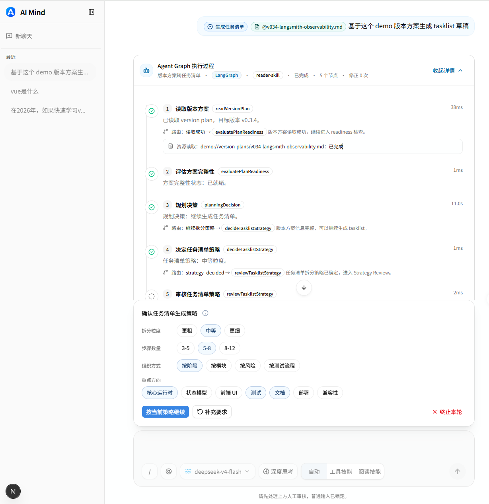
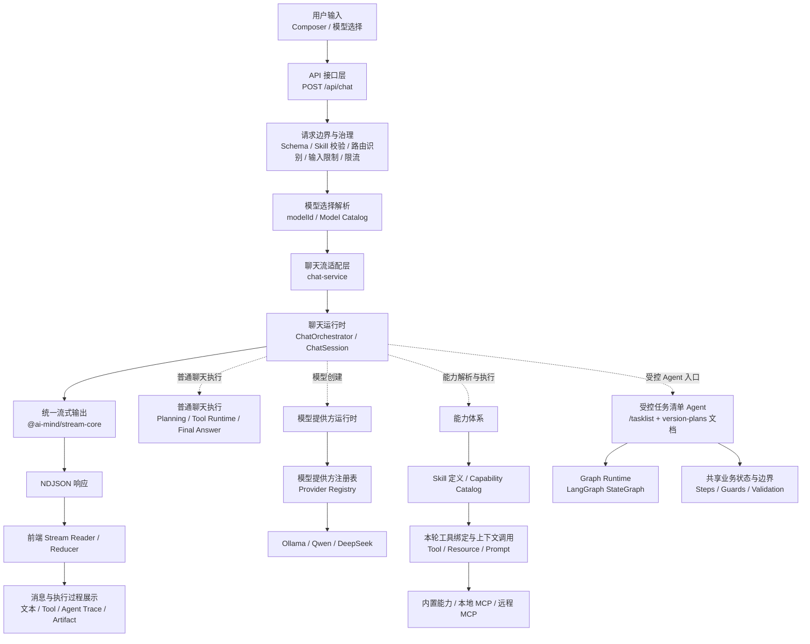
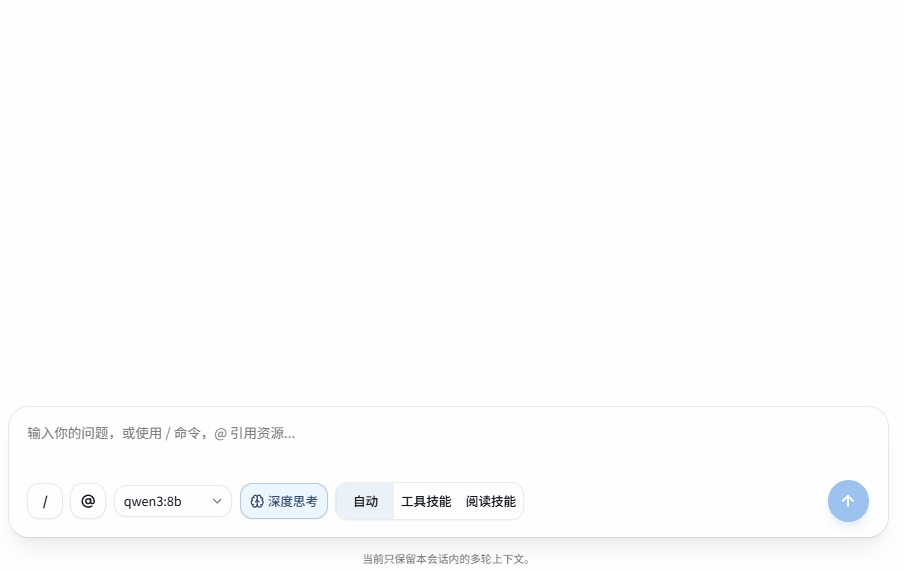

# AI Mind

AI Mind 是一个持续演进的 **AI Native Runtime Skeleton**，用于验证 AI 应用从“单轮聊天”走向“能力接入、流式协议、Skill Runtime、MCP 集成、受控 Agent 与执行过程可视化”的运行时架构。

它不是普通 AI Chat Demo，也不是完整商业化 Agent 平台。它更像一个围绕 **AI Runtime / Capability / Stream / Skill / MCP / Agent** 的开源技术探索项目，重点关注 AI 应用在工程层面如何组织输入、能力、执行过程和流式输出。

当前项目处于 **Runtime Skeleton / MVP** 阶段，适合作为 AI 应用前端、AI Runtime、MCP 接入、结构化流式协议和执行过程可视化的技术探索样例。



> 当前发布候选为 v0.5.3：Long Message Virtualization。它以免费 `react-virtuoso` 对非空消息列表执行可视区渲染，并把底层滚动与业务 Scroll Policy 明确分层；长会话、动态高度和流式阅读意图仍遵循同一条聊天体验链路。

## 项目解决的问题

AI Mind 关注的不是“再做一个聊天框”，而是聊天框背后的运行时问题：

- AI 应用从简单聊天扩展到 Tool、Resource、Prompt 和 Agent 后，运行时边界如何拆分。
- Tool / Resource / Prompt 等能力如何统一建模，并保持各自执行语义。
- 流式输出中的 `reasoning / tool / resource / prompt / agent-step / artifact / text / error` 等 chunk 如何统一协议。
- Skill Runtime 如何承接不同类型任务，而不是让主链路持续变胖。
- MCP Server 如何接入本地和远程能力。
- 第一个 Agent 如何先做成受控单 Agent，并逐步迁移到可观察的 LangGraph 编排，而不是一上来进入开放式规划系统。
- 前端如何展示 Skill 命中、capability 类型、local / remote 来源、serverId 和执行状态。
- 如何让 AI 应用从“黑盒回答”变成“可观察、可解释、可调试”的执行过程。

## 项目定位与边界

AI Mind 的价值不在于做一个完整 AI 产品，而在于验证 AI 应用从“聊天界面”走向“能力接入、运行时编排、流式协议和可解释执行”的工程结构。

- 它是一个 AI Native Runtime Skeleton，用于验证 AI 应用运行时架构。
- 它关注流式输出、Tool / Resource / Prompt 能力建模、Skill Runtime、MCP 接入、受控 Agent 和执行过程可视化。
- 它适合作为 AI 应用前端、AI Runtime、MCP 接入和流式协议的技术探索项目。
- 它不是普通 AI Chat Demo。
- 它不是完整商业化 Agent 平台。
- 它不是 Dify / LangGraph 的替代品。
- 它当前重点是 Runtime Skeleton / MVP，而不是完整生产级多 Agent 系统。

## 与 LangChain / LangGraph 的关系

AI Mind 不是 LangChain / LangGraph 的替代品，也不试图提供完整生产级 Agent Orchestration 能力。
LangChain 更适合快速构建 LLM 应用、集成模型、工具和 RAG 能力。
LangGraph 更适合构建具备状态、分支、持久化和 Human-in-the-loop 的复杂 Agent / Workflow。

`v0.2.0` 开始，AI Mind 在 `Version Plan to Tasklist Agent` 的编排层接入 LangGraph `StateGraph`。这里的 LangGraph 不是用来开放 Agent 权限，而是把已经受控的执行路径表达成 node、conditional edge 和 state patch summary，让执行过程更显式、更容易观察，也为后续 checkpoint / interrupt / HITL / replay 留出结构入口。

AI Mind 的定位仍然更小：它是一个 AI Native Runtime Skeleton，用来拆解和验证 AI 应用中的运行时边界、结构化流式协议、Tool / Resource / Prompt capability model、Skill Runtime、MCP 接入、受控 Agent 和前端执行过程可视化。

## 快速阅读指南

- 想快速了解项目定位：阅读“项目解决的问题”和“项目定位与边界”。
- 想理解架构：阅读“架构总览”和“核心设计”。
- 想了解版本演进：阅读“版本演进”和 [docs/versions](./docs/versions)。
- 想参与开发或让 Codex 改代码：阅读“开发治理入口”。
- 想运行项目：阅读“开发”和“常用验证”。
- 想了解持续输出：阅读“系列博客”。

## 架构总览



- `API 接口层` 是 HTTP 边界，在进入聊天运行时前完成请求解析、Skill 校验、路由识别、模型白名单选择、输入限制和轻量限流。
- `chat-service` 是聊天流适配层，负责创建 NDJSON 流、启动 `ChatOrchestrator`、收口流错误并包装 `Response`，不承载业务编排。
- `ChatOrchestrator / ChatSession` 负责会话构建、执行路径选择、planning、工具执行、上下文注入、受控 Agent 入口和最终回答。
- `Model Catalog` 在 API 边界把稳定 `modelId` 解析为受控模型选择；运行时再通过 `Provider Registry` 创建 Ollama、Qwen 或 DeepSeek 模型实例。
- 能力体系通过 Skill 的 `capabilitySelectors`、Capability Catalog 和本轮绑定结果，分别承接 Tool 调用以及 Resource / Prompt 上下文调用；MCP 是外部能力来源，不直接进入主运行时编排。
- 受控任务清单 Agent 只在 `/tasklist + @demo://version-plans/*.md` 入口启动。服务端固定进入 Graph Runtime，Graph nodes 复用同一套受控领域状态、Steps、Guards 和 Validation 规则；public demo 只读取 `examples/agent-demo/`。
- `@ai-mind/stream-core` 统一定义 NDJSON chunk、生命周期、错误和 Artifact 协议；前端消费流并转换为消息、Agent Trace 和 Artifact 展示，后端不直接依赖 React 组件。
- 图中的实线表示请求与响应主链路，虚线表示聊天运行时调用的受控模块，不表示模块之间按顺序串行执行。

## 核心设计

### Runtime Layer

主链路按 `API 接口层 -> chat-service -> ChatOrchestrator / ChatSession -> stream-core -> 前端消费` 分层：

- `route` 负责 HTTP 边界、请求校验、路由与模型选择、输入限制、轻量限流和错误响应。
- `chat-service` 保持为聊天流适配层，只创建流、启动主编排并包装 `Response`。
- `runtime` 负责聊天会话构建、执行路径选择、工具执行、上下文注入、受控 Agent 和最终回答。
- `skills / capabilities / mcp` 作为能力定义、选择边界和外部能力来源，不反向污染入口层。

### Stream Core

`@ai-mind/stream-core` 是从 `apps/webapp` 下沉出来的稳定流式内核。

它负责：

- NDJSON chunk 协议。
- stream lifecycle。
- error chunk。
- text artifact chunk。
- static parts writer。
- text artifact writer。
- web NDJSON writer。

这样做的价值是让流式协议更稳定、可测试、可复用，而不是让每个应用入口都重复维护一套 writer 细节。

### Model Provider Runtime

模型链路分为“请求选择”和“运行时创建”两个阶段：

- API 接口层按 `modelId -> Model Catalog` 完成白名单校验，生成受控的模型选择结果。
- `ChatSession` 按模型选择结果通过 `Provider Registry` 创建对应模型实例。
- Catalog 统一管理稳定模型 ID、Provider 实际模型名和能力声明。
- 前端只选择服务端当前可用的白名单模型，不提交 API Key、base URL 或任意模型名。
- Ollama、Qwen、DeepSeek 的参数和错误差异停留在 Provider 层。
- 普通聊天、Tool Calling 和 tasklist Graph Runtime 共用同一模型创建入口。
- `modelId` 只改变模型来源，不改变 Tool、Skill、MCP 或 Agent 权限。

### Capability Model

Capability Model 用来统一描述 Tool / Resource / Prompt：

- Tool：可执行动作，例如计算、天气查询、文档一致性检查。
- Resource：可读取上下文，例如 `demo://...`、`project://latest-context` 或 remote context。
- Prompt：可复用提示模板，例如本地文档摘要 prompt。

它统一的是“能力描述层”，不是把所有能力强行塞进同一条执行链。Runtime 可以基于 capability 信息理解本轮可用能力、来源位置、local / remote 边界和执行方式。

### Skill Runtime

当前已有两个 Skill：

- `utility-skill`：承接计算、时间、单位转换、文本转换等工具型任务。
- `reader-skill`：承接文档读取、摘要、MCP Resource / Prompt / Tool 等阅读类任务。

`v0.0.12` 后，Skill 不再直接写死 `allowedTools`，而是通过 `capabilitySelectors -> capability catalog -> active tools` 解析本轮可绑定工具。这样可以避免 Skill 维护一套工具名列表，而 Tool Runtime 又维护另一套执行来源。

### Controlled Agent Runtime

`v0.1.0` 后，项目新增第一个受控单 Agent：`Version Plan to Tasklist Agent`。

它只在 `/tasklist + @demo://version-plans/*.md` 下启动，负责读取用户显式引用的 demo 版本方案、生成 tasklist 草稿、调用 `validate_tasklist_structure` 做结构校验，并在必要时最多自动修正一次。

`v0.1.1` 在这条受控链路上增加“一次受控规划决策”：Runtime 先用规则判断 version plan readiness，再让模型在 5 类白名单 action 中做一次有限选择，并通过 `TasklistStrategy` 影响 tasklist draft。

`v0.2.3` 后，这条链路只走 LangGraph `StateGraph`。Graph Runtime 是 `/tasklist + @demo://version-plans/*.md` 的唯一执行路径；Graph events、memory checkpoint 和脱敏 Graph Debug Summary 仍通过服务端配置独立控制。

`v0.2.4` 继续把内部运行态收口为 GraphState 单一事实源。Graph nodes 直接读取 GraphState 分区并返回 GraphState patch，不再通过旧 AgentState 整包 adapter 往返转换；GraphState reducer 负责合并分区 patch，route 成功路径基于显式业务字段判断。

这个 Agent 不是通用 Agent，也不自动扫描 demo workspace 或写入文件。它的入口、步骤、工具、路由和停止条件都由 Runtime 控制。

### MCP Integration

MCP 在项目里用于验证“能力来源可以来自外部 server”：

- 本地 `stdio` MCP：用于接入 `weather-server` 和 `project-docs-server`。
- remote `Streamable HTTP` MCP：用于接入 `project-assistant-service`。
- `weather-server`：验证 local MCP Tool。
- `project-docs-server`：验证受控 docs Resource 和本地 Prompt。
- `project-assistant-service`：验证 remote Resource / Prompt / Tool 最小闭环。
- remote MCP `check_doc_consistency`：通过标准 Tool Runtime 执行，而不是写死特殊分支。

## 当前阶段与非目标

当前阶段：`Runtime Skeleton / MVP`，当前发布候选：`v0.5.3 Long Message Virtualization`。

已经验证：

- 本地聊天闭环。
- 结构化流式协议。
- Tool Calling。
- Multi-Tool Runtime。
- Skill Runtime。
- MCP Host MVP。
- Capability Model。
- Composer V1。
- Capability-driven Tool Runtime。
- 受控单 Agent。
- Agent Step 流式协议与执行过程可视化。
- 一次受控规划决策。
- Agent Text Artifact 最终产物展示。
- Controlled Agent Graph。
- Graph node / route / state patch 流式摘要。
- AgentTracePanel Graph timeline。
- memory checkpoint（显式配置，主要用于展示和调试）。
- 脱敏 Debug Summary。
- Model Catalog 与 Model Provider Runtime。
- Ollama / Qwen / DeepSeek 白名单模型选择。
- Provider 错误标准化、输入输出限制和 usage 观测。
- 默认开启的 IP / session 轻量限流。
- Containerized production deployment 与 GitHub Actions 交付链路。
- Tasklist Agent Graph Runtime 单路线。
- Tasklist Agent GraphState 单事实源收口。
- Tasklist Agent HITL Checkpoint Resume MVP。
- Tasklist Agent LangSmith lifecycle observability。
- Spec Kit Governance Baseline。
- Spec Kit CLI + Codex Skills Dual-track Pilot。
- Spec Kit Full Skills Default Entry。
- Controlled Agent-as-tool Delivery Manager。
- LangGraph 单会话 chat memory baseline。
- Tool & Agent final-turn memory。
- Minimal multi-thread chat sessions。
- browser-session scoped long-term UserMemory baseline。
- browser-local recent conversation restore、rich UI snapshot persistence 与单会话删除。
- 长消息可视区渲染、动态高度估算与本地高度提示。

当前非目标：

- 不是完整商业化 Agent 平台。
- 不是 Dify / LangGraph 替代品。
- 不是完整多 Agent 生产系统。
- 当前重点是验证运行时分层、能力接入、流式协议、受控 Agent 和执行过程可视化。

## 系列博客

- 掘金专栏（持续更新各版本实现与取舍）：
  [AI Mind 系列博客](https://juejin.cn/column/7619152366395195401)

## 项目文档

推荐阅读顺序：

1. [README](./README.md)：快速理解项目定位、核心设计和当前状态。
2. [Docs Overview](./docs)：完整文档入口与推荐阅读顺序。
3. [Architecture](./docs/architecture)：长期架构说明，包括 runtime boundary、stream-core、capability / skill surface、controlled agent runtime。
4. [Versions](./docs/versions)：各版本设计方案。
5. [Releases](./docs/releases)：版本发布说明。
6. [Tasklists](./docs/tasklists)：公开任务清单。

### 开发治理入口

后续版本开发和 AI coding 执行优先阅读：

- [Constitution](./.specify/memory/constitution.md)：AI Mind 长期工程原则。
- [AI Coding Workflow](./docs/architecture/ai-coding-workflow.md)：Change Level、Codex 执行规则和 release closing checklist。
- [Spec-driven Development](./docs/architecture/spec-driven-development.md)：spec / plan / tasks / acceptance / decisions 的使用方式。
- [Monorepo pnpm / Turborepo Governance](./docs/architecture/monorepo-pnpm-turborepo-governance.md)：workspace 依赖边界、统一命令、Catalog、安装脚本权限和任务缓存策略。
- [Production Deployment](./docs/architecture/production-deployment.md)：生产部署、TCR、Docker Compose、pgvector、env 和部署脚本的事实源。
- [ADR](./docs/adr)：长期架构决策。
- [Specs](./specs)：面向 Codex / AI coding agent 的版本级规格。

## 当前发布候选：v0.5.3 Long Message Virtualization

v0.5.3 为长会话建立统一的可视区渲染路径：

- 非空消息列表由免费 `react-virtuoso` 负责底层滚动、可见区挂载和动态尺寸测量，完整会话消息仍保留在当前数据模型中。
- AI Mind 的 Scroll Policy 只决定历史首次定位、流式跟随、用户阅读锁定和“回到底部”入口，不再与 virtualizer 竞争像素滚动控制权。
- 图片、Markdown、代码、Tool / Resource / Prompt / Agent / Workflow 等异构消息使用结构化初始高度估算；已完成历史可保留与会话和布局签名隔离的本地高度提示，失效时自动回退。
- 重要的 Reasoning、Agent、Workflow 和详情展开状态可跨离屏回收保持；静态阅读不会因测量、图片或 Composer 高度变化被自动拉回末尾。
- 历史会话先显示与消息列对齐的加载骨架，确认尾部可见后一次性揭示，避免内容列横移、滚动条突变或旧会话入口闪现。

本版本不增加服务端 cursor 分页、消息 API / Stream DTO、数据库 schema、跨设备阅读位置或 Electron IPC；离屏消息不参与浏览器原生全文查找和可访问树。详细设计见 [v0.5.3 Version](./docs/versions/v0.5.3-message-virtualization.md)、[Release Note](./docs/releases/v0.5.3.md) 和 [Tasklist](./docs/tasklists/v0.5.3-message-virtualization-tasklist.md)。

## 上一版本：v0.5.2 Conversation Entry Without Scroll Flash

v0.5.2 收口已有历史会话的进入与切换体验：历史会话首次揭示前完成尾部定位，消息区成为独立全高滚动视口，并保持 Composer 安全区、稳定 gutter 与本地优先切换语义。详细设计见 [v0.5.2 Version](./docs/versions/v0.5.2-conversation-entry-no-flash.md)、[Release Note](./docs/releases/v0.5.2.md) 和 [Tasklist](./docs/tasklists/v0.5.2-conversation-entry-no-flash-tasklist.md)。

## 更早版本：v0.5.1 Chat Experience & Image Reliability

v0.5.1 扩容近期会话、补强图片生成反馈和当前 profile 图片恢复，并在桌面侧栏和移动抽屉补充项目入口。详细设计见 [v0.5.1 Version](./docs/versions/v0.5.1-chat-experience-reliability.md)、[Release Note](./docs/releases/v0.5.1.md) 和 [Tasklist](./docs/tasklists/v0.5.1-chat-experience-reliability-tasklist.md)。

## 早期桌面预览：v0.5.0 Electron Desktop Host

v0.5.0 为既有在线 Web 应用增加 Windows x64 与 macOS arm64 Electron 桌面宿主。AI Runtime、会话、
StreamRun recovery、图像和受控 Agent 仍由服务端与 Web 应用负责；桌面进程只承担固定 Origin 准入、
本地恢复、profile 隔离和收紧的原生保存能力。公开
[`v0.5.0-public-beta`](https://github.com/HWYD/ai-mind/releases/tag/v0.5.0-public-beta) 目标 commit 为
`a39dc9f4f7424dbf787a3df6219a93a069b82326`，提供 Windows x64 安装器、macOS arm64 DMG、平台 manifest、
SHA-256、安装说明和 README，共 9 个 assets；制品未签名、在线运行且不支持自动更新。

### Public Beta 下载

请从仓库的 GitHub Pre-release 下载对应平台安装包：Windows x64 `Setup.exe` 或 macOS arm64 DMG。
下载后先使用 Release 附带的 `desktop-release.json` 和 `.sha256` 校验文件核对 SHA-256。Windows
可能出现 SmartScreen 未知发布者提示；macOS 首次启动可能需要在 Finder 中 Control-click 应用并选择“打开”。
本版本不支持 Windows ARM64、macOS Intel/universal、Linux、离线运行或自动更新。
发布策略要求线上 compatibility/header gate、Windows/macOS 的 fresh install / overlay install smoke 和最终
sign-off 均有可追溯证据。当前这些运营验收记录尚未完成，因而公开资产只能称为 `Unsigned Experimental Preview`，
不能称为正式已验收发行。详见 [v0.5.0 设计](./docs/versions/v0.5.0-electron-desktop-host.md)
和[发布记录](./docs/releases/v0.5.0.md)。

桌面端开发建议使用根脚本，它会先准备本地数据库，再同时启动 Web 服务和 Electron：

```powershell
pnpm dev:desktop
```

未打包的桌面启动器默认连接 `http://localhost:3000`。如需使用其他 loopback Origin，可复制
`apps/desktop/.env.example` 为 `.env.local`，仅修改 `AI_MIND_DESKTOP_DEV_ORIGIN`，或在当前 shell
设置该变量。该文件不会被 `make`、`preview:make` 或已打包的 Electron 进程读取；生产 Origin 始终固定在应用代码中。

`pnpm --filter @ai-mind/desktop start` 只启动 Electron。只有兼容的 Webapp 已在该 Origin 提供
`/api/desktop/compatibility` 时，它才会进入工作区；单独执行且本地 Webapp 未运行时，应用按设计停在本地 recovery。

## Previous Version: v0.4.12

这版的主线是 `Image Generation Agent`：通过显式 `/image` 把单张文生图与普通聊天分流，并以受控 LangGraph 图完成 ImageBrief、提示词检查与最多一次自动修正。

v0.4.12 的边界非常明确：

- 固定使用服务端 `doubao-seedream-5.0-lite` Provider，复用已有 Doubao Key；前端不选择模型，也不接触 endpoint 或密钥。
- 每次运行最多五个逻辑规划节点、一次 Prompt 修正和一次外部图像生成；每个规划节点仅对瞬时故障最多请求三次，无 HITL、checkpoint、resume 或开放式循环。
- Provider URL 仅保留在服务端临时记录。浏览器通过同源内容路由预览和下载经过验证的临时图片，并可在当前 profile 使用受限 Blob 缓存恢复。
- 不做编辑、局部重绘、扩图、去背景、参考图、多图、成本估算、服务端对象存储、跨设备历史或长期媒体库。

详细设计见 [AI Mind v0.4.12](./docs/versions/v0.4.12-image-generation-agent.md)、[v0.4.12 Release Note](./docs/releases/v0.4.12.md)、[v0.4.12 Tasklist](./docs/tasklists/v0.4.12-image-generation-agent-tasklist.md)、[Image Generation Agent Architecture](./docs/architecture/image-generation-agent.md) 和 [ADR-0016](./docs/adr/0016-controlled-image-generation-agent.md)。

## 上一版本：v0.4.10

这版的主线是 `Resumable Agent Streams`：为普通聊天、Tasklist Agent 和 Delivery Chain 的 `fetch POST + NDJSON` 流增加固定 envelope、事件持久化、同页断线恢复、幂等提交、显式取消和安全终态收口。

v0.4.10 的边界非常明确：

- 初始 POST 必须携带稳定的 `Idempotency-Key`；响应丢失时最多重试 3 次、总预算 20 秒，收到 replay descriptor 后转入 recovery GET。
- 同一页面生命周期内的断线可以按 `runId + cursor` 恢复；刷新或关闭页面后不恢复活动订阅，已持久化的最终结果由普通 hydration 查询。
- StreamRun/StreamEvent 只负责 transport recovery；AgentRun 与 LangGraph checkpoint 继续保持独立职责。
- retention 使用滚动事件窗口和 per-run 上限；cursor 过期时返回 safe final-state/restart guidance，不静默丢弃事件。
- 不承诺 process-crash takeover、外部 Tool/MCP side effect exactly-once、原生 EventSource 或无限历史。

详细设计见 [AI Mind v0.4.10](./docs/versions/v0.4.10-resumable-agent-streams.md)、[v0.4.10 Release Note](./docs/releases/v0.4.10.md)、[v0.4.10 Spec](./specs/v0.4.10-resumable-agent-streams/)、[Stream Recovery Architecture](./docs/architecture/stream-recovery.md) 和 [ADR-0015](./docs/adr/0015-resumable-agent-stream-recovery.md)。

## 更早版本：v0.4.9

这版的主线是 `Monorepo Boundary and CI Validation Governance`：在 pnpm/Turbo 基线上，把 workspace 身份、依赖方向、公开导入面和测试分层变成可自动验证的规则。Node.js 固定为 22.x，根 metadata、CI 与 Docker 统一使用 `pnpm@10.34.0`；pnpm 负责 workspace、lockfile、Catalog 和依赖约束，Turborepo 负责按测试层执行、并行与缓存。

v0.4.9 的边界非常明确：

- 内部 `@ai-mind/*` 依赖必须使用 `workspace:`；根 `preinstall` 会拒绝缺失 provider、普通 semver 内部依赖、非法 app/package 方向、循环依赖、未纳管 manifest、跨 workspace 相对导入和未公开深层导入。
- `@types/node@22.20.1`、TypeScript、Vitest、Zod、MCP SDK 和 dotenv 使用选择性 Catalog；Webapp-only 依赖继续保留在各自 manifest。
- `pnpm lint`、`pnpm typecheck`、`pnpm test:stable`、`pnpm test:integration`、`pnpm test`、`pnpm build` 是 canonical root commands；`pnpm test:governance` 覆盖治理脚本回归，package-level scripts 继续用于诊断。集成通道缺少 `DATABASE_URL` 时会在 Vitest 前失败，不再以全量 skip 冒充成功。
- `stable-validation` 无 PostgreSQL 服务和 `DATABASE_URL`；`stateful-integration` 仅在其成功后创建数据库状态。cloud/live smoke 只允许通过 `AI_MIND_RUN_EXTERNAL_TESTS=1` 手动执行。
- Prisma generation、migration 和 checkpoint setup 保持显式、有序且不可缓存，数据库状态不会被隐藏到普通 Turbo task cache 中。
- 不引入 `--affected`、remote cache、Changesets、npm publishing、`pnpm deploy`、Nx 迁移或大规模 package extraction。
- 不修改业务 Runtime、API、数据库 schema、stream protocol、前端交互或生产部署步骤。

业务 runtime baseline 继续保留三条明确路径：

- `/tasklist + @demo://version-plans/*.md`：Tasklist Agent Graph Runtime + HITL + LangSmith observability
- `/delivery-chain + @demo://scenarios/*/requirement.md` 或 `/delivery-chain <inline requirement>`：ControlledDeliveryManager + parallel review-group synthesis
- 普通 text chat / tool-assisted ordinary chat：selected conversation 的浏览器本地完整 UI 历史展示 + 服务端短期 ThreadState + 当前 browser session 的语义相关 UserMemory

详细设计见 [AI Mind v0.4.9: Monorepo Boundary and CI Validation Governance](./docs/versions/v0.4.9-monorepo-boundary-ci.md)、[v0.4.9 Release Note](./docs/releases/v0.4.9.md)、[specs/v0.4.9-monorepo-boundary-ci](./specs/v0.4.9-monorepo-boundary-ci/)、[Monorepo Governance](./docs/architecture/monorepo-pnpm-turborepo-governance.md) 和 [Production Deployment](./docs/architecture/production-deployment.md)。

## 当前能力

### Chat Runtime

- `LangChain.js + Model Provider Runtime（Ollama / DeepSeek / Qwen）`
- NDJSON 流式协议。
- `reasoning / tool / resource / prompt / agent-step / agent-graph-* / artifact / text / error` 多段式消息流。
- Skill 命中与 Prompt 执行事实展示。
- 统一 `error` chunk 语义。
- `authoritative answer`：在单工具确定性结果场景下支持工具结果直出，减少模型二次改写带来的偏差。
- 普通 chat 采用 server-authoritative memory：前端 payload 可继续携带本地历史用于 UI 兼容，后端模型上下文只取当前 user turn，并从 ThreadState 注入 recent messages + summary + pinned decisions。
- browser-session scoped `UserMemory`：普通 text chat 和 tool-assisted ordinary chat 可按相关性注入长期用户偏好、稳定用户背景、稳定指令和工作流偏好。
- safe final-turn memory：tool / MCP / Tasklist / Delivery 的最终用户可见问答可在刷新后恢复，但中间执行态仍不进入 memory。
- post-final-turn background memory extraction：每个 eligible ordinary completed turn 在 final turn 后 best-effort 抽取 `0..N` 长期记忆候选，并经过 deterministic validation / dedupe / suppression 后入库。
- Capability-driven Tool Runtime。
- Composer payload hint 消费。
- Runtime-controlled Agent path。
- Tasklist Agent Graph Runtime 单一路线。
- 普通 chat 与 safe final turn refresh recovery、有界上下文压缩。

### Model Provider Runtime

- 服务端 Model Catalog 与 `provider/model-key` 稳定模型 ID。
- Ollama / Qwen / DeepSeek Provider。
- `GET /api/ai/models` 公开白名单模型列表。
- 前端“线上模型 / 本地模型”分组选择器。
- Provider 错误标准化与脱敏日志。
- 输入字符、输出 token、timeout 和默认限流边界。
- usage / token best-effort 观测。

### Skills

- `utility-skill`：承接计算、时间、单位转换、文本转换等工具型任务。
- `reader-skill`：承接文档读取、摘要、MCP Resource / Prompt / Tool 等阅读类任务。

### Tools

- `calculator`
- `datetime`
- `text-transform`
- `unit-convert`
- `city-weather`
- `validate_tasklist_structure`
- remote MCP `check_doc_consistency`

### MCP Host MVP

- `@modelcontextprotocol/sdk`
- 本地 `stdio` MCP Host。
- remote `Streamable HTTP` MCP Host。
- `weather-server`
- `project-docs-server`
- `project-assistant-service`
- MCP Tool / MCP Resource adapter。
- MCP Prompt adapter。

### Composer V1

- Tiptap 增强输入框。
- `/summary`、`/tasklist`、`/check`、`/delivery-chain` inline command chip。
- `@demo://...` 与 `@project://latest-context` inline resource chip。
- Enter 发送、Shift + Enter 换行、中文 IME 防误发。
- `plainText + composer.command + composer.references` 兼容提交。



### Agent Runtime

- `Version Plan to Tasklist Agent`
- 入口：`/tasklist + @demo://version-plans/*.md`
- `Controlled Agent-as-tool Delivery Manager`
- 入口：`/delivery-chain + @demo://scenarios/*/requirement.md` 或 `/delivery-chain <inline requirement>`
- 内部固定执行 `load -> delegate-plan -> delegate-task -> delegate-review -> synthesize-report`
- Manager 只允许 `plan-subagent -> task-subagent -> review-subagent` 串行 tool-calling
- 执行中通过 compact workflow progress panel 展示安全摘要，完成后自动折叠
- Delivery Chain Report 只作为本轮非持久化文本输出，不写代码、不读真实仓库
- v0.2.3 后 `/tasklist + @demo://version-plans/*.md` 固定走 Graph Runtime。
- LangGraph `StateGraph` 是 Tasklist Agent 的唯一编排层。
- LangGraph `StateGraph` 只替换编排层。
- v0.2.4 后生产路径以 GraphState 作为内部运行态事实源。
- v0.3.0 后 Strategy Review 必停，Tasklist Revision Review 只在 `fixNow` 非空时触发。
- v0.3.0 使用 AgentRun / AgentInterrupt 记录业务状态，使用 LangGraph Postgres checkpoint 负责 graph resume。
- GraphState 按 `input / source / planning / tasklist / execution / output / graph` 分区保存本轮运行态。
- 一次 Planning Decision，只允许 5 类白名单 action。
- `read_optional_context` 最多读取一个白名单上下文。
- `TasklistStrategy` 影响 draft 的 Step 数量、拆分粒度、分组和优先级。
- `tasklistDraft` 最多两轮受控修订，第一次修订前可由 HITL 授权。
- `WarningDisposition` 区分自动修正和人工复核点。
- `RevisionEffectResult` 评估 v1 -> v2 修正效果。
- `PlanningDecisionAction` conditional edge。
- `WarningDisposition` conditional edge。
- `validate_tasklist_structure` 作为结构质量门。
- Graph Runtime 复用受控领域 step operation 和状态机 guard。
- Graph node / route / state patch summary 通过受控 stream chunk 展示。
- Postgres checkpoint 由显式配置控制，用于 v0.3.0 Tasklist Agent resume；业务状态仍由 AgentRun 表记录。
- 页面刷新后不恢复 pending HITL，用户需要重新发起 `/tasklist`。
- Debug Summary 只展示脱敏白名单字段。
- `AgentTracePanel` 展示 readiness、decision、strategy、warning disposition、revision effect、graph timeline 和折叠 Debug 摘要。
- `AgentTextArtifactPanel` 展示最终 tasklist Markdown 正文。
- 不自动扫描 demo workspace，不写入文件，不提供前端 runtime switch，不做运行中 fallback。

### 工程化边界

- `route -> chat-service facade -> runtime -> skills / tools / mcp`
- `@ai-mind/stream-core` / `packages/stream-core` 负责稳定流式内核。
- `version-plan-tasklist-agent` 负责受控 tasklist Agent 主路径。
- `apps/webapp/tests/**` 为唯一 webapp 自动化测试目录。
- `packages/stream-core/tests/**` 为 package 测试目录。

## 当前结构

### Webapp

- `apps/webapp/app/api/chat/route.ts`
    - HTTP 边界与错误映射。
- `apps/webapp/lib/ai/chat-service.ts`
    - 薄 facade，负责创建内部流、构造中间 `StreamResult` 并包装 `Response`。
- `apps/webapp/lib/ai/runtime/`
    - 正式聊天运行时编排层。
- `apps/webapp/lib/ai/model-provider/`
    - Model Catalog、Provider Registry、模型创建、错误标准化、usage 与输入输出边界。
- `apps/webapp/lib/ai/rate-limit/`
    - IP / session 轻量限流配置和单进程 Memory Store。
- `apps/webapp/lib/ai/runtime/version-plan-tasklist-agent/`
    - 受控单 Agent，负责从版本方案生成 tasklist 草稿；当前保留 Graph Runtime、共享 step operation、GraphState、HITL review nodes 和 AgentRun resume 协调。
- `apps/webapp/lib/ai/runtime/version-plan-tasklist-agent/graph/`
    - LangGraph `StateGraph`、graph nodes、route、GraphState、graph events 和 Debug Summary。
- `apps/webapp/components/chat/message-list/parts/agent-trace-panel.tsx`
    - Agent 执行过程展示面板，支持 graph timeline 和折叠 Debug。
- `apps/webapp/components/chat/message-list/parts/agent-text-artifact-panel.tsx`
    - Agent 最终文本产物展示面板。
- `apps/project-assistant-service/`
    - NestJS remote MCP 服务，当前用于验证单 server 最小闭环。
- `apps/webapp/tests/`
    - Webapp 自动化测试。

### Stream Core Package

- `packages/stream-core/src/protocol/`
    - `ChatStreamChunk` 与错误协议类型。
- `packages/stream-core/src/core/`
    - lifecycle、error helper、static part writer、text artifact writer。
- `packages/stream-core/src/adapters/web/`
    - NDJSON writer。
- `packages/stream-core/tests/`
    - package 单测。

## 关键代码入口

如果想从代码层面理解项目，可以优先看下面几个入口：

| Area                   | Path                                                                                                               | What to Look For                                                                               |
| ---------------------- | ------------------------------------------------------------------------------------------------------------------ | ---------------------------------------------------------------------------------------------- |
| Runtime 主编排         | [apps/webapp/lib/ai/runtime](./apps/webapp/lib/ai/runtime)                                                         | 聊天 session、planning、tool execution、Agent stage、final answer 和错误收口                   |
| Model Provider Runtime | [apps/webapp/lib/ai/model-provider](./apps/webapp/lib/ai/model-provider)                                           | Model Catalog、Provider Registry、模型创建、错误标准化和 usage 观测                            |
| Agent Runtime          | [apps/webapp/lib/ai/runtime/version-plan-tasklist-agent](./apps/webapp/lib/ai/runtime/version-plan-tasklist-agent) | 受控单 Agent、Graph Runtime、StateGraph、状态机、step operation、final answer 和 artifact 输出 |
| Stream Core            | [packages/stream-core/src](./packages/stream-core/src)                                                             | NDJSON chunk 协议、stream lifecycle、error chunk、agent-step、artifact 和 writer               |
| Capability Model       | [apps/webapp/lib/ai/capabilities](./apps/webapp/lib/ai/capabilities)                                               | capability catalog、selector 解析和 active tool binding                                        |
| Composer V1            | [apps/webapp/components/chat/composer](./apps/webapp/components/chat/composer)                                     | Tiptap 输入层、command chip、resource chip、模型选择器、菜单和序列化                           |
| MCP Integration        | [apps/webapp/lib/ai/mcp](./apps/webapp/lib/ai/mcp)                                                                 | MCP client、server registry、transport、Tool / Resource / Prompt adapter                       |

## v0.1.x / v0.2.x 的关键判断

这组受控 Agent 版本有几个重要原则：

1. 第一个 Agent 先做受控单 Agent，不做通用 Agent。
2. Agent 必须基于用户显式引用的 `demo://version-plans/*.md`，不自动扫描 demo workspace，也不读取真实项目目录。
3. Agent 通过 text artifact 展示最终 tasklist 草稿，并用普通 text 输出校验摘要，但不自动写入文件。
4. `v0.1.1` 只开放一次 action 选择，不开放资源权限、工具权限、写入权限和循环权限。
5. `v0.2.0` 只把这条受控链路迁移到 LangGraph `StateGraph`，不扩大 Agent 权限。
6. `v0.2.1` 只改变模型来源和 Provider 治理，不改变 Agent 权限、资源白名单或工具边界。
7. `v0.2.3` 和 `v0.2.4` 只做 Graph Runtime 与 GraphState 收口，不新增 Agent 能力。
8. `v0.3.0` 只为 Tasklist Agent 增加 HITL Checkpoint Resume，不扩展成通用审批或多 Agent 平台。

因此：

- `/tasklist` 只有配合 `@demo://version-plans/*.md` 才进入 Agent。
- `validate_tasklist_structure` 只做结构校验，不判断内容质量是否完美。
- `tasklistDraft` 只存在本轮 GraphState 内存中。
- `PlanningDecisionAction` 必须通过 schema 和状态机约束。
- `PlanningDecisionAction` 和 `WarningDisposition` 可以成为 graph route，但 route 不绕过 Runtime guard。
- Agent Step 通过流式协议展示，但不变成完整调试台。
- Graph events 只展示 node、route 和脱敏 patch summary，不透传 LangGraph 原始 debug stream。
- Agent Text Artifact 只做最终产物展示，不做持久化、编辑、下载或 diff。

## 快速开始前置条件

本项目支持本地 Ollama 和服务端配置的 DeepSeek / Qwen，启动前建议准备：

- Node.js：要求 `22.x`。
- pnpm：项目声明为 `pnpm@10.34.0`。
- Ollama：使用本地模型时安装；默认模型为 `qwen3:8b`，本机资源有限时可选择 `qwen3:4b`。
- DeepSeek / Qwen：使用云模型时，由开发者在对应平台自行创建 API Key，并仅配置在服务端环境中。
- remote MCP 验证：如果要测试 `project://latest-context` 或 remote Tool，需要同时启动 `project-assistant-service`。

常用模型准备示例：

```bash
ollama pull qwen3:8b
```

## 开发

安装依赖：

```bash
corepack prepare pnpm@10.34.0 --activate
pnpm install --frozen-lockfile
```

仓库要求 Node.js 22.x，并由根 `packageManager` 固定 pnpm 10.34.0。

开发环境按真实场景选择入口。数据库使用 `deploy/compose.dev-postgres.yml` 中的本地 Docker PostgreSQL 服务，映射到 `127.0.0.1:5433`；启动场景命令会先执行数据库 migration 和 runtime checkpoint setup。

```bash
pnpm dev
```

`pnpm dev` 用于常规业务开发/运行，会启动并检查本地 Docker PostgreSQL，再用 Turbo 同时启动 Webapp 和 Project Assistant Service，但不启动共享包 watch。

如果这次会改 `packages/*`，需要让 Webapp 依赖包进入 Turbo watch，使用：

```bash
pnpm dev:watch
```

如果只需要 Webapp 和本地 Docker PostgreSQL，不需要 Project Assistant Service，使用：

```bash
pnpm dev:webapp:db
```

如果只想分别定位服务问题，可以使用不带 DB preflight 和本地环境注入的轻量诊断入口：

```bash
pnpm dev:webapp
pnpm dev:pas
```

如果 Webapp 需要本地 PostgreSQL 环境，优先使用上面的 `pnpm dev:webapp:db`，避免手工拼环境变量。

查看或停止本地开发 PostgreSQL：

```bash
pnpm dev:db:logs
pnpm dev:db:down
```

首次克隆、清空本地数据库 volume，或拉取到新的数据库 migration 后，显式初始化一次本地业务数据库：

```bash
pnpm dev:db:setup
```

该命令才会生成 Prisma Client、执行已提交 migration，并初始化 LangGraph / UserMemory schema；日常 `pnpm dev*` 不会隐式执行这些数据库操作。

其中 `pnpm dev:webapp` 和 `pnpm dev:pas` 是不注入本地 DB/PAS 环境变量的轻量诊断入口。

`pnpm dev:watch` 会由 Turbo 并行运行 `@ai-mind/stream-core` 的 transpile 和 declaration watch；Prisma Client 生成属于显式的 `pnpm dev:db:setup`，不再伪装成长期 watch 或日常启动前置操作。单独诊断这两个共享包 watch 时，使用：

```bash
pnpm exec turbo run build:watch:transpile build:watch:types --filter=@ai-mind/stream-core
```

### 模型 Provider 配置

模型选择由服务端 Model Catalog 和环境变量共同决定。前端只提交 `modelId`，不会接收 API Key、base URL、底层模型名或完整 Provider 配置。完整配置模板见 [apps/webapp/.env.example](./apps/webapp/.env.example)。

本地使用 Ollama：

```env
AI_MIND_DEFAULT_MODEL_ID=ollama/qwen3-8b
AI_MIND_ALLOWED_PROVIDERS=ollama
AI_MIND_OLLAMA_BASE_URL=http://127.0.0.1:11434
```

Ollama 的底层模型名由服务端 Catalog 管理，不提供 `AI_MIND_OLLAMA_MODEL`。首次运行前请先拉取对应模型，例如 `ollama pull qwen3:8b`。

本地开发也可以使用 DeepSeek 或 Qwen。推荐把真实 Key 放在操作系统用户环境变量、部署平台 Secret 或其他工作区外的密钥存储中，修改后重启终端和开发服务：

```env
AI_MIND_DEFAULT_MODEL_ID=qwen/qwen3.6-flash
AI_MIND_ALLOWED_PROVIDERS=qwen,deepseek
AI_MIND_QWEN_API_KEY=xxx
AI_MIND_DEEPSEEK_API_KEY=xxx
```

线上部署只启用实际使用的云 Provider，并把默认模型设为同一白名单内的模型。当前 production Catalog 不展示本地 Ollama 模型；DeepSeek / Qwen Key 必须通过部署平台的服务端 Secret 注入。AI Mind 不托管、不创建、不展示第三方平台 API Key，也不会把 Key 放入前端 DTO、stream chunk 或调试信息。

系统默认按 IP 和 session 开启每日限流；本地调试如确有需要，可显式设置 `AI_MIND_RATE_LIMIT_ENABLED=off` 暂时关闭：

```env
AI_MIND_RATE_LIMIT_ENABLED=on
AI_MIND_CHAT_DAILY_LIMIT_PER_IP=200
AI_MIND_CHAT_DAILY_LIMIT_PER_SESSION=100
AI_MIND_TASKLIST_DAILY_LIMIT_PER_IP=50
AI_MIND_TASKLIST_DAILY_LIMIT_PER_SESSION=20
AI_MIND_IMAGE_DAILY_LIMIT_PER_IP=10
AI_MIND_IMAGE_DAILY_LIMIT_PER_SESSION=3
```

`/image` 使用独立的生图配额：每个 Session 默认每天 3 次，同一 IP 默认每天 10 次（可在 10–20 范围内调整）；普通聊天不消耗生图配额。无效请求、幂等重放和活动任务冲突不计数，已接受任务即使后续失败仍计数。

当前限流状态只保存在单个 Node.js 进程内存中，服务重启后会清空，也不能在多实例之间共享。多实例公开访问需要接入 Redis / KV 等集中式存储；这不属于 v0.2.1 的实现范围。

### Runtime checkpoint / chat memory / user memory setup

如果要验证 durable Tasklist checkpoint、chat memory checkpoint 或 UserMemory semantic retrieval，先准备 `DATABASE_URL`，再执行：

```bash
pnpm db:setup:deploy
```

这个命令会按顺序完成：

- Prisma 业务表 deploy migration
- Tasklist Agent `langgraph_checkpoint` schema/setup
- chat memory `langgraph_chat_memory` schema/setup
- user memory `langgraph_user_memory` schema/setup

v0.4.6 起引入的真实 UserMemory semantic retrieval 还需要服务端配置 `AI_MIND_DOUBAO_API_KEY` 和 `AI_MIND_USER_MEMORY_EMBEDDING_DIMENSIONS=1024`。它固定使用 `doubao-embedding-vision` 与 `PostgresStore` vector search；模型或维度变更时，需要同步调整 Store setup 与部署配置。

如果只想单独初始化 chat memory checkpoint，也可以运行：

```bash
pnpm --dir apps/webapp db:chat-memory:setup
```

如果只想单独初始化 UserMemory Store，也可以运行：

```bash
pnpm --dir apps/webapp db:user-memory:setup
```

## 可以试试这些问题

启动项目后，可以从下面几类问题开始验证当前能力：

- `现在广州天气怎么样？`
- `记住我喜欢吃桃子。`
- 新开一个会话后输入：`给我推荐几种水果。`
- `以后解释技术问题时，先用大白话，再补充专业说法。`
- 选择 `/summary`，引用 `@demo://README.md`，输入：`帮我总结这个 demo workspace 的边界设计`
- 选择 `/tasklist`，引用 `@demo://version-plans/v034-langsmith-observability.md`，输入：`基于这个版本方案生成 tasklist 草稿`
- 选择 `/delivery-chain`，引用 `@demo://scenarios/register-login/requirement.md`，输入：`基于这个 demo scenario 生成交付计划报告`
- 输入：`/delivery-chain 帮我规划一个登录表单，支持手机号、密码、错误提示和加载状态`
- 选择 `@project://latest-context`，输入：`帮我概括当前项目上下文`

其中 `/tasklist` 只有配合 `@demo://version-plans/*.md` 才进入受控 Agent；`/check` 当前主要作为任务意图 hint，不等同于立即执行 remote Tool。

## 常用验证

日常开发和 CI 使用同一组根命令，由 Turborepo 根据 workspace 依赖图安排执行顺序：

```bash
pnpm lint
pnpm typecheck
pnpm test:stable
pnpm test:integration
pnpm test
pnpm build
```

包级命令保留用于缩小故障范围，不作为第二套编排入口。完整规则见 [Monorepo pnpm / Turborepo Governance](./docs/architecture/monorepo-pnpm-turborepo-governance.md)。

### Webapp

```bash
pnpm --dir apps/webapp test
pnpm --dir apps/webapp typecheck
pnpm --dir apps/webapp build
```

### Project Assistant Service

```bash
pnpm dev:pas
pnpm --filter @ai-mind/project-assistant-service typecheck
pnpm --filter @ai-mind/project-assistant-service build
```

### Stream Core

```bash
pnpm --filter @ai-mind/stream-core test
pnpm --filter @ai-mind/stream-core typecheck
pnpm --filter @ai-mind/stream-core build
```

### Lint

```bash
pnpm lint
pnpm --filter @ai-mind/webapp lint:fix
pnpm -r --filter "./packages/*" lint:fix
```

## 版本演进

AI Mind 采用小版本渐进式演进，每个版本只解决一个明确的运行时问题。

| Version | Theme                                              | Key Changes                                                                                                                                                                     |
| ------- | -------------------------------------------------- | ------------------------------------------------------------------------------------------------------------------------------------------------------------------------------- |
| v0.0.4  | 本地聊天闭环                                       | 完成本地聊天、流式输出与 Streamdown 展示                                                                                                                                        |
| v0.0.5  | Tool Calling MVP                                   | 接入最小 Tool Calling 能力                                                                                                                                                      |
| v0.0.6  | Multi-Tool Runtime                                 | 支持多工具运行时与工具结果回传                                                                                                                                                  |
| v0.0.7  | Skill Runtime                                      | 引入第一层 Skill Runtime，完成 `utility-skill`                                                                                                                                  |
| v0.0.8  | Reader Skill                                       | 新增 `reader-skill`，支持文件读取与阅读类能力                                                                                                                                   |
| v0.0.9  | MCP Host MVP                                       | 接入本地 stdio MCP，验证 MCP Tool / Resource                                                                                                                                    |
| v0.0.10 | Runtime Refactor + Stream Core                     | 收口 chat-service 主链，抽离 `@ai-mind/stream-core`                                                                                                                             |
| v0.0.11 | Capability Model + Remote MCP                      | 建立 capability model / skill metadata，接入 remote MCP 单服务闭环                                                                                                              |
| v0.0.12 | Docs Resource + Composer + Capability Tool Runtime | 收紧 docs resource 边界，接入 Tiptap Composer V1，并用 capability selectors 驱动 Tool Runtime                                                                                   |
| v0.1.0  | Controlled Tasklist Agent                          | 引入受控单 Agent，基于显式 version plan 生成 tasklist 草稿并进行结构校验                                                                                                        |
| v0.1.1  | 一次受控规划决策                                   | 在受控 Agent 内增加一次白名单 Planning Decision、策略生成、warning 分流、修正效果评估和最终产物 Artifact 展示                                                                   |
| v0.2.0  | Controlled Agent Graph                             | 将受控 Tasklist Agent 编排层迁移到 LangGraph StateGraph，新增 graph events、Trace timeline、开发态 checkpoint 和脱敏 Debug Summary                                              |
| v0.2.1  | Online Demo & Model Provider Runtime               | 建立 Model Catalog 与 Ollama / Qwen / DeepSeek Provider Runtime，新增白名单模型选择、错误收口、限流和 usage 观测                                                                |
| v0.2.2  | Containerized Deployment & GitHub Actions Delivery | 完成容器化部署、生产环境配置和 GitHub Actions 交付链路                                                                                                                          |
| v0.2.3  | Tasklist Agent Graph Runtime Consolidation         | 删除 legacy runner 与 runtime switch，`/tasklist` 固定走 Graph Runtime                                                                                                          |
| v0.2.4  | Tasklist Agent Graph Single State Model            | GraphState 成为 Tasklist Agent 内部运行态事实源，旧 AgentState API 退出，graph nodes 返回合并式 GraphState patch                                                                |
| v0.3.0  | Tasklist Agent HITL Checkpoint Resume              | Strategy 必审、修订前条件式 HITL、最多两轮受控修订，并接入 Prisma AgentRun 与 LangGraph Postgres checkpoint resume                                                              |
| v0.3.1  | Spec Kit Governance Baseline                       | 新增 constitution、specs、ADR、AI coding workflow 和 PR checklist，把后续 AI coding 开发流程规范化                                                                              |
| v0.3.2  | Spec Kit CLI + Codex Skills Dual-track Pilot       | 真实试跑官方 CLI，新增项目内 `speckit-*` pilot skills，确认 CLI、skills 和人工等价三条治理路径的边界与协同方式                                                                  |
| v0.3.3  | Spec Kit Full Skills Default Entry                 | 引入 official full `speckit-*` skills，迁移本地 pilot 规则，建立 Level C / D 默认入口和 converge 收口检查                                                                       |
| v0.3.4  | Tasklist Agent LangSmith Observability             | 为 Tasklist Agent HITL checkpoint resume 链路接入可选 LangSmith lifecycle tracing，记录脱敏 metadata 并保持主流程 soft fail                                                     |
| v0.3.5  | Agent Demo Workspace Resource Boundary             | 将 public demo Agent 资源收口到 `examples/agent-demo/`，新增 `@demo://`，迁移 `/tasklist` demo 入口并限制 picker 只展示 demo version-plans                                      |
| v0.3.6  | Controlled Delivery Chain MVP                      | 新增 `/delivery-chain`，支持 demo scenario 与 inline requirement，在 `@demo://` 边界内输出受控的 Plan、Task、Review 报告                                                        |
| v0.3.7  | Delivery Chain Workflow Progress Presentation      | 为 `/delivery-chain` 新增 `workflow-progress-*` 过程展示、完成后折叠摘要和报告 section presentation，首版不影响 `/tasklist` 与普通资源面板                                      |
| v0.4.0  | Controlled Agent-as-tool Delivery Manager MVP      | 用 `ControlledDeliveryManager` 接管 `/delivery-chain`，通过受控 tool-calling 串行委派 `plan/task/review` 子 Agent tool，并保持 RuntimeArtifact 仅在 run-local runtime 内部流转  |
| v0.4.1  | Parallel Review Subagents + Manager Synthesis      | Review 阶段升级为 3 个 review-class subagent 并行执行，引入 phase-aware DelegationPolicy 和基于规则的 `synthesizeReviewBundle` 综合判断                                         |
| v0.4.2  | LangGraph Single Thread Memory Baseline            | 为当前单聊天会话引入 LangGraph thread memory、refresh hydration、summary compaction 与 pinned decisions，并保持 Tasklist / Delivery / stream 边界不变                           |
| v0.4.3  | Tool & Agent Final Turn Memory                     | 把 tool / MCP / Tasklist / Delivery 的最终用户可见问答纳入可恢复 chat memory，同时继续排除 raw transcript、GraphState、RuntimeArtifact 和 protocol / reducer breaking change    |
| v0.4.4  | Minimal Multi-thread Chat Sessions                 | 把 chat page 扩展为 browser-session scoped recent conversations，保持 conversation 隔离的 memory / hydration / final-turn writes，并继续复用 instant-mind + 本地 shadcn/ui 基线 |
| v0.4.5  | Long-term User Memory Store Baseline               | 引入 browser-session scoped `UserMemory Store`，为 ordinary text chat 和 tool-assisted ordinary chat 提供后台抽取、严格校验、相关性召回和有界注入的长期用户记忆基线             |
| v0.4.6  | UserMemory Semantic Retrieval Baseline             | 使用 `PostgresStore` vector search 与独立 embedding 配置，为 eligible ordinary chat 提供 vector-only 的长期 UserMemory 语义召回，并保持公开状态与 Agent/Workflow 边界不变       |
| v0.4.7  | Browser-local Chat Session Persistence             | 引入浏览器本地最近会话与完整用户可见消息快照恢复，采用本地优先展示 + 服务端会话列表校准，并保持 Server Registry / ThreadState / UserMemory 的权威边界不变                       |
| v0.4.8  | Monorepo pnpm / Turborepo Governance               | 统一 Node 22、pnpm 10.34.0、workspace/Catalog/安装脚本策略与 Turbo 根任务图，使本地、CI、Docker 共享可复现工程入口，并保持业务 Runtime 与部署契约不变                           |
| v0.4.9  | Monorepo Boundary and CI Validation Governance     | 强制 workspace 依赖与导入边界，拆分 stable/integration/external 测试任务与缓存语义，并让 CI 仅在稳定验证成功后创建 PostgreSQL 状态                                              |
| v0.4.10 | Resumable Agent Streams                            | 为普通聊天、Tasklist Agent 和 Delivery Chain 增加固定 envelope、幂等提交、同页断线恢复、显式取消和 bounded event retention                                                      |
| v0.4.11 | Structured Supervisor Review Loop                  | 将 `/delivery-chain` 演进为拥有严格 Contract、Runtime 强制 Review Group 和一次受控返修的 ControlledDeliverySupervisor                                                           |
| v0.4.12 | Image Generation Agent                             | 通过显式 `/image` 增加受控单张文生图：独立 LangGraph 图、固定 Provider、临时同源预览与下载                                                                                      |
| v0.5.0  | Electron Desktop Host                              | 增加固定 Origin 的 Windows x64 / macOS arm64 Electron 宿主与公开未签名预览；生产与双平台手工验收仍在收口                                                                        |
| v0.5.1  | Chat Experience & Image Reliability                | 扩容近期会话、改进标题与加载反馈、增加受限本地图片恢复和分层重试，并补充桌面/移动项目菜单                                                                                       |
| v0.5.2  | Conversation Entry Without Scroll Flash            | 历史会话首次揭示直接到达最新消息；全高消息滚动视口与悬浮 Composer 保持稳定 gutter、列对齐和本地优先切换语义                                                                     |
| v0.5.3  | Long Message Virtualization                        | 以免费 `react-virtuoso` 实现统一消息虚拟化、动态高度估算与单一滚动所有权，并保留流式阅读意图和离屏详情状态                                                                      |

完整版本设计、发布记录和任务清单见 [docs](./docs)。

## Roadmap

- [x] 本地聊天闭环
- [x] Tool Calling
- [x] Multi-Tool Runtime
- [x] 第一层 Skill Runtime
- [x] `reader-skill`
- [x] MCP Host MVP
- [x] Chat Runtime 收口
- [x] Stream Core package 化
- [x] Capability Model + Skill Metadata
- [x] Local / Remote MCP Resource / Prompt / Tool 最小闭环
- [x] Composer V1（Tiptap 输入层 + `/` command + `@` resource）
- [x] Capability-driven Tool Runtime 收口
- [x] 受控单 Agent Preview
- [x] 一次受控规划决策
- [x] Agent Text Artifact 最终产物展示
- [x] Controlled Agent Graph（LangGraph StateGraph）
- [x] Graph events / AgentTracePanel timeline
- [x] Graph checkpoint / Debug Summary
- [x] Model Catalog / Multi-Provider Runtime
- [x] 服务端白名单模型选择器
- [x] Provider 错误标准化 / 默认轻量限流 / usage 观测
- [x] Containerized production deployment
- [x] Tasklist Agent Graph Runtime 单路线
- [x] Tasklist Agent GraphState 单事实源收口
- [x] Tasklist Agent HITL Checkpoint Resume MVP
- [x] Spec Kit Governance Baseline
- [x] Spec Kit CLI + Codex Skills Dual-track Pilot
- [x] Spec Kit Full Skills Default Entry
- [x] Tasklist Agent LangSmith Observability
- [x] LangGraph 单会话 chat memory baseline
- [x] Tool & Agent final-turn memory
- [x] Browser-session scoped long-term UserMemory baseline
- [x] UserMemory vector semantic retrieval baseline
- [x] pnpm / Turborepo Monorepo 工程治理
- [x] 长消息可视区渲染与动态高度稳定化
- [ ] Redis / KV 分布式限流
- [ ] 持久化 UsageLog 与成本观测
- [ ] Agent Trace 持久化
- [ ] tasklist 最终草稿保存
- [ ] 更完整持久化与数据层

## Design Notes / 设计说明

### 为什么要抽离 stream-core？

流式输出是 AI 应用的稳定内核之一。如果协议、生命周期、错误事件和 writer 都散落在应用入口里，后续每次调整 runtime 都容易影响前端消费语义。抽离 `@ai-mind/stream-core` 后，流式协议可以独立测试、独立构建，也更容易被其他 app 或模块复用。

### 为什么要建立 capability model？

当系统只有 Tool Calling 时，一个工具列表还能撑住。但接入 Resource、Prompt、local MCP、remote MCP 后，能力需要先被描述清楚：它是什么类型、来自哪里、能被哪个 Skill 消费、执行边界是什么。Capability Model 解决的是能力描述和选择问题，不是把所有能力统一成同一种执行方式。

### 为什么要从 allowedTools 转向 capability selectors？

`allowedTools` 只适合早期 Skill 直接声明工具名。随着能力来源变多，同一个模型可见工具名可能对应不同 capability，Tool 绑定、校验和执行容易变成双轨。`capabilitySelectors` 可以先从 catalog 中解析本轮 active tools，再统一用于模型绑定、tool call 校验和执行。

### 为什么要接入 MCP？

MCP 用来验证外部能力来源如何进入 AI Runtime。项目同时保留本地 `stdio` MCP 和 remote `Streamable HTTP` MCP，是为了分别验证本地工具/资源/Prompt，以及远程能力的最小闭环，而不是把系统提前做成完整平台。

### 为什么要展示执行过程？

AI 应用如果只展示最终答案，运行时行为会很黑盒。当前前端会展示 Skill 命中、capability 类型、local / remote 来源、serverId、执行状态、Agent step、最终文本产物和错误信息，让调试、回归和能力验证更清楚。

### 为什么第一个 Agent 做成受控 Tasklist Agent？

第一个 Agent 如果直接做通用规划，很容易把资源读取、工具权限、停止条件和前端展示都变成黑盒。`v0.1.0` 选择从 `Version Plan to Tasklist Agent` 开始，是因为它输入明确、输出明确、可以通过结构质量门校验，并且不会自动写文件。

`v0.1.1` 在这个基础上只增加一次有限 Planning Decision。模型能选择下一步，但不能自由读取资源、调用工具、写文件或循环执行。

### 为什么 v0.2.0 接入 LangGraph？

`v0.2.0` 接入 LangGraph，不是为了让 Agent 更自由，而是为了把已经受控的执行路径表达得更清楚。

手写 runner 适合早期快速验证，但随着 readiness、decision、optional context、validation、revision、final artifact 等步骤变多，分支会越来越依赖 if / else。`StateGraph` 可以把这些步骤整理成命名 node，把 `PlanningDecisionAction` 和 `WarningDisposition` 整理成 conditional edge，并通过 state patch summary 给前端展示更稳定的执行轨迹。

AI Mind 没有直接透传 LangGraph 原始 debug stream，而是定义自己的 graph chunk。这样可以继续保护 prompt、version plan、optional context、draft 和 tool raw output 不被前端暴露。

### 当前为什么不直接做完整 Agent / Workflow？

当前已经完成受控单 Agent Preview、一次受控规划决策和 Controlled Agent Graph，但它仍然不是完整 Agent / Workflow 平台。项目会继续先把 Runtime 边界、Agent Trace、工具作用域、graph runtime 稳定性和人工确认流做稳，再评估更开放的规划执行、多 Agent 或持久化能力。

## Star

如果你也在学习 AI 应用前端、Tool Calling、MCP、Skill Runtime 或 Agent Runtime，可以点个 Star 关注这个项目。

AI Mind 会继续按版本迭代，每一版都会尽量配套源码、设计文档、tasklist、release 和复盘文章，方便持续跟进运行时架构如何一步步长出来。

## License

MIT
