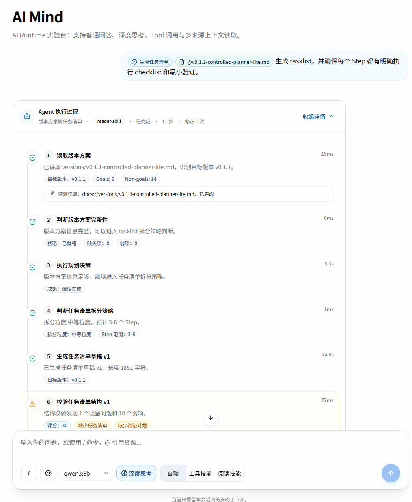
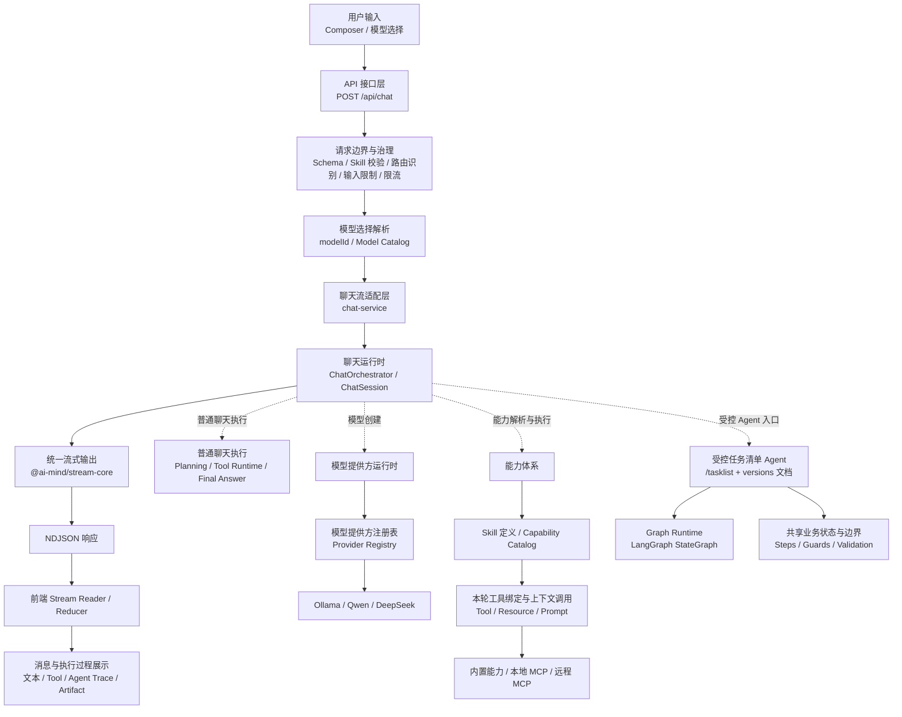

# AI Mind

AI Mind 是一个持续演进的 **AI Native Runtime Skeleton**，用于验证 AI 应用从“单轮聊天”走向“能力接入、流式协议、Skill Runtime、MCP 集成、受控 Agent 与执行过程可视化”的运行时架构。

它不是普通 AI Chat Demo，也不是完整商业化 Agent 平台。它更像一个围绕 **AI Runtime / Capability / Stream / Skill / MCP / Agent** 的开源技术探索项目，重点关注 AI 应用在工程层面如何组织输入、能力、执行过程和流式输出。

当前项目处于 **Runtime Skeleton / MVP** 阶段，适合作为 AI 应用前端、AI Runtime、MCP 接入、结构化流式协议和执行过程可视化的技术探索样例。



> v0.2.4：Tasklist Agent 继续沿 LangGraph 路线收口，生产路径以 GraphState 作为内部运行态事实源；本版不新增 HITL、Resume 或持久化能力。

## 项目解决的问题

AI Mind 关注的不是“再做一个聊天框”，而是聊天框背后的运行时问题：

- AI 应用从简单聊天扩展到 Tool、Resource、Prompt 和 Agent 后，运行时边界如何拆分。
- Tool / Resource / Prompt 等能力如何统一建模，并保持各自执行语义。
- 流式输出中的 `reasoning / tool / resource / prompt / agent-step / artifact / text / error` 等 chunk 如何统一协议。
- Skill Runtime 如何承接不同类型任务，而不是让主链路持续变胖。
- MCP Server 如何接入本地和远程能力。
- 第一个 Agent 如何先做成受控单 Agent，并逐步迁移到可观察的 LangGraph 编排，而不是一上来进入开放式规划系统。
- 前端如何展示 Skill 命中、capability 类型、local / remote 来源、serverId 和执行状态。
- 如何让 AI 应用从“黑盒回答”变成“可观察、可解释、可调试”的执行过程。

## 项目定位与边界

AI Mind 的价值不在于做一个完整 AI 产品，而在于验证 AI 应用从“聊天界面”走向“能力接入、运行时编排、流式协议和可解释执行”的工程结构。

- 它是一个 AI Native Runtime Skeleton，用于验证 AI 应用运行时架构。
- 它关注流式输出、Tool / Resource / Prompt 能力建模、Skill Runtime、MCP 接入、受控 Agent 和执行过程可视化。
- 它适合作为 AI 应用前端、AI Runtime、MCP 接入和流式协议的技术探索项目。
- 它不是普通 AI Chat Demo。
- 它不是完整商业化 Agent 平台。
- 它不是 Dify / LangGraph 的替代品。
- 它当前重点是 Runtime Skeleton / MVP，而不是完整生产级多 Agent 系统。

## 与 LangChain / LangGraph 的关系

AI Mind 不是 LangChain / LangGraph 的替代品，也不试图提供完整生产级 Agent Orchestration 能力。
LangChain 更适合快速构建 LLM 应用、集成模型、工具和 RAG 能力。
LangGraph 更适合构建具备状态、分支、持久化和 Human-in-the-loop 的复杂 Agent / Workflow。

`v0.2.0` 开始，AI Mind 在 `Version Plan to Tasklist Agent` 的编排层接入 LangGraph `StateGraph`。这里的 LangGraph 不是用来开放 Agent 权限，而是把已经受控的执行路径表达成 node、conditional edge 和 state patch summary，让执行过程更显式、更容易观察，也为后续 checkpoint / interrupt / HITL / replay 留出结构入口。

AI Mind 的定位仍然更小：它是一个 AI Native Runtime Skeleton，用来拆解和验证 AI 应用中的运行时边界、结构化流式协议、Tool / Resource / Prompt capability model、Skill Runtime、MCP 接入、受控 Agent 和前端执行过程可视化。

## 快速阅读指南

- 想快速了解项目定位：阅读“项目解决的问题”和“项目定位与边界”。
- 想理解架构：阅读“架构总览”和“核心设计”。
- 想了解版本演进：阅读“版本演进”和 [docs/versions](./docs/versions)。
- 想运行项目：阅读“开发”和“常用验证”。
- 想了解持续输出：阅读“系列博客”。

## 架构总览



- `API 接口层` 是 HTTP 边界，在进入聊天运行时前完成请求解析、Skill 校验、路由识别、模型白名单选择、输入限制和轻量限流。
- `chat-service` 是聊天流适配层，负责创建 NDJSON 流、启动 `ChatOrchestrator`、收口流错误并包装 `Response`，不承载业务编排。
- `ChatOrchestrator / ChatSession` 负责会话构建、执行路径选择、planning、工具执行、上下文注入、受控 Agent 入口和最终回答。
- `Model Catalog` 在 API 边界把稳定 `modelId` 解析为受控模型选择；运行时再通过 `Provider Registry` 创建 Ollama、Qwen 或 DeepSeek 模型实例。
- 能力体系通过 Skill 的 `capabilitySelectors`、Capability Catalog 和本轮绑定结果，分别承接 Tool 调用以及 Resource / Prompt 上下文调用；MCP 是外部能力来源，不直接进入主运行时编排。
- 受控任务清单 Agent 只在 `/tasklist + @docs://versions/*.md` 入口启动。服务端固定进入 Graph Runtime，Graph nodes 复用同一套受控领域状态、Steps、Guards 和 Validation 规则。
- `@ai-mind/stream-core` 统一定义 NDJSON chunk、生命周期、错误和 Artifact 协议；前端消费流并转换为消息、Agent Trace 和 Artifact 展示，后端不直接依赖 React 组件。
- 图中的实线表示请求与响应主链路，虚线表示聊天运行时调用的受控模块，不表示模块之间按顺序串行执行。

## 核心设计

### Runtime Layer

主链路按 `API 接口层 -> chat-service -> ChatOrchestrator / ChatSession -> stream-core -> 前端消费` 分层：

- `route` 负责 HTTP 边界、请求校验、路由与模型选择、输入限制、轻量限流和错误响应。
- `chat-service` 保持为聊天流适配层，只创建流、启动主编排并包装 `Response`。
- `runtime` 负责聊天会话构建、执行路径选择、工具执行、上下文注入、受控 Agent 和最终回答。
- `skills / capabilities / mcp` 作为能力定义、选择边界和外部能力来源，不反向污染入口层。

### Stream Core

`@ai-mind/stream-core` 是从 `apps/webapp` 下沉出来的稳定流式内核。

它负责：

- NDJSON chunk 协议。
- stream lifecycle。
- error chunk。
- text artifact chunk。
- static parts writer。
- text artifact writer。
- web NDJSON writer。

这样做的价值是让流式协议更稳定、可测试、可复用，而不是让每个应用入口都重复维护一套 writer 细节。

### Model Provider Runtime

模型链路分为“请求选择”和“运行时创建”两个阶段：

- API 接口层按 `modelId -> Model Catalog` 完成白名单校验，生成受控的模型选择结果。
- `ChatSession` 按模型选择结果通过 `Provider Registry` 创建对应模型实例。
- Catalog 统一管理稳定模型 ID、Provider 实际模型名和能力声明。
- 前端只选择服务端当前可用的白名单模型，不提交 API Key、base URL 或任意模型名。
- Ollama、Qwen、DeepSeek 的参数和错误差异停留在 Provider 层。
- 普通聊天、Tool Calling 和 tasklist Graph Runtime 共用同一模型创建入口。
- `modelId` 只改变模型来源，不改变 Tool、Skill、MCP 或 Agent 权限。

### Capability Model

Capability Model 用来统一描述 Tool / Resource / Prompt：

- Tool：可执行动作，例如计算、天气查询、文档一致性检查。
- Resource：可读取上下文，例如 `docs://...` 或 remote context。
- Prompt：可复用提示模板，例如本地文档摘要 prompt。

它统一的是“能力描述层”，不是把所有能力强行塞进同一条执行链。Runtime 可以基于 capability 信息理解本轮可用能力、来源位置、local / remote 边界和执行方式。

### Skill Runtime

当前已有两个 Skill：

- `utility-skill`：承接计算、时间、单位转换、文本转换等工具型任务。
- `reader-skill`：承接文档读取、摘要、MCP Resource / Prompt / Tool 等阅读类任务。

`v0.0.12` 后，Skill 不再直接写死 `allowedTools`，而是通过 `capabilitySelectors -> capability catalog -> active tools` 解析本轮可绑定工具。这样可以避免 Skill 维护一套工具名列表，而 Tool Runtime 又维护另一套执行来源。

### Controlled Agent Runtime

`v0.1.0` 后，项目新增第一个受控单 Agent：`Version Plan to Tasklist Agent`。

它只在 `/tasklist + @docs://versions/*.md` 下启动，负责读取用户显式引用的版本方案、生成 tasklist 草稿、调用 `validate_tasklist_structure` 做结构校验，并在必要时最多自动修正一次。

`v0.1.1` 在这条受控链路上增加“一次受控规划决策”：Runtime 先用规则判断 version plan readiness，再让模型在 5 类白名单 action 中做一次有限选择，并通过 `TasklistStrategy` 影响 tasklist draft。

`v0.2.3` 后，这条链路只走 LangGraph `StateGraph`。Graph Runtime 是 `/tasklist + @docs://versions/*.md` 的唯一执行路径；Graph events、memory checkpoint 和脱敏 Graph Debug Summary 仍通过服务端配置独立控制。

`v0.2.4` 继续把内部运行态收口为 GraphState 单一事实源。Graph nodes 直接读取 GraphState 分区并返回 GraphState patch，不再通过旧 AgentState 整包 adapter 往返转换；GraphState reducer 负责合并分区 patch，route 成功路径基于显式业务字段判断。

这个 Agent 不是通用 Agent，也不自动扫描 docs 或写入文件。它的入口、步骤、工具、路由和停止条件都由 Runtime 控制。

### MCP Integration

MCP 在项目里用于验证“能力来源可以来自外部 server”：

- 本地 `stdio` MCP：用于接入 `weather-server` 和 `project-docs-server`。
- remote `Streamable HTTP` MCP：用于接入 `project-assistant-service`。
- `weather-server`：验证 local MCP Tool。
- `project-docs-server`：验证受控 docs Resource 和本地 Prompt。
- `project-assistant-service`：验证 remote Resource / Prompt / Tool 最小闭环。
- remote MCP `check_doc_consistency`：通过标准 Tool Runtime 执行，而不是写死特殊分支。

## 当前阶段与非目标

当前阶段：`Runtime Skeleton / MVP`，当前版本：`v0.2.4`。

已经验证：

- 本地聊天闭环。
- 结构化流式协议。
- Tool Calling。
- Multi-Tool Runtime。
- Skill Runtime。
- MCP Host MVP。
- Capability Model。
- Composer V1。
- Capability-driven Tool Runtime。
- 受控单 Agent。
- Agent Step 流式协议与执行过程可视化。
- 一次受控规划决策。
- Agent Text Artifact 最终产物展示。
- Controlled Agent Graph。
- Graph node / route / state patch 流式摘要。
- AgentTracePanel Graph timeline。
- memory checkpoint（显式配置，主要用于展示和调试）。
- 脱敏 Debug Summary。
- Model Catalog 与 Model Provider Runtime。
- Ollama / Qwen / DeepSeek 白名单模型选择。
- Provider 错误标准化、输入输出限制和 usage 观测。
- 默认开启的 IP / session 轻量限流。
- Containerized production deployment 与 GitHub Actions 交付链路。
- Tasklist Agent Graph Runtime 单路线。
- Tasklist Agent GraphState 单事实源收口。

当前非目标：

- 不是完整商业化 Agent 平台。
- 不是 Dify / LangGraph 替代品。
- 不是完整多 Agent 生产系统。
- 当前重点是验证运行时分层、能力接入、流式协议、受控 Agent 和执行过程可视化。

## 系列博客

- 掘金专栏（持续更新各版本实现与取舍）：
  [AI Mind 系列博客](https://juejin.cn/column/7619152366395195401)

## 项目文档

推荐阅读顺序：

1. [README](./README.md)：快速理解项目定位、核心设计和当前状态。
2. [Docs Overview](./docs)：完整文档入口与推荐阅读顺序。
3. [Architecture](./docs/architecture)：长期架构说明，包括 runtime boundary、stream-core、capability / skill surface、controlled agent runtime。
4. [Versions](./docs/versions)：各版本设计方案。
5. [Releases](./docs/releases)：版本发布说明。
6. [Tasklists](./docs/tasklists)：公开任务清单。

## 当前版本：v0.2.4

这版的主线是 Tasklist Agent Graph 单状态模型收口：在 v0.2.3 已经删除 legacy runner 和 runtime switch 后，让生产 graph nodes 直接以 GraphState 作为内部运行态事实源。

- `/tasklist + @docs://versions/*.md` 仍固定进入 LangGraph `StateGraph`。
- 初始 GraphState 直接由 `runId`、显式 `versionPlanReference` 和 runtime config 创建。
- Graph nodes 不再依赖 `toVersionPlanTasklistAgentState()` 执行业务逻辑。
- Graph nodes 不再依赖 `createGraphStateUpdateFromAgentState()` 返回 patch。
- 旧 `VersionPlanTasklistAgentState` 类型和旧状态机 API 已移除。
- 领域状态机继续保留 guard 规则，并只提供 GraphState patch apply 语义。
- GraphState reducer 合并分区 patch，route 成功路径基于显式业务字段判断。
- graph tests 直接断言 GraphState、node patch 和显式 route 字段。
- stream chunk、tasklist artifact、AgentTracePanel 和 Graph Debug Summary 保持兼容。

v0.2.4 不实现 HITL、LangGraph `interrupt()`、Resume API、Run History、AgentRun 数据库存储、新 Agent 类型或自由 tool calling。

详细设计见 [v0.2.4 版本说明](./docs/versions/v0.2.4-tasklist-agent-graph-single-state-model.md)。

## 当前能力

### Chat Runtime

- `LangChain.js + Model Provider Runtime（Ollama / DeepSeek / Qwen）`
- NDJSON 流式协议。
- `reasoning / tool / resource / prompt / agent-step / agent-graph-* / artifact / text / error` 多段式消息流。
- Skill 命中与 Prompt 执行事实展示。
- 统一 `error` chunk 语义。
- `authoritative answer`：在单工具确定性结果场景下支持工具结果直出，减少模型二次改写带来的偏差。
- 最近 `N=8` 轮上下文。
- Capability-driven Tool Runtime。
- Composer payload hint 消费。
- Runtime-controlled Agent path。
- Tasklist Agent Graph Runtime 单一路线。

### Model Provider Runtime

- 服务端 Model Catalog 与 `provider/model-key` 稳定模型 ID。
- Ollama / Qwen / DeepSeek Provider。
- `GET /api/ai/models` 公开白名单模型列表。
- 前端“线上模型 / 本地模型”分组选择器。
- Provider 错误标准化与脱敏日志。
- 输入字符、输出 token、timeout 和默认限流边界。
- usage / token best-effort 观测。

### Skills

- `utility-skill`：承接计算、时间、单位转换、文本转换等工具型任务。
- `reader-skill`：承接文档读取、摘要、MCP Resource / Prompt / Tool 等阅读类任务。

### Tools

- `calculator`
- `datetime`
- `text-transform`
- `unit-convert`
- `city-weather`
- `validate_tasklist_structure`
- remote MCP `check_doc_consistency`

### MCP Host MVP

- `@modelcontextprotocol/sdk`
- 本地 `stdio` MCP Host。
- remote `Streamable HTTP` MCP Host。
- `weather-server`
- `project-docs-server`
- `project-assistant-service`
- MCP Tool / MCP Resource adapter。
- MCP Prompt adapter。

### Composer V1

- Tiptap 增强输入框。
- `/summary`、`/tasklist`、`/check` inline command chip。
- `@docs://...` 与 `@project://latest-context` inline resource chip。
- Enter 发送、Shift + Enter 换行、中文 IME 防误发。
- `plainText + composer.command + composer.references` 兼容提交。


### Agent Runtime

- `Version Plan to Tasklist Agent`
- 入口：`/tasklist + @docs://versions/*.md`
- v0.2.3 后 `/tasklist + @docs://versions/*.md` 固定走 Graph Runtime。
- LangGraph `StateGraph` 是 Tasklist Agent 的唯一编排层。
- LangGraph `StateGraph` 只替换编排层。
- v0.2.4 后生产路径以 GraphState 作为内部运行态事实源。
- GraphState 按 `input / source / planning / tasklist / execution / output / graph` 分区保存本轮运行态。
- 一次 Planning Decision，只允许 5 类白名单 action。
- `read_optional_context` 最多读取一个白名单上下文。
- `TasklistStrategy` 影响 draft 的 Step 数量、拆分粒度、分组和优先级。
- `tasklistDraft v1 -> v2` 最多自动修正一次。
- `WarningDisposition` 区分自动修正和人工复核点。
- `RevisionEffectResult` 评估 v1 -> v2 修正效果。
- `PlanningDecisionAction` conditional edge。
- `WarningDisposition` conditional edge。
- `validate_tasklist_structure` 作为结构质量门。
- Graph Runtime 复用受控领域 step operation 和状态机 guard。
- Graph node / route / state patch summary 通过受控 stream chunk 展示。
- memory checkpoint 由显式配置控制，可用于展示和调试，但不表示持久化、Resume 或产品级恢复能力。
- Debug Summary 只展示脱敏白名单字段。
- `AgentTracePanel` 展示 readiness、decision、strategy、warning disposition、revision effect、graph timeline 和折叠 Debug 摘要。
- `AgentTextArtifactPanel` 展示最终 tasklist Markdown 正文。
- 不自动扫描 docs，不写入 docs 文件，不提供前端 runtime switch，不做运行中 fallback。

### 工程化边界

- `route -> chat-service facade -> runtime -> skills / tools / mcp`
- `@ai-mind/stream-core` / `packages/stream-core` 负责稳定流式内核。
- `version-plan-tasklist-agent` 负责受控 tasklist Agent 主路径。
- `apps/webapp/tests/**` 为唯一 webapp 自动化测试目录。
- `packages/stream-core/tests/**` 为 package 测试目录。

## 当前结构

### Webapp

- `apps/webapp/app/api/chat/route.ts`
    - HTTP 边界与错误映射。
- `apps/webapp/lib/ai/chat-service.ts`
    - 薄 facade，负责创建内部流、构造中间 `StreamResult` 并包装 `Response`。
- `apps/webapp/lib/ai/runtime/`
    - 正式聊天运行时编排层。
- `apps/webapp/lib/ai/model-provider/`
    - Model Catalog、Provider Registry、模型创建、错误标准化、usage 与输入输出边界。
- `apps/webapp/lib/ai/rate-limit/`
    - IP / session 轻量限流配置和单进程 Memory Store。
- `apps/webapp/lib/ai/runtime/version-plan-tasklist-agent/`
    - 受控单 Agent，负责从版本方案生成 tasklist 草稿；当前只保留 Graph Runtime、共享 step operation、GraphState 和 graph-only runtime config。
- `apps/webapp/lib/ai/runtime/version-plan-tasklist-agent/graph/`
    - LangGraph `StateGraph`、graph nodes、route、GraphState、graph events 和 Debug Summary。
- `apps/webapp/components/chat/message-list/parts/agent-trace-panel.tsx`
    - Agent 执行过程展示面板，支持 graph timeline 和折叠 Debug。
- `apps/webapp/components/chat/message-list/parts/agent-text-artifact-panel.tsx`
    - Agent 最终文本产物展示面板。
- `apps/project-assistant-service/`
    - NestJS remote MCP 服务，当前用于验证单 server 最小闭环。
- `apps/webapp/tests/`
    - Webapp 自动化测试。

### Stream Core Package

- `packages/stream-core/src/protocol/`
    - `ChatStreamChunk` 与错误协议类型。
- `packages/stream-core/src/core/`
    - lifecycle、error helper、static part writer、text artifact writer。
- `packages/stream-core/src/adapters/web/`
    - NDJSON writer。
- `packages/stream-core/tests/`
    - package 单测。

## 关键代码入口

如果想从代码层面理解项目，可以优先看下面几个入口：

| Area                   | Path                                                                                                               | What to Look For                                                                               |
| ---------------------- | ------------------------------------------------------------------------------------------------------------------ | ---------------------------------------------------------------------------------------------- |
| Runtime 主编排         | [apps/webapp/lib/ai/runtime](./apps/webapp/lib/ai/runtime)                                                         | 聊天 session、planning、tool execution、Agent stage、final answer 和错误收口                   |
| Model Provider Runtime | [apps/webapp/lib/ai/model-provider](./apps/webapp/lib/ai/model-provider)                                           | Model Catalog、Provider Registry、模型创建、错误标准化和 usage 观测                            |
| Agent Runtime          | [apps/webapp/lib/ai/runtime/version-plan-tasklist-agent](./apps/webapp/lib/ai/runtime/version-plan-tasklist-agent) | 受控单 Agent、Graph Runtime、StateGraph、状态机、step operation、final answer 和 artifact 输出 |
| Stream Core            | [packages/stream-core/src](./packages/stream-core/src)                                                             | NDJSON chunk 协议、stream lifecycle、error chunk、agent-step、artifact 和 writer               |
| Capability Model       | [apps/webapp/lib/ai/capabilities](./apps/webapp/lib/ai/capabilities)                                               | capability catalog、selector 解析和 active tool binding                                        |
| Composer V1            | [apps/webapp/components/chat/composer](./apps/webapp/components/chat/composer)                                     | Tiptap 输入层、command chip、resource chip、模型选择器、菜单和序列化                           |
| MCP Integration        | [apps/webapp/lib/ai/mcp](./apps/webapp/lib/ai/mcp)                                                                 | MCP client、server registry、transport、Tool / Resource / Prompt adapter                       |

## v0.1.x / v0.2.x 的关键判断

这组受控 Agent 版本有几个重要原则：

1. 第一个 Agent 先做受控单 Agent，不做通用 Agent。
2. Agent 必须基于用户显式引用的 `docs://versions/*.md`，不自动扫描 docs。
3. Agent 通过 text artifact 展示最终 tasklist 草稿，并用普通 text 输出校验摘要，但不自动写入文件。
4. `v0.1.1` 只开放一次 action 选择，不开放资源权限、工具权限、写入权限和循环权限。
5. `v0.2.0` 只把这条受控链路迁移到 LangGraph `StateGraph`，不扩大 Agent 权限。
6. `v0.2.1` 只改变模型来源和 Provider 治理，不改变 Agent 权限、资源白名单或工具边界。
7. `v0.2.3` 和 `v0.2.4` 只做 Graph Runtime 与 GraphState 收口，不新增 Agent 能力。

因此：

- `/tasklist` 只有配合 `@docs://versions/*.md` 才进入 Agent。
- `validate_tasklist_structure` 只做结构校验，不判断内容质量是否完美。
- `tasklistDraft` 只存在本轮 GraphState 内存中。
- `PlanningDecisionAction` 必须通过 schema 和状态机约束。
- `PlanningDecisionAction` 和 `WarningDisposition` 可以成为 graph route，但 route 不绕过 Runtime guard。
- Agent Step 通过流式协议展示，但不变成完整调试台。
- Graph events 只展示 node、route 和脱敏 patch summary，不透传 LangGraph 原始 debug stream。
- Agent Text Artifact 只做最终产物展示，不做持久化、编辑、下载或 diff。

## 快速开始前置条件

本项目支持本地 Ollama 和服务端配置的 DeepSeek / Qwen，启动前建议准备：

- Node.js：建议 `20+`。
- pnpm：项目声明为 `pnpm@10.18.3`。
- Ollama：使用本地模型时安装；默认模型为 `qwen3:8b`，本机资源有限时可选择 `qwen3:4b`。
- DeepSeek / Qwen：使用云模型时，由开发者在对应平台自行创建 API Key，并仅配置在服务端环境中。
- remote MCP 验证：如果要测试 `project://latest-context` 或 remote Tool，需要同时启动 `project-assistant-service`。

常用模型准备示例：

```bash
ollama pull qwen3:8b
```

## 开发

安装依赖：

```bash
pnpm install
```

启动开发环境：

```bash
pnpm dev
```

这个命令会同时：

- 启动 `packages/*` 的 `build:watch`。
- 启动 `apps/webapp`。

如果需要验证 remote MCP 服务，请在另一个终端启动：

```bash
pnpm dev:pas
```

如果只想单独启动 webapp，可以使用：

```bash
pnpm dev:webapp
```

如果只想单独开启 workspace 包 watch，可以使用：

```bash
pnpm build:watch
```

### 模型 Provider 配置

模型选择由服务端 Model Catalog 和环境变量共同决定。前端只提交 `modelId`，不会接收 API Key、base URL、底层模型名或完整 Provider 配置。完整配置模板见 [apps/webapp/.env.example](./apps/webapp/.env.example)。

本地使用 Ollama：

```env
AI_MIND_DEFAULT_MODEL_ID=ollama/qwen3-8b
AI_MIND_ALLOWED_PROVIDERS=ollama
AI_MIND_OLLAMA_BASE_URL=http://127.0.0.1:11434
```

Ollama 的底层模型名由服务端 Catalog 管理，不提供 `AI_MIND_OLLAMA_MODEL`。首次运行前请先拉取对应模型，例如 `ollama pull qwen3:8b`。

本地开发也可以使用 DeepSeek 或 Qwen。推荐把真实 Key 放在操作系统用户环境变量、部署平台 Secret 或其他工作区外的密钥存储中，修改后重启终端和开发服务：

```env
AI_MIND_DEFAULT_MODEL_ID=qwen/qwen3.6-flash
AI_MIND_ALLOWED_PROVIDERS=qwen,deepseek
AI_MIND_QWEN_API_KEY=xxx
AI_MIND_DEEPSEEK_API_KEY=xxx
```

线上部署只启用实际使用的云 Provider，并把默认模型设为同一白名单内的模型。当前 production Catalog 不展示本地 Ollama 模型；DeepSeek / Qwen Key 必须通过部署平台的服务端 Secret 注入。AI Mind 不托管、不创建、不展示第三方平台 API Key，也不会把 Key 放入前端 DTO、stream chunk 或调试信息。

系统默认按 IP 和 session 开启每日限流；本地调试如确有需要，可显式设置 `AI_MIND_RATE_LIMIT_ENABLED=off` 暂时关闭：

```env
AI_MIND_RATE_LIMIT_ENABLED=on
AI_MIND_CHAT_DAILY_LIMIT_PER_IP=200
AI_MIND_CHAT_DAILY_LIMIT_PER_SESSION=100
AI_MIND_TASKLIST_DAILY_LIMIT_PER_IP=50
AI_MIND_TASKLIST_DAILY_LIMIT_PER_SESSION=20
```

当前限流状态只保存在单个 Node.js 进程内存中，服务重启后会清空，也不能在多实例之间共享。多实例公开访问需要接入 Redis / KV 等集中式存储；这不属于 v0.2.1 的实现范围。

## 可以试试这些问题

启动项目后，可以从下面几类问题开始验证当前能力：

- `现在广州天气怎么样？`
- 选择 `/summary`，引用 `@docs://README.md`，输入：`帮我总结这份项目文档`
- 选择 `/tasklist`，引用 `@docs://versions/v0.2.0-controlled-agent-graph.md`，输入：`基于这个版本方案生成 tasklist 草稿`
- 选择 `@project://latest-context`，输入：`帮我概括当前项目上下文`

其中 `/tasklist` 只有配合 `@docs://versions/*.md` 才进入受控 Agent；`/check` 当前主要作为任务意图 hint，不等同于立即执行 remote Tool。

## 常用验证

### Webapp

```bash
pnpm --dir apps/webapp test
pnpm --dir apps/webapp typecheck
pnpm --dir apps/webapp build
```

### Project Assistant Service

```bash
pnpm dev:pas
pnpm typecheck:pas
pnpm build:pas
```

### Stream Core

```bash
pnpm --filter @ai-mind/stream-core test
pnpm --filter @ai-mind/stream-core typecheck
pnpm --filter @ai-mind/stream-core build
```

### Lint

```bash
pnpm lint
pnpm lint:webapp:fix
pnpm lint:packages:fix
```

## 版本演进

AI Mind 采用小版本渐进式演进，每个版本只解决一个明确的运行时问题。

| Version | Theme                                              | Key Changes                                                                                                                        |
| ------- | -------------------------------------------------- | ---------------------------------------------------------------------------------------------------------------------------------- |
| v0.0.4  | 本地聊天闭环                                       | 完成本地聊天、流式输出与 Streamdown 展示                                                                                           |
| v0.0.5  | Tool Calling MVP                                   | 接入最小 Tool Calling 能力                                                                                                         |
| v0.0.6  | Multi-Tool Runtime                                 | 支持多工具运行时与工具结果回传                                                                                                     |
| v0.0.7  | Skill Runtime                                      | 引入第一层 Skill Runtime，完成 `utility-skill`                                                                                     |
| v0.0.8  | Reader Skill                                       | 新增 `reader-skill`，支持文件读取与阅读类能力                                                                                      |
| v0.0.9  | MCP Host MVP                                       | 接入本地 stdio MCP，验证 MCP Tool / Resource                                                                                       |
| v0.0.10 | Runtime Refactor + Stream Core                     | 收口 chat-service 主链，抽离 `@ai-mind/stream-core`                                                                                |
| v0.0.11 | Capability Model + Remote MCP                      | 建立 capability model / skill metadata，接入 remote MCP 单服务闭环                                                                 |
| v0.0.12 | Docs Resource + Composer + Capability Tool Runtime | 收紧 docs resource 边界，接入 Tiptap Composer V1，并用 capability selectors 驱动 Tool Runtime                                      |
| v0.1.0  | Controlled Tasklist Agent                          | 引入受控单 Agent，基于显式 version plan 生成 tasklist 草稿并进行结构校验                                                           |
| v0.1.1  | 一次受控规划决策                                   | 在受控 Agent 内增加一次白名单 Planning Decision、策略生成、warning 分流、修正效果评估和最终产物 Artifact 展示                      |
| v0.2.0  | Controlled Agent Graph                             | 将受控 Tasklist Agent 编排层迁移到 LangGraph StateGraph，新增 graph events、Trace timeline、开发态 checkpoint 和脱敏 Debug Summary |
| v0.2.1  | Online Demo & Model Provider Runtime               | 建立 Model Catalog 与 Ollama / Qwen / DeepSeek Provider Runtime，新增白名单模型选择、错误收口、限流和 usage 观测                   |
| v0.2.2  | Containerized Deployment & GitHub Actions Delivery | 完成容器化部署、生产环境配置和 GitHub Actions 交付链路                                                                             |
| v0.2.3  | Tasklist Agent Graph Runtime Consolidation         | 删除 legacy runner 与 runtime switch，`/tasklist` 固定走 Graph Runtime                                                             |
| v0.2.4  | Tasklist Agent Graph Single State Model            | GraphState 成为 Tasklist Agent 内部运行态事实源，旧 AgentState API 退出，graph nodes 返回合并式 GraphState patch                   |

完整版本设计、发布记录和任务清单见 [docs](./docs)。

## Roadmap

- [x] 本地聊天闭环
- [x] Tool Calling
- [x] Multi-Tool Runtime
- [x] 第一层 Skill Runtime
- [x] `reader-skill`
- [x] MCP Host MVP
- [x] Chat Runtime 收口
- [x] Stream Core package 化
- [x] Capability Model + Skill Metadata
- [x] Local / Remote MCP Resource / Prompt / Tool 最小闭环
- [x] Composer V1（Tiptap 输入层 + `/` command + `@` resource）
- [x] Capability-driven Tool Runtime 收口
- [x] 受控单 Agent Preview
- [x] 一次受控规划决策
- [x] Agent Text Artifact 最终产物展示
- [x] Controlled Agent Graph（LangGraph StateGraph）
- [x] Graph events / AgentTracePanel timeline
- [x] Graph checkpoint / Debug Summary
- [x] Model Catalog / Multi-Provider Runtime
- [x] 服务端白名单模型选择器
- [x] Provider 错误标准化 / 默认轻量限流 / usage 观测
- [x] Containerized production deployment
- [x] Tasklist Agent Graph Runtime 单路线
- [x] Tasklist Agent GraphState 单事实源收口
- [ ] Redis / KV 分布式限流
- [ ] 持久化 UsageLog 与成本观测
- [ ] Agent Trace 持久化
- [ ] tasklist 草稿保存与人工确认流
- [ ] 持久化与数据层

## Design Notes / 设计说明

### 为什么要抽离 stream-core？

流式输出是 AI 应用的稳定内核之一。如果协议、生命周期、错误事件和 writer 都散落在应用入口里，后续每次调整 runtime 都容易影响前端消费语义。抽离 `@ai-mind/stream-core` 后，流式协议可以独立测试、独立构建，也更容易被其他 app 或模块复用。

### 为什么要建立 capability model？

当系统只有 Tool Calling 时，一个工具列表还能撑住。但接入 Resource、Prompt、local MCP、remote MCP 后，能力需要先被描述清楚：它是什么类型、来自哪里、能被哪个 Skill 消费、执行边界是什么。Capability Model 解决的是能力描述和选择问题，不是把所有能力统一成同一种执行方式。

### 为什么要从 allowedTools 转向 capability selectors？

`allowedTools` 只适合早期 Skill 直接声明工具名。随着能力来源变多，同一个模型可见工具名可能对应不同 capability，Tool 绑定、校验和执行容易变成双轨。`capabilitySelectors` 可以先从 catalog 中解析本轮 active tools，再统一用于模型绑定、tool call 校验和执行。

### 为什么要接入 MCP？

MCP 用来验证外部能力来源如何进入 AI Runtime。项目同时保留本地 `stdio` MCP 和 remote `Streamable HTTP` MCP，是为了分别验证本地工具/资源/Prompt，以及远程能力的最小闭环，而不是把系统提前做成完整平台。

### 为什么要展示执行过程？

AI 应用如果只展示最终答案，运行时行为会很黑盒。当前前端会展示 Skill 命中、capability 类型、local / remote 来源、serverId、执行状态、Agent step、最终文本产物和错误信息，让调试、回归和能力验证更清楚。

### 为什么第一个 Agent 做成受控 Tasklist Agent？

第一个 Agent 如果直接做通用规划，很容易把资源读取、工具权限、停止条件和前端展示都变成黑盒。`v0.1.0` 选择从 `Version Plan to Tasklist Agent` 开始，是因为它输入明确、输出明确、可以通过结构质量门校验，并且不会自动写文件。

`v0.1.1` 在这个基础上只增加一次有限 Planning Decision。模型能选择下一步，但不能自由读取资源、调用工具、写文件或循环执行。

### 为什么 v0.2.0 接入 LangGraph？

`v0.2.0` 接入 LangGraph，不是为了让 Agent 更自由，而是为了把已经受控的执行路径表达得更清楚。

手写 runner 适合早期快速验证，但随着 readiness、decision、optional context、validation、revision、final artifact 等步骤变多，分支会越来越依赖 if / else。`StateGraph` 可以把这些步骤整理成命名 node，把 `PlanningDecisionAction` 和 `WarningDisposition` 整理成 conditional edge，并通过 state patch summary 给前端展示更稳定的执行轨迹。

AI Mind 没有直接透传 LangGraph 原始 debug stream，而是定义自己的 graph chunk。这样可以继续保护 prompt、version plan、optional context、draft 和 tool raw output 不被前端暴露。

### 当前为什么不直接做完整 Agent / Workflow？

当前已经完成受控单 Agent Preview、一次受控规划决策和 Controlled Agent Graph，但它仍然不是完整 Agent / Workflow 平台。项目会继续先把 Runtime 边界、Agent Trace、工具作用域、graph runtime 稳定性和人工确认流做稳，再评估更开放的规划执行、多 Agent 或持久化能力。

## Star

如果你也在学习 AI 应用前端、Tool Calling、MCP、Skill Runtime 或 Agent Runtime，可以点个 Star 关注这个项目。

AI Mind 会继续按版本迭代，每一版都会尽量配套源码、设计文档、tasklist、release 和复盘文章，方便持续跟进运行时架构如何一步步长出来。

## License

MIT
