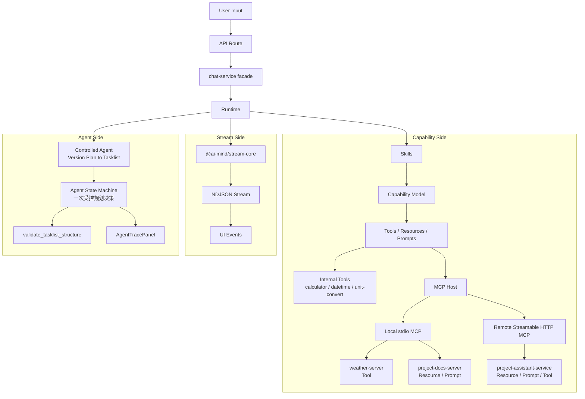

# AI Mind

AI Mind 是一个持续演进的 **AI Native Runtime Skeleton**，用于验证 AI 应用从“单轮聊天”走向“能力接入、流式协议、Skill Runtime、MCP 集成、受控 Agent 与执行过程可视化”的运行时架构。

它不是普通 AI Chat Demo，也不是完整商业化 Agent 平台。它更像一个围绕 **AI Runtime / Capability / Stream / Skill / MCP / Agent** 的开源技术探索项目，重点关注 AI 应用在工程层面如何组织输入、能力、执行过程和流式输出。

当前项目处于 **Runtime Skeleton / MVP** 阶段，适合作为 AI 应用前端、AI Runtime、MCP 接入、结构化流式协议和执行过程可视化的技术探索样例。


> v0.1.x：通过 `/tasklist + @docs://versions/*.md` 触发受控 Tasklist Agent。`v0.1.1` 在固定链路上增加一次 Planning Decision，并用 Agent Text Artifact 展示最终 tasklist 产物。

## 项目解决的问题

AI Mind 关注的不是“再做一个聊天框”，而是聊天框背后的运行时问题：

- AI 应用从简单聊天扩展到 Tool、Resource、Prompt 和 Agent 后，运行时边界如何拆分。
- Tool / Resource / Prompt 等能力如何统一建模，并保持各自执行语义。
- 流式输出中的 `reasoning / tool / resource / prompt / agent-step / artifact / text / error` 等 chunk 如何统一协议。
- Skill Runtime 如何承接不同类型任务，而不是让主链路持续变胖。
- MCP Server 如何接入本地和远程能力。
- 第一个 Agent 如何先做成受控单 Agent，而不是一上来进入开放式规划系统。
- 前端如何展示 Skill 命中、capability 类型、local / remote 来源、serverId 和执行状态。
- 如何让 AI 应用从“黑盒回答”变成“可观察、可解释、可调试”的执行过程。

## 项目定位与边界

AI Mind 的价值不在于做一个完整 AI 产品，而在于验证 AI 应用从“聊天界面”走向“能力接入、运行时编排、流式协议和可解释执行”的工程结构。

- 它是一个 AI Native Runtime Skeleton，用于验证 AI 应用运行时架构。
- 它关注流式输出、Tool / Resource / Prompt 能力建模、Skill Runtime、MCP 接入、受控 Agent 和执行过程可视化。
- 它适合作为 AI 应用前端、AI Runtime、MCP 接入和流式协议的技术探索项目。
- 它不是普通 AI Chat Demo。
- 它不是完整商业化 Agent 平台。
- 它不是 Dify / LangGraph 的替代品。
- 它当前重点是 Runtime Skeleton / MVP，而不是完整生产级多 Agent 系统。

## 与 LangChain / LangGraph 的关系

AI Mind 不是 LangChain / LangGraph 的替代品，也不试图提供完整生产级 Agent Orchestration 能力。
LangChain 更适合快速构建 LLM 应用、集成模型、工具和 RAG 能力。
LangGraph 更适合构建具备状态、分支、持久化和 Human-in-the-loop 的复杂 Agent / Workflow。
AI Mind 的定位更小：它是一个 AI Native Runtime Skeleton，用来拆解和验证 AI 应用中的运行时边界、结构化流式协议、Tool / Resource / Prompt capability model、Skill Runtime、MCP 接入和前端执行过程可视化。
因此，AI Mind 更关注“AI 应用运行时如何被前端产品化表达”，而不是替代成熟框架。

## 快速阅读指南

- 想快速了解项目定位：阅读“项目解决的问题”和“项目定位与边界”。
- 想理解架构：阅读“架构总览”和“核心设计”。
- 想了解版本演进：阅读“版本演进”和 [docs/versions](./docs/versions)。
- 想运行项目：阅读“开发”和“常用验证”。
- 想了解持续输出：阅读“系列博客”。

## 架构总览



- `API Route` 是 HTTP 边界，负责请求入口、响应包装和错误映射。
- `chat-service facade` 是薄 facade，负责创建内部流、组装运行时依赖，并返回 `Response`。
- `Runtime` 是聊天主链路编排层，负责 session、planning、tool execution、controlled agent path、final answer、context 注入和错误收口。
- `@ai-mind/stream-core` 承接稳定流式内核，负责 NDJSON chunk、生命周期、错误事件、Agent text artifact 和 writer。
- `Skills` 用于承接稳定任务模式，例如 `utility-skill` 和 `reader-skill`。
- `Capability Model` 统一描述 Tool / Resource / Prompt 的能力表面、来源和选择边界。
- MCP Host 同时接入本地 `stdio` server 和 remote `Streamable HTTP` server；当前包含 `weather-server`、`project-docs-server` 和 `project-assistant-service`。
- `Controlled Agent` 当前用于 `/tasklist + @docs://versions/*.md`，在受控边界内完成一次 Planning Decision，生成 tasklist 草稿并通过结构质量门校验。
- 前端通过流式 part 展示文本、工具、资源、Prompt、Skill 命中、Agent step、Agent text artifact 和执行状态。

## 核心设计

### Runtime Layer

主链路按 `route -> chat-service facade -> runtime -> skills / tools / mcp` 分层：

- `route` 只处理 HTTP 边界、请求解析和错误响应。
- `chat-service` 保持薄 facade，不承载复杂业务编排。
- `runtime` 负责聊天会话构建、阶段编排、工具执行、上下文注入、最终回答和错误收口。
- `skills / tools / mcp` 作为能力组织和能力来源，不反向污染入口层。

### Stream Core

`@ai-mind/stream-core` 是从 `apps/webapp` 下沉出来的稳定流式内核。

它负责：

- NDJSON chunk 协议。
- stream lifecycle。
- error chunk。
- text artifact chunk。
- static parts writer。
- text artifact writer。
- web NDJSON writer。

这样做的价值是让流式协议更稳定、可测试、可复用，而不是让每个应用入口都重复维护一套 writer 细节。

### Capability Model

Capability Model 用来统一描述 Tool / Resource / Prompt：

- Tool：可执行动作，例如计算、天气查询、文档一致性检查。
- Resource：可读取上下文，例如 `docs://...` 或 remote context。
- Prompt：可复用提示模板，例如本地文档摘要 prompt。

它统一的是“能力描述层”，不是把所有能力强行塞进同一条执行链。Runtime 可以基于 capability 信息理解本轮可用能力、来源位置、local / remote 边界和执行方式。

### Skill Runtime

当前已有两个 Skill：

- `utility-skill`：承接计算、时间、单位转换、文本转换等工具型任务。
- `reader-skill`：承接文档读取、摘要、MCP Resource / Prompt / Tool 等阅读类任务。

`v0.0.12` 后，Skill 不再直接写死 `allowedTools`，而是通过 `capabilitySelectors -> capability catalog -> active tools` 解析本轮可绑定工具。这样可以避免 Skill 维护一套工具名列表，而 Tool Runtime 又维护另一套执行来源。

### Controlled Agent Runtime

`v0.1.0` 后，项目新增第一个受控单 Agent：`Version Plan to Tasklist Agent`。

它只在 `/tasklist + @docs://versions/*.md` 下启动，负责读取用户显式引用的版本方案、生成 tasklist 草稿、调用 `validate_tasklist_structure` 做结构校验，并在必要时最多自动修正一次。

`v0.1.1` 在这条受控链路上增加“一次受控规划决策”：Runtime 先用规则判断 version plan readiness，再让模型在 5 类白名单 action 中做一次有限选择，并通过 `TasklistStrategy` 影响 tasklist draft。

这个 Agent 不是通用 Agent，也不自动扫描 docs 或写入文件。它的入口、步骤、工具和停止条件都由 Runtime 控制。

### MCP Integration

MCP 在项目里用于验证“能力来源可以来自外部 server”：

- 本地 `stdio` MCP：用于接入 `weather-server` 和 `project-docs-server`。
- remote `Streamable HTTP` MCP：用于接入 `project-assistant-service`。
- `weather-server`：验证 local MCP Tool。
- `project-docs-server`：验证受控 docs Resource 和本地 Prompt。
- `project-assistant-service`：验证 remote Resource / Prompt / Tool 最小闭环。
- remote MCP `check_doc_consistency`：通过标准 Tool Runtime 执行，而不是写死特殊分支。

## 当前阶段与非目标

当前阶段：`Runtime Skeleton / MVP`，当前版本：`v0.1.1`。

已经验证：

- 本地聊天闭环。
- 结构化流式协议。
- Tool Calling。
- Multi-Tool Runtime。
- Skill Runtime。
- MCP Host MVP。
- Capability Model。
- Composer V1。
- Capability-driven Tool Runtime。
- 受控单 Agent。
- Agent Step 流式协议与执行过程可视化。
- 一次受控规划决策。
- Agent Text Artifact 最终产物展示。

当前非目标：

- 不是完整商业化 Agent 平台。
- 不是 Dify / LangGraph 替代品。
- 不是完整多 Agent 生产系统。
- 当前重点是验证运行时分层、能力接入、流式协议、受控 Agent 和执行过程可视化。

## 系列博客

- 掘金专栏（持续更新各版本实现与取舍）：
  [AI Mind 系列博客](https://juejin.cn/column/7619152366395195401)

## 项目文档

推荐阅读顺序：

1. [README](./README.md)：快速理解项目定位、核心设计和当前状态。
2. [Docs Overview](./docs)：完整文档入口与推荐阅读顺序。
3. [Architecture](./docs/architecture)：长期架构说明，包括 runtime boundary、stream-core、capability / skill surface、controlled agent runtime。
4. [Versions](./docs/versions)：各版本设计方案。
5. [Releases](./docs/releases)：版本发布说明。
6. [Tasklists](./docs/tasklists)：公开任务清单。

## 当前版本：v0.1.1

这版的主线是给 `Version Plan to Tasklist Agent` 增加“一次受控规划决策”。

它不是通用 Agent，也不是让模型自由规划再执行的开放式 Agent，而是只承接一条明确路径：

- 用户通过 Composer 选择 `/tasklist`。
- 用户显式引用 `docs://versions/*.md` 版本方案。
- Runtime 读取版本方案并用规则判断方案完整性。
- 模型只能在 Runtime 白名单 action 中做一次 Planning Decision。
- 如需补充上下文，最多读取 1 个白名单 optional context。
- Runtime 基于 `TasklistStrategy` 生成 tasklist 草稿。
- `validate_tasklist_structure` 执行确定性结构校验。
- warning 会分流为自动修正或人工复核点。
- 如存在可自动修正的结构问题，最多自动修正一次，并评估 v1 -> v2 修正效果。
- 最终 tasklist 正文通过 Agent Text Artifact 展示；普通 final answer text 只输出结构校验结论、修正效果和人工复核点摘要。

本版不写入 `docs/tasklists/*`，不读取历史 tasklist，不自动扫描 `docs/versions/*`，也不持久化 AgentState 或 artifact。

更多 UI 演示可查看 [assets/screenshots](./assets/screenshots)。

## 当前能力

### Chat Runtime

- `LangChain.js + Ollama`
- NDJSON 流式协议。
- `reasoning / tool / resource / prompt / agent-step / artifact / text / error` 多段式消息流。
- Skill 命中与 Prompt 执行事实展示。
- 统一 `error` chunk 语义。
- `authoritative answer`：在单工具确定性结果场景下支持工具结果直出，减少模型二次改写带来的偏差。
- 最近 `N=8` 轮上下文。
- Capability-driven Tool Runtime。
- Composer payload hint 消费。
- Runtime-controlled Agent path。

### Skills

- `utility-skill`：承接计算、时间、单位转换、文本转换等工具型任务。
- `reader-skill`：承接文档读取、摘要、MCP Resource / Prompt / Tool 等阅读类任务。

### Tools

- `calculator`
- `datetime`
- `text-transform`
- `unit-convert`
- `city-weather`
- `validate_tasklist_structure`
- remote MCP `check_doc_consistency`

### MCP Host MVP

- `@modelcontextprotocol/sdk`
- 本地 `stdio` MCP Host。
- remote `Streamable HTTP` MCP Host。
- `weather-server`
- `project-docs-server`
- `project-assistant-service`
- MCP Tool / MCP Resource adapter。
- MCP Prompt adapter。

### Composer V1

- Tiptap 增强输入框。
- `/summary`、`/tasklist`、`/check` inline command chip。
- `@docs://...` 与 `@project://latest-context` inline resource chip。
- Enter 发送、Shift + Enter 换行、中文 IME 防误发。
- `plainText + composer.command + composer.references` 兼容提交。


### Agent Runtime

- `Version Plan to Tasklist Agent`
- 入口：`/tasklist + @docs://versions/*.md`
- `AgentState` 只保存本轮草稿、planner artifact、校验结果和修正次数。
- 一次 Planning Decision，只允许 5 类白名单 action。
- `read_optional_context` 最多读取一个白名单上下文。
- `TasklistStrategy` 影响 draft 的 Step 数量、拆分粒度、分组和优先级。
- `tasklistDraft v1 -> v2` 最多自动修正一次。
- `WarningDisposition` 区分自动修正和人工复核点。
- `RevisionEffectResult` 评估 v1 -> v2 修正效果。
- `validate_tasklist_structure` 作为结构质量门。
- `AgentTracePanel` 展示 readiness、decision、strategy、warning disposition、revision effect 等轻量摘要。
- `AgentTextArtifactPanel` 展示最终 tasklist Markdown 正文。
- 不自动扫描 docs，不写入 tasklist 文件。

### 工程化边界

- `route -> chat-service facade -> runtime -> skills / tools / mcp`
- `@ai-mind/stream-core` / `packages/stream-core` 负责稳定流式内核。
- `version-plan-tasklist-agent` 负责受控 tasklist Agent 主路径。
- `apps/webapp/tests/**` 为唯一 webapp 自动化测试目录。
- `packages/stream-core/tests/**` 为 package 测试目录。

## 当前结构

### Webapp

- `apps/webapp/app/api/chat/route.ts`
    - HTTP 边界与错误映射。
- `apps/webapp/lib/ai/chat-service.ts`
    - 薄 facade，负责创建内部流、构造中间 `StreamResult` 并包装 `Response`。
- `apps/webapp/lib/ai/runtime/`
    - 正式聊天运行时编排层。
- `apps/webapp/lib/ai/runtime/version-plan-tasklist-agent/`
    - 受控单 Agent，负责从版本方案生成 tasklist 草稿。
- `apps/webapp/components/chat/message-list/parts/agent-trace-panel.tsx`
    - Agent 执行过程展示面板。
- `apps/webapp/components/chat/message-list/parts/agent-text-artifact-panel.tsx`
    - Agent 最终文本产物展示面板。
- `apps/project-assistant-service/`
    - NestJS remote MCP 服务，当前用于验证单 server 最小闭环。
- `apps/webapp/tests/`
    - Webapp 自动化测试。

### Stream Core Package

- `packages/stream-core/src/protocol/`
    - `ChatStreamChunk` 与错误协议类型。
- `packages/stream-core/src/core/`
    - lifecycle、error helper、static part writer、text artifact writer。
- `packages/stream-core/src/adapters/web/`
    - NDJSON writer。
- `packages/stream-core/tests/`
    - package 单测。

## 关键代码入口

如果想从代码层面理解项目，可以优先看下面几个入口：

| Area             | Path                                                                                                               | What to Look For                                                                 |
| ---------------- | ------------------------------------------------------------------------------------------------------------------ | -------------------------------------------------------------------------------- |
| Runtime 主编排   | [apps/webapp/lib/ai/runtime](./apps/webapp/lib/ai/runtime)                                                         | 聊天 session、planning、tool execution、Agent stage、final answer 和错误收口     |
| Agent Runtime    | [apps/webapp/lib/ai/runtime/version-plan-tasklist-agent](./apps/webapp/lib/ai/runtime/version-plan-tasklist-agent) | 受控单 Agent、状态机、runner、plan extract、final answer 和 artifact 输出        |
| Stream Core      | [packages/stream-core/src](./packages/stream-core/src)                                                             | NDJSON chunk 协议、stream lifecycle、error chunk、agent-step、artifact 和 writer |
| Capability Model | [apps/webapp/lib/ai/capabilities](./apps/webapp/lib/ai/capabilities)                                               | capability catalog、selector 解析和 active tool binding                          |
| Composer V1      | [apps/webapp/components/chat/composer](./apps/webapp/components/chat/composer)                                     | Tiptap 输入层、command chip、resource chip、菜单和序列化                         |
| MCP Integration  | [apps/webapp/lib/ai/mcp](./apps/webapp/lib/ai/mcp)                                                                 | MCP client、server registry、transport、Tool / Resource / Prompt adapter         |

## v0.1.x 的关键判断

这组受控 Agent 版本有几个重要原则：

1. 第一个 Agent 先做受控单 Agent，不做通用 Agent。
2. Agent 必须基于用户显式引用的 `docs://versions/*.md`，不自动扫描 docs。
3. Agent 通过 text artifact 展示最终 tasklist 草稿，并用普通 text 输出校验摘要，但不自动写入文件。
4. `v0.1.1` 只开放一次 action 选择，不开放资源权限、工具权限、写入权限和循环权限。

因此：

- `/tasklist` 只有配合 `@docs://versions/*.md` 才进入 Agent。
- `validate_tasklist_structure` 只做结构校验，不判断内容质量是否完美。
- `tasklistDraft` 只存在本轮 `AgentState` 内存中。
- `PlanningDecisionAction` 必须通过 schema 和状态机约束。
- Agent Step 通过流式协议展示，但不变成完整调试台。
- Agent Text Artifact 只做最终产物展示，不做持久化、编辑、下载或 diff。

## 快速开始前置条件

本项目当前主要在本地运行和验证，启动前建议准备：

- Node.js：建议 `20+`。
- pnpm：项目声明为 `pnpm@10.18.3`。
- Ollama：用于本地模型推理。
- 推荐模型：默认使用 `qwen3:8b`；如果本机资源有限，可以先拉取并选择 `qwen3:4b`。
- remote MCP 验证：如果要测试 `project://latest-context` 或 remote Tool，需要同时启动 `project-assistant-service`。

常用模型准备示例：

```bash
ollama pull qwen3:8b
```

## 开发

安装依赖：

```bash
pnpm install
```

启动开发环境：

```bash
pnpm dev
```

这个命令会同时：

- 启动 `packages/*` 的 `build:watch`。
- 启动 `apps/webapp`。

如果需要验证 remote MCP 服务，请在另一个终端启动：

```bash
pnpm dev:pas
```

如果只想单独启动 webapp，可以使用：

```bash
pnpm dev:webapp
```

如果只想单独开启 workspace 包 watch，可以使用：

```bash
pnpm build:watch
```

## 可以试试这些问题

启动项目后，可以从下面几类问题开始验证当前能力：

- `现在广州天气怎么样？`
- 选择 `/summary`，引用 `@docs://README.md`，输入：`帮我总结这份项目文档`
- 选择 `/tasklist`，引用 `@docs://versions/v0.1.1-controlled-planner-lite.md`，输入：`基于这个版本方案生成 tasklist 草稿`
- 选择 `@project://latest-context`，输入：`帮我概括当前项目上下文`

其中 `/tasklist` 只有配合 `@docs://versions/*.md` 才进入受控 Agent；`/check` 当前主要作为任务意图 hint，不等同于立即执行 remote Tool。

## 常用验证

### Webapp

```bash
pnpm --dir apps/webapp test
pnpm --dir apps/webapp typecheck
pnpm --dir apps/webapp build
```

### Project Assistant Service

```bash
pnpm dev:pas
pnpm typecheck:pas
pnpm build:pas
```

### Stream Core

```bash
pnpm --dir packages/stream-core test
pnpm --dir packages/stream-core typecheck
pnpm --dir packages/stream-core build
```

### Lint

```bash
pnpm lint
pnpm lint:webapp:fix
pnpm lint:packages:fix
```

## 版本演进

AI Mind 采用小版本渐进式演进，每个版本只解决一个明确的运行时问题。

| Version | Theme                                              | Key Changes                                                                                                   |
| ------- | -------------------------------------------------- | ------------------------------------------------------------------------------------------------------------- |
| v0.0.4  | 本地聊天闭环                                       | 完成本地聊天、流式输出与 Streamdown 展示                                                                      |
| v0.0.5  | Tool Calling MVP                                   | 接入最小 Tool Calling 能力                                                                                    |
| v0.0.6  | Multi-Tool Runtime                                 | 支持多工具运行时与工具结果回传                                                                                |
| v0.0.7  | Skill Runtime                                      | 引入第一层 Skill Runtime，完成 `utility-skill`                                                                |
| v0.0.8  | Reader Skill                                       | 新增 `reader-skill`，支持文件读取与阅读类能力                                                                 |
| v0.0.9  | MCP Host MVP                                       | 接入本地 stdio MCP，验证 MCP Tool / Resource                                                                  |
| v0.0.10 | Runtime Refactor + Stream Core                     | 收口 chat-service 主链，抽离 `@ai-mind/stream-core`                                                           |
| v0.0.11 | Capability Model + Remote MCP                      | 建立 capability model / skill metadata，接入 remote MCP 单服务闭环                                            |
| v0.0.12 | Docs Resource + Composer + Capability Tool Runtime | 收紧 docs resource 边界，接入 Tiptap Composer V1，并用 capability selectors 驱动 Tool Runtime                 |
| v0.1.0  | Controlled Tasklist Agent                          | 引入受控单 Agent，基于显式 version plan 生成 tasklist 草稿并进行结构校验                                      |
| v0.1.1  | 一次受控规划决策                                   | 在受控 Agent 内增加一次白名单 Planning Decision、策略生成、warning 分流、修正效果评估和最终产物 Artifact 展示 |

完整版本设计、发布记录和任务清单见 [docs](./docs)。

## Roadmap

- [x] 本地聊天闭环
- [x] Tool Calling
- [x] Multi-Tool Runtime
- [x] 第一层 Skill Runtime
- [x] `reader-skill`
- [x] MCP Host MVP
- [x] Chat Runtime 收口
- [x] Stream Core package 化
- [x] Capability Model + Skill Metadata
- [x] Local / Remote MCP Resource / Prompt / Tool 最小闭环
- [x] Composer V1（Tiptap 输入层 + `/` command + `@` resource）
- [x] Capability-driven Tool Runtime 收口
- [x] 受控单 Agent Preview
- [x] 一次受控规划决策
- [x] Agent Text Artifact 最终产物展示
- [ ] Agent Trace 持久化
- [ ] tasklist 草稿保存与人工确认流
- [ ] 持久化与数据层

## Design Notes / 设计说明

### 为什么要抽离 stream-core？

流式输出是 AI 应用的稳定内核之一。如果协议、生命周期、错误事件和 writer 都散落在应用入口里，后续每次调整 runtime 都容易影响前端消费语义。抽离 `@ai-mind/stream-core` 后，流式协议可以独立测试、独立构建，也更容易被其他 app 或模块复用。

### 为什么要建立 capability model？

当系统只有 Tool Calling 时，一个工具列表还能撑住。但接入 Resource、Prompt、local MCP、remote MCP 后，能力需要先被描述清楚：它是什么类型、来自哪里、能被哪个 Skill 消费、执行边界是什么。Capability Model 解决的是能力描述和选择问题，不是把所有能力统一成同一种执行方式。

### 为什么要从 allowedTools 转向 capability selectors？

`allowedTools` 只适合早期 Skill 直接声明工具名。随着能力来源变多，同一个模型可见工具名可能对应不同 capability，Tool 绑定、校验和执行容易变成双轨。`capabilitySelectors` 可以先从 catalog 中解析本轮 active tools，再统一用于模型绑定、tool call 校验和执行。

### 为什么要接入 MCP？

MCP 用来验证外部能力来源如何进入 AI Runtime。项目同时保留本地 `stdio` MCP 和 remote `Streamable HTTP` MCP，是为了分别验证本地工具/资源/Prompt，以及远程能力的最小闭环，而不是把系统提前做成完整平台。

### 为什么要展示执行过程？

AI 应用如果只展示最终答案，运行时行为会很黑盒。当前前端会展示 Skill 命中、capability 类型、local / remote 来源、serverId、执行状态、Agent step、最终文本产物和错误信息，让调试、回归和能力验证更清楚。

### 为什么第一个 Agent 做成受控 Tasklist Agent？

第一个 Agent 如果直接做通用规划，很容易把资源读取、工具权限、停止条件和前端展示都变成黑盒。`v0.1.0` 选择从 `Version Plan to Tasklist Agent` 开始，是因为它输入明确、输出明确、可以通过结构质量门校验，并且不会自动写文件。

`v0.1.1` 在这个基础上只增加一次有限 Planning Decision。模型能选择下一步，但不能自由读取资源、调用工具、写文件或循环执行。

### 当前为什么不直接做完整 Agent / Workflow？

当前已经完成受控单 Agent Preview 和一次受控规划决策，但它仍然不是完整 Agent / Workflow 平台。项目会继续先把 Runtime 边界、Agent Trace、工具作用域和人工确认流做稳，再评估更开放的规划执行、多 Agent 或持久化能力。

## Star

如果你也在学习 AI 应用前端、Tool Calling、MCP、Skill Runtime 或 Agent Runtime，可以点个 Star 关注这个项目。

AI Mind 会继续按版本迭代，每一版都会尽量配套源码、设计文档、tasklist、release 和复盘文章，方便持续跟进运行时架构如何一步步长出来。

## License

MIT
