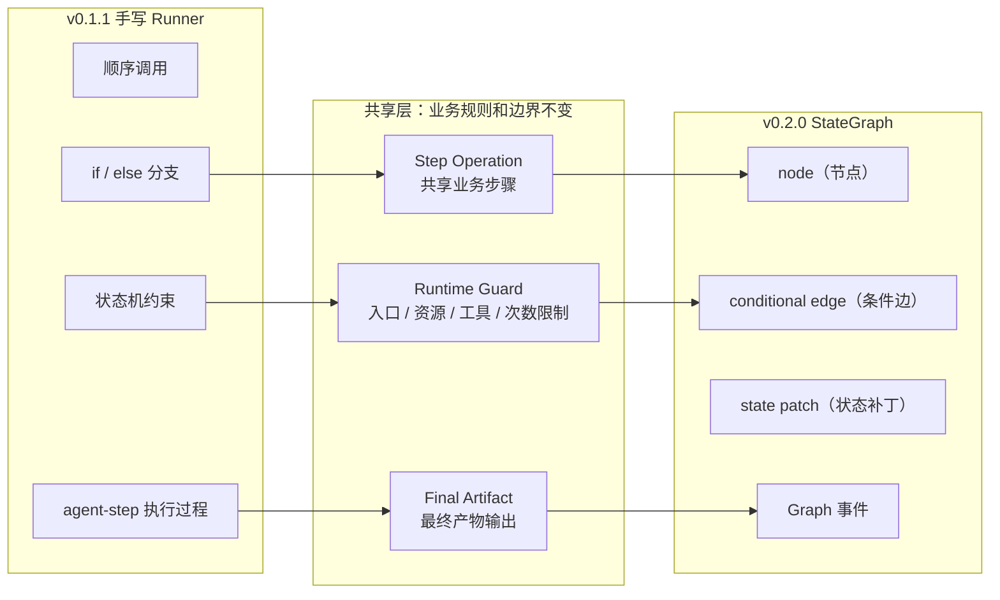
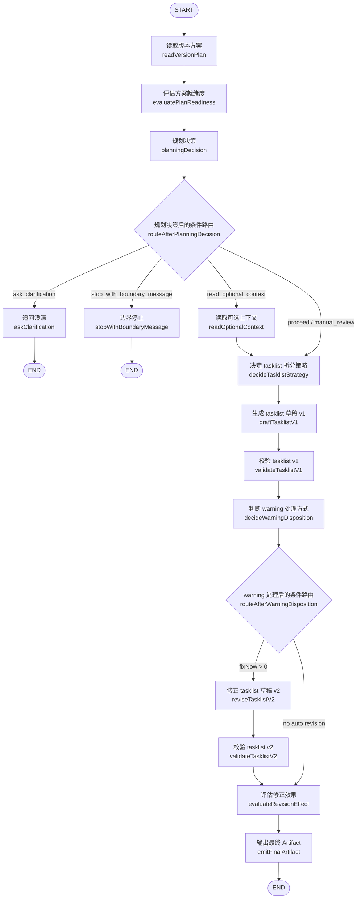
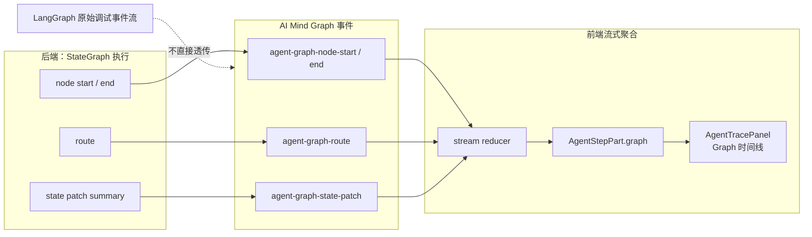

# 从手写 Runner 到 LangGraph：受控 Agent 接入 LangGraph

> 本文基于 `AI Mind` 真实实现整理。
>
> GitHub：<https://github.com/HWYD/ai-mind>
> 对应版本：`v0.2.0`
>
> AI Mind 是一个正在持续升级的 Next.js AI Chat 项目。它从本地聊天开始，逐步加入流式协议、工具调用（Tool Calling）、Skill、MCP、受控 Agent 和 Agent 图编排能力（Agent Graph）。
>
> 如果你对这个项目感兴趣，或者这篇文章对你有一点帮助，也欢迎顺手到 GitHub 帮 AI Mind 点个 Star⭐，这会是对我继续更新很大的鼓励。

这篇文章复盘的是：我如何把一个已经受控的任务清单 Agent（Tasklist Agent），从手写 Runner / 状态机流程编排，迁移到 LangGraph `StateGraph`（状态图 / 可执行流程图）。


一提到 LangGraph，很多人第一反应可能是：

- 是不是要做更复杂的 Agent？
- 是不是要让模型自己决定下一步？
- 是不是要开放更多工具调用和自动规划？

但在 AI Mind 的 `v0.2.0` 里，我接入 LangGraph，并不是为了让 Agent 更自由。

恰恰相反，这一版的目标是：

> 在不扩大 Agent 权限的前提下，把一条已经受控的 Agent 主链路，从手写 Runner 迁移成更显式、更可观察的图编排。

所以这不是一篇“LangGraph 怎么用”的教程，而是一篇真实项目里的工程迁移复盘。

它真正讨论的是：

```text
以前：
手写 Runner 里维护顺序调用、if / else 分支、状态推进和提前停止

现在：
用 LangGraph 的 StateGraph、node（节点）、edge（边）、conditional edge（条件边）表达同一条受控路径
```

换句话说，`v0.2.0` 不是让 Tasklist Agent 更开放，而是让它的执行路径更清楚。

---

## 1. 先说清楚：Tasklist Agent 到底是做什么的

如果第一次看到 AI Mind，可能会先疑惑：

- Tasklist Agent 是什么？
- 它到底在帮谁做什么？

在 AI Mind 里，`Tasklist Agent`（任务清单 Agent）的作用很具体：

用户给它一个版本方案文档，它根据这个方案生成一份可执行的开发 tasklist（任务清单）草稿。

也就是说，它不是从一句“帮我规划一个版本”开始自由发挥，而是必须基于用户显式引用的版本方案工作。

它的输入大概是：

```text
/tasklist + @docs://versions/*.md
```

它的输出不是直接写文件，而是通过 `AgentTextArtifactPanel`（产物展示面板）展示一份可复制的 tasklist Markdown。

可以简单理解成：

```text
版本方案文档
  -> Agent 读取
  -> 生成开发任务清单
  -> 校验 tasklist 结构
  -> 必要时最多修正一次
  -> 输出最终 Artifact（产物）
```

这个场景很适合做成 Agent，但也很容易失控。

如果不设边界，模型可能会：

- 自己扫描版本目录；
- 读取未授权的文档；
- 根据一句裸目标自由生成 tasklist；
- 无限补上下文；
- 无限修正；
- 直接写入 docs 文件。

所以 AI Mind 里的 Tasklist Agent 一开始就不是开放式 Agent，而是受控 Agent。

这也是为什么这篇文章反复强调：

LangGraph 接入的是一条已经受控的 Agent 主路径，而不是给模型开放更多自由。

---

## 2. 这里的 Runner 是什么

标题里有一个词：Runner。

这里的 `Runner`（执行器）不需要理解成一个复杂框架概念，可以先理解为：一段负责“按固定顺序推进 Agent 步骤”的执行器。

在 `v0.1.1` 里，这个手写 Runner 大概负责依次推进这些事情：

```text
读取版本方案
判断方案是否足够生成 tasklist
做一次受控规划决策
必要时读取一个可选上下文
生成 tasklist 拆分策略
生成 tasklist 草稿 v1
执行结构校验
必要时最多修正一次
再次校验 v2
评估修正效果
输出最终 Artifact
```

所以，“从手写 Runner 到 LangGraph”的意思不是把业务规则重写掉，也不是把 Agent 变成自由规划器。

它更准确的含义是：

把原来由手写执行器推进的顺序调用和 if / else 分支，迁移成 LangGraph 的 `StateGraph`、node（节点）和 conditional edge（条件边）。

这里顺便区分一下几个词：

```text
Runtime（运行时）：
更大的运行时边界，负责入口判断、资源边界、工具权限、状态机约束、限制条件和失败收束。

Runner（执行器）：
某一种具体执行实现，负责把一轮 Agent 步骤按顺序推进完。

Graph / StateGraph（图编排 / 状态图）：
新的编排表达方式，用 node（节点）和 conditional edge（条件边）描述 Runner 原本要执行的流程。
```

所以这次迁移不是“从 Runtime 迁移到 LangGraph”。

而是：

把 Tasklist Agent 的 Runner 编排迁移到 LangGraph。

---

## 3. v0.1.1 的 Tasklist Agent 已经受控到什么程度

在 `v0.2.0` 之前，AI Mind 已经有了一个受控 Tasklist Agent。

它的入口非常明确：

```text
/tasklist + @docs://versions/*.md
```

也就是说，用户必须显式选择 `/tasklist`，并且显式引用一个 `docs://versions/*.md` 版本方案，Agent 才会进入 tasklist 生成链路。

如果用户只说“帮我规划一个版本”，但没有引用版本方案，Agent 不会偷偷扫描 `docs/versions`，也不会从自然语言目标直接生成 tasklist。

这条主链路大概是：

```text
用户显式选择 /tasklist
  -> 用户显式引用 docs://versions/*.md
  -> Runtime 读取 version plan
  -> Runtime 生成 planExtract
  -> 规则判断方案是否足够生成 tasklist
  -> 模型只在白名单 action 中做一次规划决策
  -> 可选读取 1 个白名单上下文
  -> 生成 tasklist 拆分策略
  -> 生成 tasklistDraft v1
  -> validate_tasklist_structure 确定性校验
  -> 判断 warning 是否需要修正
  -> 最多修正一次生成 tasklistDraft v2
  -> v2 再次校验，但不生成 v3
  -> 评估修正效果
  -> Agent Text Artifact 展示最终 tasklist Markdown
```

这里有几个关键边界。

第一，模型不是自由规划。它只能在几个白名单动作中选择一次下一步方向。

第二，Agent 不是自由读取资源。version plan 必须由用户显式引用，可选上下文也只能读取白名单资源，而且最多一次。

第三，Agent 不是无限修正。tasklistDraft 最多从 v1 修正到 v2，v2 再校验，但不允许生成 v3。

第四，Agent 不写文件。最终 tasklist 通过 `AgentTextArtifactPanel` 展示，用户可以复制，但 Agent 不会写入 `docs/tasklists/*`。

所以，`v0.2.0` 不是从零开始做 Agent。

它是在一条已经受控的 Agent 主链路上，继续演进编排层。

---

## 4. 先简单理解 LangGraph：它解决的是 Agent 流程编排问题

如果第一次接触 LangGraph，可以先把它理解成：

用图来组织 Agent / LLM 应用执行流程的编排工具。

在本文里，我们只需要理解几个概念，不需要先掌握 LangGraph 的全部 API。

### 4.1 StateGraph：一张可以执行的流程图

`StateGraph` 可以理解成一张“可执行流程图”。

普通流程图只能看，`StateGraph` 里的 `node`（节点）可以执行逻辑，`node` 之间通过 `edge`（边）连接，执行时会带着一份状态对象（state）一路往下走。

对应到 AI Mind 这个 Tasklist Agent，流程大概是：

```text
读取版本方案
  -> 评估方案就绪度
  -> 做一次规划决策
  -> 生成 tasklist 草稿 v1
  -> 校验 tasklist v1
  -> 输出最终 Artifact
```

在手写 Runner 里，这些可能是一串函数调用。

迁移到 `StateGraph` 之后，它们就变成了一个个有名字的 `node`（节点）。

### 4.2 node（节点）：每一步具体做什么

`node`（节点）就是图里的一个执行节点。

它接收当前状态，执行一段逻辑，然后返回一段 `state patch`（状态补丁）。

在 AI Mind 里，`node` 不是随便新写一套业务逻辑，而是复用已有的 Step Operation（可复用业务步骤）。

比如：

```text
读取版本方案节点
规划决策节点
生成 tasklist 草稿 v1 节点
校验 tasklist v1 节点
修正 tasklist 草稿 v2 节点
输出最终 Artifact 节点
```

这些 `node` 本质上仍然做原来那些事，只是被放进了图编排里。

所以在这篇文章里，`node` 可以理解成：

把原来 Runner 里的某一步，变成图里的一个命名执行节点。

### 4.3 edge（边）和 conditional edge（条件边）：下一步怎么走

`edge`（边）表示固定顺序。

比如：

```text
读取版本方案节点 -> 评估方案就绪度节点
```

`conditional edge`（条件边）表示条件分支。

比如规划决策节点之后，可能走向：

```text
追问澄清
边界停止
读取可选上下文
决定 tasklist 拆分策略
```

这正好对应 AI Mind 这版最重要的迁移点：

把手写 Runner 里的 `if / else` 分支，迁移成可命名、可测试、可观察的 route（路由）。

注意，这不是让模型自由选择下一步。

模型仍然只能输出白名单动作，Graph 只是根据这个受控结果走到对应 `node`。

### 4.4 State / state patch：中间状态怎么传递

Graph 执行时会带着一份状态对象（state）。

每个 `node` 不一定返回完整状态，而是返回一段 `state patch`（状态补丁），再由 `reducer`（合并规则）合并回 GraphState。

在 AI Mind 里，我没有用 GraphState 替代原来的 AgentState。

更准确的关系是：

```text
AgentState：Agent 业务状态，仍然是业务事实源
GraphState：图执行状态，包住 AgentState，并记录 Graph 执行轨迹
```

也就是说，Agent 当前读到了哪个 version plan、生成了什么 tasklist draft、校验结果是什么，这些业务事实仍然在原来的 AgentState 里。

GraphState 主要负责多记录一些图执行相关信息：

```text
threadId
currentNode
visitedNodes
routes
statePatchSummaries
```

### 4.5 reducer（合并规则）：state patch 怎么合并

既然 `node` 返回的是局部状态更新，那不同字段怎么合并就很重要。

比如：

```text
currentNode：应该替换成最新节点
visitedNodes：应该追加 nodeId
routes：应该追加 route entry
statePatchSummaries：应该追加状态变更摘要
```

如果这里不定义清楚，后面的 `node` 更新可能会把前面的轨迹覆盖掉。

所以在 `v0.2.0` 里，我明确给 GraphState 的不同字段设计了 replace / append 语义。

这一点不是很炫，但很重要。

因为 Graph Trace 能不能稳定展示，依赖这些轨迹字段不会被后续状态补丁覆盖。

---

## 5. 为什么 v0.1.1 暂时不接 LangGraph，v0.2.0 才接

我没有一开始做 Agent 时就接 LangGraph。

这是一个有意为之的选择。

在 `v0.1.0` 和 `v0.1.1`，最重要的问题不是“用什么框架编排”，而是先验证受控 Agent 本身能不能成立。

当时要先收住这些边界：

- 入口是不是明确？
- 资源读取会不会越界？
- 模型能不能自由选择任意动作？
- 可选上下文会不会无限读？
- warning 会不会无限修？
- tasklist 会不会写入 docs？
- 最终产物能不能稳定通过 Artifact 展示？
- 普通问答、docs summary、工具调用会不会被影响？

如果这些边界还没有跑稳，过早接 LangGraph，可能只是把不稳定流程换成另一种框架写法。

Graph 不能替代边界设计。

它能让流程显式，但不能自动让 Agent 安全。

所以我的判断是：

> 边界没稳时，Graph 只是更复杂的表达；边界稳定后，Graph 才能变成更合适的编排层。

到了 `v0.2.0`，Tasklist Agent 的受控路径已经比较清楚：

- 入口固定；
- 动作白名单固定；
- 可选上下文限制固定；
- tasklist 生成和校验链路固定；
- v2 后不再修正；
- Artifact 输出语义固定。

这时再引入 LangGraph，就不是为了追框架，而是为了让一条稳定流程变得更显式、更可观察。

---

## 6. 手写 Runner 的问题：不是不能用，而是不够显式

手写 Runner 本身没有问题。

在 `v0.1.0` 或 `v0.1.1`，手写 Runner 反而是更合适的。

因为那个阶段流程还在变，直接用函数顺序调用、状态机约束和少量分支判断，能更快验证主链路。

但当流程里同时出现这些分支时，手写 Runner 的复杂度就开始变明显：

```text
提前停止
可选上下文
warning 分流
最多一次修正
最终 Artifact 输出
```

这时，Runner 里的 `if / else` 会越来越像一张隐形流程图。

流程大概会经过这些步骤：

```text
读取版本方案
评估方案就绪度
做一次规划决策
读取可选上下文
决定 tasklist 拆分策略
生成 tasklist 草稿 v1
校验 tasklist v1
判断 warning 处理方式
修正 tasklist 草稿 v2
校验 tasklist v2
评估修正效果
输出最终 Artifact
追问澄清 / 边界停止
```

如果继续放在手写 Runner 里，它会变成：

```text
一串顺序调用
+ 一些 if / else
+ 一些提前 stop
+ 一些 warning 分流
+ 一些 revision 分支
```

这种写法仍然能跑，但读代码的人需要在脑子里还原流程图。

而且后续如果要做：

- `node` 级执行过程；
- 路由摘要；
- 状态变更摘要；
- checkpoint（检查点）；
- 调试摘要；
- interrupt（中断）、HITL（人工介入）、replay（重放）的架构入口；

手写 Runner 就会越来越吃力。

所以这版我更愿意把它表达成 Graph。

```text
v0.1.1 手写 Runner
  -> if / else
  -> 顺序调用
  -> 状态机约束
  -> agent-step 执行过程

v0.2.0 StateGraph
  -> node（节点）
  -> conditional edge（条件边）
  -> state patch（状态补丁）
  -> Graph 事件
```



这里的关键不是“手写 Runner 被淘汰了”。

而是：

手写 Runner 不是错，只是当分支变多、路径变长、后续还要做执行过程展示、调试摘要和检查点时，显式 Graph 更适合承载这条链路。

---

## 7. LangGraph 在这一版只替换编排层

这是这篇文章最重要的一点。

`v0.2.0` 使用 LangGraph，但只替换 Agent 编排层。

LangGraph 接管的是：

```text
node（节点）编排
edge（边）编排
conditional edge（条件边）路由
GraphState 的局部更新
Graph 事件输出
```

LangGraph 不接管的是：

```text
Agent 入口边界
资源白名单
工具权限范围
最大步骤数 maxSteps
最多一次可选上下文读取 maxOptionalContextReads
最多一次草稿修正 maxDraftRevisions
stopped（已停止）状态边界
v2 后禁止继续修正
最终输出前必须完成校验和修正效果评估
文件写入权限
源码读取权限
自由工具调用
```

这意味着：

> StateGraph 决定“流程怎么走”，Runtime guard（运行时守卫）决定“Agent 能不能做”。

比如，Graph 里可以有“读取可选上下文节点”。

但这个节点不能随便读任何资源。

它仍然必须满足：

```text
规划决策动作是 read_optional_context
只能读取 decision 指定的白名单 URI
最多读取一次
读取失败后降级继续，并加入人工复核点
```

再比如，Graph 里可以有“修正 tasklist 草稿 v2 节点”。

但它仍然不能无限循环修正：

```text
最多自动修正一次
v2 必须再次校验
v2 后不生成 v3
```

所以，这版接入 LangGraph 后，Agent 并没有变得更自由。

它只是把受控路径表达成了 Graph。

---

## 8. 迁移前先做一件事：抽共享 Step Operation

在真正写 Graph Runner 之前，我先做了一件很重要的事：

把原来 legacy runner（旧版执行器）里的业务步骤抽成共享 Step Operation。

这里的 Step Operation 可以理解成“单个业务步骤的可复用执行函数”。比如规划决策、生成草稿、结构校验、修正草稿这些动作，都先从旧版 Runner 里抽出来，变成 legacy runner 和 graph runner 都能复用的步骤。

原因很简单：我不希望为了接入 LangGraph，复制一套业务流程。

如果复制一套，后面会出现几个问题：

- legacy runner 和 graph runner 行为可能漂移；
- 修改 bug 时要改两套；
- 行为等价测试会变复杂；
- graph runner 可能绕过原来的状态机约束；
- 受控边界可能出现分叉。

所以正确方向是：

```text
legacy runner（旧版执行器）
       \
        -> shared step operations（共享业务步骤）
       /
graph runner（图编排执行器）
```

我没有让 graph runner 重新实现一套读取、决策、生成、校验、修正逻辑。

真正稳妥的迁移方式是：

先把业务步骤抽成共享 Step Operation，再让 legacy runner 和 graph runner 只是“编排方式不同”。

这些 Step Operation 包括：

```text
方案就绪度判断
规划决策
tasklist 拆分策略
生成 tasklist 草稿
warning 处理方式判断
修正效果评估
修正 tasklist 草稿
```

对应到代码里，就是类似这些共享函数：

```text
runPlanReadinessStep
runPlanningDecisionStep
runTasklistStrategyStep
runDraftTasklistStep
runWarningDispositionStep
runRevisionEffectStep
runReviseTasklistStep
```

它们继续复用原来的：

```text
readiness rule
planner schema
optional context whitelist
TasklistStrategy prompt builder
draft / revise prompt builder
validate_tasklist_structure
warning disposition
revision effect
final artifact emitter
state-machine guard
limits
```

这样一来，legacy runner 和 graph runner 的区别主要在“怎么编排”，不是“业务规则是否一致”。

这点对迁移很关键。

因为真正危险的不是接入 LangGraph，而是为了接入 LangGraph 复制一套业务流程。

```ts
export async function runPlanningDecisionStep(
    options: TasklistAgentStepOperationOptions
): Promise<{ output: PlanningDecisionOutput; state: VersionPlanTasklistAgentState }> {
    const stepIndex = getNextStepIndex(options.state)
    const step = startAgentStep({
        actionType: 'planning_decision',
        state: options.state,
        stepIndex,
        title: '执行规划决策',
        writeChunk: options.writeChunk,
    })

    const output = await generatePlanningDecisionOutput(options.model, options.state, options.userGoal, options.context.signal)

    const nextState = applyVersionPlanTasklistAgentAction(options.state, {
        type: 'planning_decision',
        decision: output.decision,
        reason: output.decision.reason,
    })

    endAgentStep({
        actionType: 'planning_decision',
        durationStartedAt: step.startedAt,
        partId: step.partId,
        severity:
            output.decision.type === 'ask_clarification' || output.decision.type === 'stop_with_boundary_message' ? 'warning' : 'info',
        state: nextState,
        stepIndex,
        summary: getPlanningDecisionSummary(output.decision),
        tags: [`action: ${output.decision.type}`],
        title: '执行规划决策',
        writeChunk: options.writeChunk,
    })

    return { output, state: nextState }
}
```

这里保留的是 `runPlanningDecisionStep` 的关键路径：开始 step、生成受控规划决策、通过状态机 action 推进 AgentState、结束 step 并返回新状态。`runWarningDispositionStep`、`runDraftTasklistStep`、`runReviseTasklistStep` 等共享步骤也是类似模式，只是内部业务动作不同。

---

## 9. GraphState 设计：不替代 AgentState

接入 Graph 后，很容易产生一个冲动：

- 既然用了 LangGraph，是不是应该重新设计一份 GraphState，把所有业务状态都平铺进去？

我这版没有这么做。

原因是：`v0.1.1` 的 `VersionPlanTasklistAgentState` 已经表达了业务事实，而且状态机约束也是围绕它工作的。

如果这时为了 LangGraph 重写一份平铺 GraphState，迁移风险会很高。

所以我采用的是包裹式设计：

```text
VersionPlanTasklistGraphState
  ├─ agentState
  ├─ threadId
  ├─ input
  ├─ graph
  └─ output
```

其中：

```text
agentState：仍然是业务事实源
graph：只记录图执行轨迹
```

Graph runtime state 大概记录这些内容：

```text
runtimeMode
checkpointMode
currentNode
visitedNodes
routes
lastRoute
statePatchSummaries
```

也就是说：

AgentState 记录“当前任务事实”，GraphState 记录“Graph 怎么执行”。

这也带来一个安全边界。

GraphState 在服务端运行时内部可以持有完整 AgentState。

但 stream event（流式事件）、调试摘要、UI view model（界面展示模型）和日志，不能暴露完整业务事实。

比如不能把这些内容直接发到前端：

```text
完整 prompt
完整 model messages
完整 version plan 原文
完整 optional context 原文
完整 tasklist draft
完整 tool raw output
完整 GraphState
完整 AgentState
```

前端真正需要的是：

```text
当前跑到哪个 node（节点）
走了哪条 route（路由）
发生了什么状态摘要
是否有 warning
是否进入修正
最终 artifact 在哪里
```

这也是后面 Graph 事件和 `AgentTracePanel`（执行过程面板）的基础。

```ts
export interface VersionPlanTasklistGraphRuntimeState {
    checkpointMode: TasklistAgentRuntimeConfig['graphCheckpointMode']
    currentNode?: string
    lastRoute?: VersionPlanTasklistGraphRoute
    routes: VersionPlanTasklistGraphRoute[]
    runtimeMode: 'graph'
    // 这里只保存可展示的状态变化摘要，不写入完整 prompt、资源正文、草稿正文或 tool output。
    statePatchSummaries: VersionPlanTasklistGraphStatePatchSummary[]
    visitedNodes: string[]
}

export interface VersionPlanTasklistGraphState {
    // GraphState 只包裹现有 AgentState；业务事实源仍然由受控状态机维护。
    agentState: VersionPlanTasklistAgentState
    graph: VersionPlanTasklistGraphRuntimeState
    input: VersionPlanTasklistGraphInput
    output?: VersionPlanTasklistGraphOutput
    threadId: string
}

export function reduceVersionPlanTasklistGraphRuntimeState(
    left: VersionPlanTasklistGraphRuntimeState,
    right: VersionPlanTasklistGraphRuntimeStateUpdate
): VersionPlanTasklistGraphRuntimeState {
    return {
        checkpointMode: right.checkpointMode ?? left.checkpointMode,
        currentNode: right.currentNode ?? left.currentNode,
        lastRoute: right.lastRoute ?? left.lastRoute,
        runtimeMode: 'graph',

        // LangGraph node 返回 partial update；轨迹数组必须累加，避免节点历史被覆盖。
        routes: [...left.routes, ...(right.routes ?? [])],
        statePatchSummaries: [...left.statePatchSummaries, ...(right.statePatchSummaries ?? [])],
        visitedNodes: [...left.visitedNodes, ...(right.visitedNodes ?? [])],
    }
}
```

完整实现里还会通过 `Annotation.Root` 把这些 reducer 注册给 LangGraph。博客这里只保留状态结构和合并规则，因为它们最能说明“GraphState 只是包裹 AgentState，并记录图执行轨迹”。

---

## 10. 把主流程映射成 StateGraph

真正迁移时，核心就是把原来的主链路映射成 StateGraph 的 node（节点）和 conditional edge（条件边）。

大致结构是这样：



这里有几个点很重要。

第一，规划决策后会进入 conditional edge（条件边）。

它根据规划决策动作路由到不同 node。

第二，warning 处理后也会进入 conditional edge（条件边）。

它根据 warning 处理结果判断是否进入“修正 tasklist 草稿 v2”。

第三，追问澄清和边界停止是提前结束路径。

它们不会继续生成 tasklist draft。

第四，非修正分支也必须经过“评估修正效果”。

因为最终输出守卫要求状态到达 `revision_effect_evaluated`。

第五，最终 tasklist 仍然通过 Agent Text Artifact 展示。

Graph 不改变最终产物交付方式。

```ts
export function createVersionPlanTasklistGraph(options: CreateVersionPlanTasklistGraphOptions) {
    const nodeIds = VERSION_PLAN_TASKLIST_GRAPH_NODE_IDS
    const withEvents = (nodeId: VersionPlanTasklistGraphNodeId, node: GraphNodeHandler) =>
        withGraphNodeEvents(nodeId, node, options.runtime)

    return (
        new StateGraph(VersionPlanTasklistGraphStateAnnotation)
            .addNode(nodeIds.readVersionPlan, withEvents(nodeIds.readVersionPlan, createReadVersionPlanNode(options.runtime)))
            .addNode(nodeIds.planningDecision, withEvents(nodeIds.planningDecision, createPlanningDecisionNode(options.runtime)))
            .addNode(
                nodeIds.decideTasklistStrategy,
                withEvents(nodeIds.decideTasklistStrategy, createDecideTasklistStrategyNode(options.runtime))
            )
            .addNode(nodeIds.draftTasklistV1, withEvents(nodeIds.draftTasklistV1, createDraftTasklistV1Node(options.runtime)))
            .addNode(nodeIds.validateTasklistV1, withEvents(nodeIds.validateTasklistV1, createValidateTasklistV1Node(options.runtime)))
            .addNode(
                nodeIds.decideWarningDisposition,
                withEvents(nodeIds.decideWarningDisposition, createDecideWarningDispositionNode(options.runtime))
            )
            .addNode(nodeIds.emitFinalArtifact, withEvents(nodeIds.emitFinalArtifact, createEmitFinalArtifactNode(options.runtime)))

            .addEdge(START, nodeIds.readVersionPlan)
            .addEdge(nodeIds.draftTasklistV1, nodeIds.validateTasklistV1)
            .addEdge(nodeIds.validateTasklistV1, nodeIds.decideWarningDisposition)

            .addConditionalEdges(nodeIds.planningDecision, routeAfterPlanningDecision, [
                nodeIds.askClarification,
                nodeIds.stopWithBoundaryMessage,
                nodeIds.readOptionalContext,
                nodeIds.decideTasklistStrategy,
                END,
            ])
            .addConditionalEdges(nodeIds.decideWarningDisposition, routeAfterWarningDisposition, [
                nodeIds.reviseTasklistV2,
                nodeIds.evaluateRevisionEffect,
            ])

            // 其他节点和边省略：readOptionalContext / reviseTasklistV2 / validateTasklistV2 / evaluateRevisionEffect ...
            .compile({
                checkpointer: options.checkpointer,
                name: options.graphName ?? 'version-plan-tasklist-agent-graph',
            })
    )
}
```

这段只保留了主干。完整实现里还有可选上下文读取、v2 修正、v2 校验、修正效果评估、追问澄清和边界停止等节点。

---

## 11. Conditional Edge：把关键 if / else 变成命名路由

这版里最值得讲的 LangGraph 点，不是 API 本身，而是 conditional edge（条件边）。

因为 Tasklist Agent 里有两个很典型的受控分支。

第一个是规划决策后的分支。

模型只能在几个白名单动作里选一次：

```text
ask_clarification
stop_with_boundary_message
read_optional_context
proceed_to_tasklist_strategy
proceed_with_manual_review_items
```

映射成 Graph 的路由后，大概是：

```text
ask_clarification -> 追问澄清节点
stop_with_boundary_message -> 边界停止节点
read_optional_context -> 读取可选上下文节点
proceed_to_tasklist_strategy -> 决定 tasklist 拆分策略节点
proceed_with_manual_review_items -> 决定 tasklist 拆分策略节点
```

第二个是 warning 处理后的分支。

tasklistDraft v1 校验后，会判断 warning 应该自动修，还是交给人工复核：

```text
fixNow.length > 0 -> 修正 tasklist 草稿 v2
fixNow.length === 0 -> 评估修正效果
```

这里最重要的是：conditional edge（条件边）并不是让模型自由决定下一步。

模型输出仍然受 schema（结构约束）和白名单约束。

Graph 只是把“受控分支”显式表达出来。

所以我对 conditional edge（条件边）的理解是：

它的价值不是放开规划，而是把已经受控的分支变成可命名、可测试、可观察的路由。

这比手写 `if / else` 更适合后续执行过程展示和调试摘要。

```ts
export function getRouteAfterPlanningDecision(state: VersionPlanTasklistGraphStateAnnotationState): VersionPlanTasklistGraphRoute {
    if (state.output?.status === 'stopped') {
        return {
            fromNodeId: VERSION_PLAN_TASKLIST_GRAPH_NODE_IDS.planningDecision,
            label: 'controlled_output_failed',
            reason: state.output.textSummary ?? '规划决策输出不符合受控 JSON schema，本轮已安全停止。',
            toNodeId: END,
        }
    }

    const decision = state.agentState.artifacts.planning.decision

    if (!decision) {
        throw new Error('缺少 PlanningDecisionAction，无法决定 graph 下一跳。')
    }

    switch (decision.type) {
        case 'ask_clarification':
            return toRoute(decision, VERSION_PLAN_TASKLIST_GRAPH_NODE_IDS.askClarification)
        case 'stop_with_boundary_message':
            return toRoute(decision, VERSION_PLAN_TASKLIST_GRAPH_NODE_IDS.stopWithBoundaryMessage)
        case 'read_optional_context':
            return toRoute(decision, VERSION_PLAN_TASKLIST_GRAPH_NODE_IDS.readOptionalContext)
        case 'proceed_to_tasklist_strategy':
        case 'proceed_with_manual_review_items':
            return toRoute(decision, VERSION_PLAN_TASKLIST_GRAPH_NODE_IDS.decideTasklistStrategy)
        default:
            throw new Error('未知 PlanningDecisionAction，graph 已拒绝继续路由。')
    }
}
```

这里省略了 `toRoute` 的字段组装细节。关键是：每一种白名单动作都只能进入固定节点，未知动作直接拒绝继续路由。

```ts
export function getRouteAfterWarningDisposition(state: VersionPlanTasklistGraphStateAnnotationState): VersionPlanTasklistGraphRoute {
    const disposition = state.agentState.artifacts.planning.warningDisposition

    if (!disposition) {
        throw new Error('缺少 WarningDisposition，无法决定 graph 下一跳。')
    }

    const shouldRevise = disposition.fixNow.length > 0

    return {
        fromNodeId: VERSION_PLAN_TASKLIST_GRAPH_NODE_IDS.decideWarningDisposition,
        label: shouldRevise ? 'fix_now' : 'no_auto_revision',
        reason: disposition.reason,
        toNodeId: shouldRevise
            ? VERSION_PLAN_TASKLIST_GRAPH_NODE_IDS.reviseTasklistV2
            : VERSION_PLAN_TASKLIST_GRAPH_NODE_IDS.evaluateRevisionEffect,
    }
}

export function routeAfterWarningDisposition(state: VersionPlanTasklistGraphStateAnnotationState): WarningDispositionRouteTarget {
    return getRouteAfterWarningDisposition(state).toNodeId as WarningDispositionRouteTarget
}
```

---

## 12. 运行时配置：请求开始前选择 legacy 或 graph

迁移期间，我保留了 legacy runner（旧版执行器）。

但 legacy runner 和 graph runner 的选择，不是前端按钮，也不是用户功能。

它是服务端运行时配置（runtime config）。

大概是：

```env
AI_MIND_TASKLIST_AGENT_RUNTIME=graph
AI_MIND_GRAPH_EVENTS=on
AI_MIND_GRAPH_CHECKPOINT=off
AI_MIND_GRAPH_DEBUG_VIEW=off
```

如果需要回退，也可以配置成：

```env
AI_MIND_TASKLIST_AGENT_RUNTIME=legacy
AI_MIND_GRAPH_EVENTS=off
AI_MIND_GRAPH_CHECKPOINT=off
AI_MIND_GRAPH_DEBUG_VIEW=off
```

这里有几个边界。

第一，不做前端运行时切换按钮。

用户不应该关心这次 Agent 是手写 Runner 还是 LangGraph Runner。

第二，不做运行中回退。

也就是说，不会出现：

```text
graph runner 执行一半失败
  -> 自动切 legacy runner 接着跑
```

因为这样会带来很多问题：

- Graph 事件已经发出；
- 前端执行过程面板已经开始展示 Graph 时间线；
- runId / threadId / partId / artifactId 已经生成；
- 中途切换可能导致 UI 混乱；
- 还可能重复模型调用或重复 Artifact。

所以回退只发生在请求开始前。

第三，配置只影响 Tasklist Agent。

普通问答、普通 docs summary、工具调用、Reader Skill、Utility Skill 主链路不受影响。

这一节的核心是：

Runtime selection（运行时选择）是工程配置，不是用户功能。

```ts
export function getTasklistAgentRuntimeConfig(
    env: RuntimeEnv = process.env,
    nodeEnv: string | undefined = process.env.NODE_ENV
): TasklistAgentRuntimeConfig {
    // 迁移期默认 legacy，只有显式开启 graph 时才进入新编排路径，避免半成品 graph 影响现有 /tasklist 链路。
    const runtimeMode: TasklistAgentRuntimeMode = env.AI_MIND_TASKLIST_AGENT_RUNTIME?.trim() === 'graph' ? 'graph' : 'legacy'
    const graphRuntimeEnabled = runtimeMode === 'graph'

    // Graph 附加能力只在 graph runtime 下生效；legacy fallback 不应该发送 graph events 或暴露 debug 摘要。
    const graphEventsEnabled = graphRuntimeEnabled && env.AI_MIND_GRAPH_EVENTS?.trim() === 'on'
    const graphDebugViewEnabled = graphRuntimeEnabled && env.AI_MIND_GRAPH_DEBUG_VIEW?.trim() === 'on'

    // memory checkpoint 只用于开发态调试，production 下强制 off，避免被误解为可恢复的产品级状态。
    const graphCheckpointMode: GraphCheckpointMode =
        graphRuntimeEnabled && env.AI_MIND_GRAPH_CHECKPOINT?.trim() === 'memory' && nodeEnv !== 'production' ? 'memory' : 'off'

    return {
        graphCheckpointMode,
        graphDebugViewEnabled,
        graphEventsEnabled,
        runtimeMode,
    }
}
```

```ts
export function selectTasklistAgentRuntime(
    invocation: VersionPlanTasklistAgentInvocation | null,
    config: TasklistAgentRuntimeConfig = getTasklistAgentRuntimeConfig()
): TasklistAgentRuntimeSelection | null {
    if (invocation?.kind !== 'ready') {
        return null
    }

    return {
        config,
        runtimeMode: config.runtimeMode,
    }
}
```

---

## 13. 怎么证明迁移没有破坏原有行为

从技术迁移角度看，接入 LangGraph 不是“能跑起来”就够了。

真正要证明的是：

Graph Runner（图编排执行器）和 legacy runner（旧版执行器）在关键路径上行为等价。

这也是我为什么先抽共享 Step Operation，而不是直接另写一套 Graph 逻辑。

验证重点主要包括：

```text
ready plan 可以生成 v1、校验并 final
needs_review 可以继续并输出人工复核点
ask_clarification 会进入 stopped，不生成 draft
stop_with_boundary_message 会进入 stopped，不生成 draft
optional context 成功后继续生成 strategy 和 tasklist
optional context 失败后降级继续，并输出人工复核点
warning 只有人工复核项时不触发 v2
fail 或 fixNow 时最多生成 v2
v2 必须再次校验
v2 后不生成 v3
final 前必须完成 revision effect
final tasklist 正文只通过 Agent Text Artifact 展示
普通问答和 docs summary 不退化
```

这些测试的目的不是证明 LangGraph 多强，而是证明：

换了编排表达方式，受控边界没有变。

这点非常重要。

如果接入 Graph 后，Agent 可以多读资源、多修几次、绕过最终输出守卫，或者普通问答主链路被影响，那迁移就失败了。

所以这版的验证重点不是“Graph 更智能”，而是：

Graph Runner 能不能在行为边界上对齐旧版 Runner。

```ts
async function runGraphRunner(...responses: string[]) {
    return runGraphRunnerWithEnv({ AI_MIND_TASKLIST_AGENT_RUNTIME: 'graph' }, ...responses)
}

it('ready plan 可生成 v1、校验并 final，且 tasklist 正文只通过 artifact 输出', async () => {
    const { model, result, writtenChunks } = await runGraphRunner(proceedPlanningOutput, validTasklist)

    expect(result.state.status).toBe('final')
    expect(result.graphState.output?.status).toBe('final')
    expect(result.state.artifacts.tasklistDraft?.version).toBe(1)
    expect(result.state.artifacts.tasklistDraft?.validationV1?.status).toBe('pass')
    expect(result.state.artifacts.planning.revisionEffect?.finalDecision).toBe('final')
    expect(model.invoke).toHaveBeenCalledTimes(2)

    // 最终 tasklist 通过 Artifact 输出，不混进普通 text-delta。
    expect(writtenChunks.some(chunk => chunk.type === 'artifact-start')).toBe(true)
    expect(writtenChunks.some(chunk => chunk.type === 'text-delta' && chunk.delta.includes('## Step 1：Graph State'))).toBe(false)
})
```

完整测试还覆盖了 Graph 事件开关、调试摘要脱敏、追问澄清、边界停止、可选上下文失败降级、warning 分流和 v2 后不再修正等路径。这里保留一个最小测试片段，用来说明迁移后最重要的产物语义没有变化。

---

## 14. Graph 事件：我没有透传 LangGraph 原始调试事件流

接入 Graph 后，很自然会想展示 Graph 执行过程。

但我没有把 LangGraph 原始调试事件直接透传给前端。

原因有三个。

第一，AI Mind 已经有自己的 stream-core 协议。

前端消费的是 AI Mind 的流式 chunk，而不是某个框架的内部事件。

第二，LangGraph 原始事件结构会把前端和框架实现强绑定。

以后如果框架事件变了，前端也会被迫跟着变。

第三，原始事件可能携带过多内部状态。

比如 prompt、model messages、draft、tool raw output，这些不应该直接展示给前端。

所以这版新增的是 AI Mind 自己的 Graph 事件：

```text
agent-graph-node-start
agent-graph-node-end
agent-graph-route
agent-graph-state-patch
```

它们只表达产品化执行过程需要的信息：

```text
哪个 node（节点）开始
哪个 node（节点）完成
走了哪条 route（路由）
产生了什么 state patch（状态补丁）摘要
耗时多久
有没有 warning / error
```

它们不会传：

```text
完整 prompt
完整 model messages
完整 version plan 原文
完整 optional context 原文
完整 tasklist draft
完整 tool raw output
完整 GraphState
```

所以这里的核心判断是：

> Graph 事件不是 LangGraph 调试事件流的转发，而是 AI Mind 自己的受控可观察协议。

```ts
export function withGraphNodeEvents(
    nodeId: VersionPlanTasklistGraphNodeId,
    node: GraphNodeHandler,
    runtime: VersionPlanTasklistGraphNodeRuntime
): GraphNodeHandler {
    if (!runtime.runtimeConfig.graphEventsEnabled) {
        return node
    }

    return async function graphNodeWithEvents(state) {
        const eventBase = getGraphEventBase(state)
        const nodePartId = createId()

        emitGraphNodeStart(runtime.writeChunk, {
            ...eventBase,
            nodeId,
            partId: nodePartId,
            title: getGraphNodeTitle(nodeId),
        })

        const update = await node(state)
        const graphUpdate = getGraphRuntimeUpdate(update)

        for (const patch of graphUpdate?.statePatchSummaries ?? []) {
            emitGraphStatePatch(runtime.writeChunk, { ...eventBase, nodeId: patch.nodeId, patchSummary: patch.summary })
        }

        for (const route of graphUpdate?.routes ?? []) {
            emitGraphRoute(runtime.writeChunk, { ...eventBase, route })
        }

        emitGraphNodeEnd(runtime.writeChunk, {
            ...eventBase,
            nodeId,
            partId: nodePartId,
            status: 'completed',
            summary: getGraphUpdateSummary(update, nodeId),
        })

        return update
    }
}
```

`emitGraphNodeStart`、`emitGraphRoute`、`emitGraphStatePatch` 等函数只负责输出脱敏后的 node、route 和状态变更摘要。完整 prompt、version plan、tasklist draft 和 GraphState 都不会通过这些事件直接发给前端。

---

## 15. AgentTracePanel：从执行步骤到 Graph 时间线

前端展示上，`AgentTracePanel`（执行过程面板）也跟着升级。

但我没有把它做成复杂拓扑图。

它仍然是 timeline（时间线），只是可以展示更多 Graph 信息：

```text
运行模式标识：LangGraph
node 数量
nodeId
路由摘要
状态变更摘要
耗时
warning 标签
人工复核点
调试摘要折叠区
```

它不展示：

```text
完整 prompt
完整 action JSON
完整 TasklistStrategy JSON
完整 AgentState
完整 GraphState
完整 draft diff
完整 tool output
```

整体链路可以理解成：

```text
StateGraph node / route / patch
  -> AI Mind Graph 事件
  -> stream reducer
  -> AgentStepPart.graph
  -> AgentTracePanel 时间线
```



这样前端看到的是：

Agent 执行过程摘要。

而不是：

框架内部调试台。

最终 tasklist 仍然由 `AgentTextArtifactPanel` 展示。

Trace 展示过程，Artifact 展示产物。

这两个职责没有混在一起。

```ts
case 'agent-graph-node-start':
    return updateActiveMessage(state, (messages, messageId) =>
        upsertAgentGraphNodePart(messages, messageId, {
            nodeId: chunk.nodeId,
            partId: chunk.partId,
            patchSummaries: [],
            status: 'running',
            stepIndex: chunk.stepIndex,
            title: chunk.title,
        }, chunk.runId, chunk.agentName)
    )

case 'agent-graph-route':
    return updateActiveMessage(state, (messages, messageId) =>
        appendAgentGraphRoutePart(messages, messageId, {
            fromNodeId: chunk.fromNodeId,
            routeLabel: chunk.routeLabel,
            toNodeId: chunk.toNodeId,
            reason: chunk.reason,
        }, chunk.runId, chunk.agentName)
    )

case 'agent-graph-state-patch':
    return updateActiveMessage(state, (messages, messageId) =>
        upsertAgentGraphNodePart(messages, messageId, {
            nodeId: chunk.nodeId,
            patchSummaries: [chunk.patchSummary],
        }, chunk.runId, chunk.agentName)
    )
```

这里保留的是 reducer 层的聚合入口：Graph 事件先进入消息树，再由 `AgentTracePanel` 统一展示为 Graph 时间线。完整的 message operation 和 JSX 展示代码不展开，否则会把文章重心从 Agent Graph 迁移带到前端组件实现上。

---

## 16. Checkpoint 和调试摘要：开发态入口，不是产品能力

接入 LangGraph 后，checkpoint（检查点）、resume（恢复执行）、replay（重放）、HITL（人工介入）这些能力很容易被提起。

但在 `v0.2.0`，我没有把这些做成用户产品能力。

这版最多只做开发态 memory checkpoint：

```text
AI_MIND_GRAPH_CHECKPOINT=memory
```

并且边界非常明确：

```text
只允许 development
production 强制 off
不承诺刷新后恢复
不承诺服务重启后恢复
不提供历史 run 列表
不提供 resume
不提供 replay
不提供 state edit
不做 HITL 审批按钮
```

调试摘要（Debug Summary）也是只读的。

它只展示白名单摘要字段，比如：

```text
runId
threadId
runtimeMode
checkpointMode
currentNode
visitedNodes
lastRoute
readiness.status
decision.type
strategy.granularity
validation score
revisionEffect.finalDecision
limits
```

它不展示完整 state JSON。

更不会展示完整 prompt、完整 version plan、完整 tasklist draft 或完整 tool output。

所以这里要强调：

Checkpoint 在这一版不是用户态能力，而是开发态观察入口。

它的意义是给后续 checkpoint、interrupt、HITL、replay 留一个更自然的架构位置，而不是现在就承诺这些产品能力。

---

## 17. 这版仍然没有放开 Agent 边界

虽然接入了 LangGraph，但这版仍然没有把 Tasklist Agent 扩成通用 Agent：它不开放自由工具调用，不允许模型自由读取资源，不从裸目标生成 tasklist，也不会扫描目录或写入 docs 文件。

同时，checkpoint、调试摘要和 Graph 时间线也都只是受控观察能力，不是生产级恢复执行、重放、人工审批或状态编辑。这样做的目的很简单：先验证“受控 Agent 主路径能否稳定迁移到 Graph 编排”，而不是把所有 Agent 能力一次性打开。

---

## 18. 这版真正锻炼的是什么

做完 `v0.2.0` 后，我对 LangGraph 的理解更具体了。

它不是只能用于开放式 Agent，也可以用于受控 Agent。关键在于，我们怎么定义它的位置。

在 AI Mind 里，LangGraph 不是权限层，也不是安全边界的事实源。

它是编排表达层。

真正的边界仍然来自：

```text
入口判断
资源白名单
工具权限范围
状态机约束
步骤上限
修正次数上限
最终输出守卫
流式协议
UI 展示边界
```

所以这版真正锻炼的不是 LangGraph API，而是三件事：

1.  怎么在不扩大 Agent 权限的前提下迁移编排层；
2.  怎么保证旧版 Runner 和 Graph Runner 行为等价；
3.  怎么把框架内部事件转成产品可消费的执行过程，而不是把调试事件流原样扔给前端。

如果用一句话总结 `v0.2.0`：

> 这版不是让 Tasklist Agent 更开放，而是把一条已经受控的 Agent 主路径，迁移成更显式、更可观察，也更适合后续演进的 Graph 编排。

这也是我觉得“从手写 Runner 到 LangGraph”真正有价值的地方。

---

## 项目地址

👉 GitHub：<https://github.com/HWYD/ai-mind>

如果这篇文章或者 AI Mind 项目对你有所帮助，也欢迎顺手帮项目点个 Star⭐。这个支持对我来说很重要，也会让我更有动力继续整理后续版本的实现过程、设计取舍和踩坑复盘。
