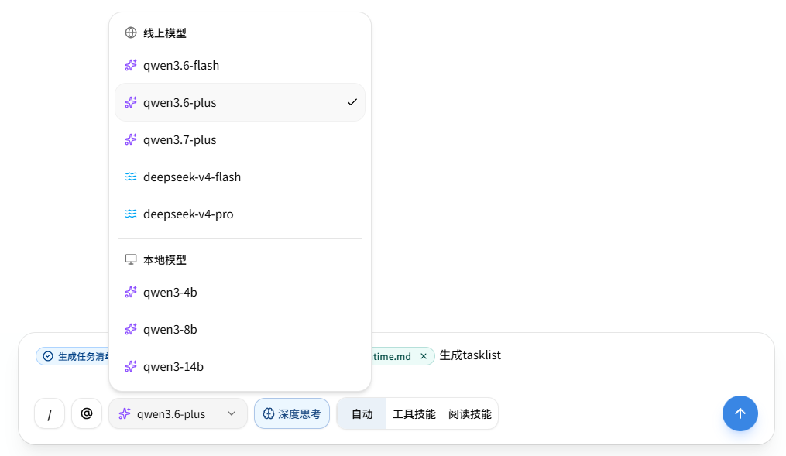

> 本文基于 `AI Mind` 项目的真实实现整理。  
> GitHub：<https://github.com/HWYD/ai-mind>  
> 对应代码版本：`v0.2.1`
>
> AI Mind 是一个持续迭代中的 Next.js AI Chat 项目。从最基础的本地聊天开始，逐步加入流式协议、工具调用、MCP、Skill 和 Agent 能力。
>
> 如果你对这个项目感兴趣，或者这篇文章对你有一点帮助，也欢迎顺手到 GitHub 帮 AI Mind 点个 Star⭐，这会是对我继续更新很大的鼓励。



这篇文章复盘的是：我如何把 AI Mind 从本地 Ollama 单一路径，升级成一个本地可切换 Ollama / DeepSeek / Qwen、线上可受控切换 DeepSeek / Qwen 的多模型 Runtime。

在 AI 应用刚开始做本地 Demo 时，模型调用通常不是最复杂的部分。

比如 AI Mind 早期版本里，直接用本地 Ollama 跑一个 `qwen3:8b`，聊天能通，流式输出能通，Tool Calling 能接上，`/tasklist` Agent 也能跑起来。

这个阶段真正重要的是先把聊天运行时、流式协议、工具调用、文档读取和 Agent 主链路跑通。

但一旦准备把项目做成线上 Demo，问题就变了。

本地只需要考虑：

```text
我要调哪个本地模型？
Ollama 服务有没有启动？
这个模型能不能流式输出？
```

线上则必须考虑：

```text
模型从哪里来？
本地和线上分别允许哪些 Provider？
前端能不能切换模型？
切换模型会不会绕过服务端边界？
密钥放在哪里？
Provider 原始错误能不能直接给前端？
普通聊天和 /tasklist Agent 能不能共用同一个模型创建入口？
```

所以 `v0.2.1` 的重点不是继续扩展 Agent，也不是继续给 `/tasklist` 加更多能力。

这一版真正要解决的是：

> AI 应用上线前，模型选择、Provider 配置和模型调用入口应该怎么收口。

换句话说，接入 DeepSeek / Qwen 本身不是难点。真正容易出问题的是：多模型接入后，如果前端、路由、业务运行时和模型 SDK 各自维护一套模型信息，整个系统很快会变得不可控。

---

## 1. 本地 Ollama 阶段为什么很简单

在只有本地 Ollama 的阶段，模型调用链路可以非常直接。

大概就是：

```text
聊天请求
  -> 创建聊天会话
  -> 创建 Ollama 模型实例
  -> 进入聊天 / 工具 / Agent 运行时
  -> 输出流式片段
  -> 前端聚合展示
```

这个阶段的好处是简单。

模型来源固定，Provider 固定，不需要云模型密钥，服务地址通常也是本地地址：

```env
OLLAMA_BASE_URL=http://localhost:11434
```

说明一下，文章里为了方便阅读，会省略项目环境变量的统一前缀。真实项目里会加上 `AI_MIND_` 前缀，比如这里对应的是 `AI_MIND_OLLAMA_BASE_URL`。

在本地阶段，业务代码里如果直接依赖 Ollama 模型类，短期也能跑。

但这个设计有一个隐含前提：

> 项目只有一个模型来源。

只要模型来源从一个变成多个，这个前提就不成立了。

比如后面要同时支持：

```text
本地 Ollama
DeepSeek
Qwen / 阿里云百炼
```

继续让聊天会话创建逻辑直接知道 Ollama，就会带来几个问题：

- 普通聊天和 `/tasklist` Agent 可能各自创建模型；
- DeepSeek / Qwen 的密钥读取逻辑可能散落在不同地方；
- 前端模型下拉可能和服务端真实白名单不一致；
- 模型能力差异，比如工具调用、结构化输出、流式输出，可能没有统一判断；
- Provider 错误可能直接穿透到前端；
- 切换模型时，很难确认到底是用户选择生效，还是默认配置生效。

所以，v0.2.1 的第一件事不是马上接云模型，而是先把“模型选择”这件事从原来的本地模型名，升级成一个受服务端治理的模型选择协议。

---

## 2. 上线 Demo 后，模型选择开始变复杂

线上 Demo 和本地开发最大的差异，不只是“模型变成云端了”。

更关键的是：线上环境里，模型选择必须有边界。

本地开发时，开发者可以自己改 `.env.local`，自己启动 Ollama，自己决定用哪个模型。即使出错，也只是本地调试成本。

但线上 Demo 面向的是外部访问，至少要保证：

```text
密钥不暴露
前端不能填写任意服务地址
前端不能填写任意 Provider
前端不能填写任意模型名
服务端能控制哪些模型可用
模型不可用时有可理解的错误提示
普通聊天和 /tasklist Agent 的模型来源一致
```

所以这一版没有采用“前端传 Provider + 模型名 + 服务地址”的方式。

看起来这样最灵活：

```json
{
    "provider": "qwen",
    "model": "qwen3.6-flash",
    "baseURL": "...",
    "apiKey": "..."
}
```

但这对一个线上 Demo 来说风险很高。

前端一旦能传这些字段，就意味着模型调用边界被前端控制了。用户不仅可以选择未授权模型，还可能把请求打到任意 Provider 或任意服务地址。

所以这一版的原则是：

> 前端可以选择模型，但只能选择服务端允许它看到的模型。

前端只传一个字段：

```ts
modelId
```

其余所有东西都由服务端决定：

```text
Provider 是谁？
真实调用的模型名是什么？
是否在当前允许的 Provider 列表里？
当前环境是否可用？
密钥是否存在？
是否支持当前请求类型？
是否支持工具调用？
```

这也是后面 Model Catalog 和 Provider Runtime 要解决的问题。

---

## 3. 从 `options.model` 到 `options.modelId`

v0.2.1 做了一个破坏性协议迁移：

```text
options.model -> options.modelId
```

这个变化看起来只是改了一个字段名，但语义差别很大。

旧的 `model` 更像“裸模型名”：

```text
qwen3:8b
qwen-plus
deepseek-chat
```

问题是：裸模型名通常和某个 Provider 的原始命名耦合。

比如 Ollama 里的模型名可能是：

```text
qwen3:8b
```

但这个名字不适合直接暴露成 AI Mind 的前端协议。因为 `qwen3:8b` 是 Ollama 的原生格式，换到 Qwen 或 DeepSeek 就没有同样语义。

所以 v0.2.1 把请求字段改成 `modelId`，并统一采用：

```text
provider/model-key
```

例如：

```text
ollama/qwen3-8b
qwen/qwen3.6-flash
qwen/qwen3.6-plus
qwen/qwen3.7-plus
deepseek/deepseek-v4-flash
deepseek/deepseek-v4-pro
```

这里的 `modelId` 是 AI Mind 内部稳定选择 ID，不等于 Provider 原始模型名。

比如：

```text
前端请求 modelId：
ollama/qwen3-8b

Provider 实际调用：
qwen3:8b
```

这样做的好处是：

1. 前端不直接依赖某个 Provider 的原始模型格式；
2. 后端可以通过模型目录把 `modelId` 解析到真实模型名；
3. 后续 Provider 模型名调整时，可以优先在服务端模型目录里收口；
4. 请求协议更稳定；
5. 非法 `modelId` 可以在路由入口直接拒绝，不偷偷回退默认模型。

这里我比较在意最后一点。

如果用户选择了一个模型，结果服务端发现不可用，然后静默回退默认模型，用户会以为自己在用 A，实际跑的是 B。这对调试和体验都不好。

所以这版的策略是：

> 非法 `modelId` 直接失败，不回退默认模型。

---

## 4. Model Catalog：服务端模型白名单事实源

有了 `modelId` 以后，还需要一个地方回答：

```text
哪些模型可以被选择？
每个模型属于哪个 Provider？
真实调用名是什么？
当前环境能不能用？
是否支持聊天？
是否支持 /tasklist？
是否支持工具调用？
```

这个地方就是 Model Catalog。

可以把它理解成服务端模型白名单。

一个模型条目大概包含这些信息：

```ts
type ModelCatalogItem = {
    id: string
    provider: 'ollama' | 'deepseek' | 'qwen'
    modelKey: string
    providerModel: string
    label: string
    enabled: boolean
    availableIn: Array<'development' | 'production'>
    capabilities: {
        chat: boolean
        tasklist: boolean
        embedding: boolean
        streaming: boolean
        jsonOutput: boolean
        toolCalling: boolean
    }
}
```

这里保留字段名是为了方便和实现对应。阅读时可以这样理解：

```text
id：AI Mind 内部稳定选择 ID，例如 qwen/qwen3.6-flash
modelKey：项目内部模型 key，例如 qwen3.6-flash
providerModel：Provider 实际调用的模型名，例如 qwen3.6-flash 或 qwen3:8b
enabled：当前是否启用
availableIn：在哪些环境可用
capabilities：能力声明
```

这几个字段分开以后，前端、服务端协议和 Provider 原始调用名就不会混在一起。

比如 Ollama 可以这样写：

```ts
{
  id: 'ollama/qwen3-8b',
  provider: 'ollama',
  modelKey: 'qwen3-8b',
  providerModel: 'qwen3:8b',
  label: 'qwen3-8b',
  enabled: true,
  availableIn: ['development'],
  capabilities: {
    chat: true,
    tasklist: true,
    embedding: false,
    streaming: true,
    jsonOutput: true,
    toolCalling: true,
  },
}
```

Qwen 可以这样写：

```ts
{
  id: 'qwen/qwen3.6-flash',
  provider: 'qwen',
  modelKey: 'qwen3.6-flash',
  providerModel: 'qwen3.6-flash',
  label: 'qwen3.6-flash',
  enabled: true,
  availableIn: ['development', 'production'],
  capabilities: {
    chat: true,
    tasklist: true,
    embedding: false,
    streaming: true,
    jsonOutput: true,
    toolCalling: true,
  },
}
```

这样 Model Catalog 就成为模型选择的唯一事实源。

前端不能自己维护一份静态模型列表，业务运行时也不应该散落读取模型配置。所有模型是否可用，都应该先回到服务端模型目录判断。

---

## 5. 模型列表接口：前端只拿公开模型列表

既然服务端模型目录是事实源，那前端模型选择器应该怎么拿数据？

v0.2.1 新增了模型列表接口：

```text
GET /api/ai/models
```

这个接口返回：

```ts
{
  defaultModelId: string
  models: PublicChatModel[]
}
```

但这里有一个很重要的边界：

> 这个接口不是把完整 Model Catalog 直接暴露给前端。

前端真正需要的只是：

```ts
type PublicChatModel = {
    id: string
    label: string
    provider: 'ollama' | 'deepseek' | 'qwen'
}
```

它不需要知道：

```text
Provider 实际模型名
内部模型 key
可用环境
完整能力声明
密钥
服务地址
具体缺失了哪个环境变量
Provider 原始错误
```

这些都应该留在服务端。

接口返回模型前，会做服务端过滤：

```text
模型已启用
Provider 在当前允许列表中
当前环境可用
支持聊天
DeepSeek / Qwen 已配置密钥
Ollama 已配置服务地址
不返回 embedding-only 模型
```

这样前端拿到的模型列表天然就是“当前环境可选择模型”。

比如本地开发可以出现：

```text
本地 Ollama
DeepSeek
Qwen
```

在当前前端实现里，这些模型会被收口成“本地模型 / 线上模型”两组展示，再配上 Provider 图标，而不是直接按 Provider 名称分成三列。

线上环境可以通过：

```env
ALLOWED_PROVIDERS=qwen,deepseek
```

从入口屏蔽 Ollama。

真实项目里对应的是 `AI_MIND_ALLOWED_PROVIDERS`，这里正文使用短名，是为了减少阅读负担。

这样一来，前端不需要知道为什么线上没有 Ollama，也不需要自己判断哪些模型该隐藏。

前端只负责展示服务端已经允许的模型。

---

## 6. ModelProvider Runtime：不是重造 LangChain

项目里已经用了 LangChain，那为什么还要做一层 ModelProvider Runtime？

这个问题很关键。

我的理解是：

```text
LangChain 负责模型调用层。
AI Mind ModelProvider Runtime 负责项目级治理层。
```

LangChain 可以帮我们创建和调用模型，比如 Ollama、兼容 OpenAI 协议的模型等。

但 AI Mind 自己还需要处理这些问题：

```text
从环境变量读取哪些配置？
modelId 怎么解析？
Provider 密钥是否存在？
模型是否在白名单里？
当前请求类型是否支持？
这个模型是否支持工具调用？
Provider 错误怎么标准化？
普通聊天和 /tasklist Agent 是否共用同一入口？
```

这些不是 LangChain 替项目自动决定的。

所以 v0.2.1 抽了一层 `ModelProvider` 接口：

```ts
interface ModelProvider {
    readonly provider: AiMindLlmProvider
    readonly capabilities: ModelProviderCapabilities

    createModel(options: ModelProviderCreateOptions): BaseChatModel

    normalizeError(error: unknown): NormalizedProviderError
}
```

然后通过统一入口创建模型：

```text
根据解析后的模型选择结果
  -> 找到对应 Provider
  -> 创建模型实例
  -> 返回给聊天运行时或 Agent 运行时
```

这样聊天会话创建逻辑就不再直接依赖 Ollama。

原来是：

```text
创建聊天会话
  -> 直接创建 Ollama 模型
```

现在变成：

```text
请求进入路由入口
  -> 根据 modelId 校验模型是否合法
  -> 把解析后的模型选择结果传给聊天运行时
  -> 通过统一入口创建模型实例
  -> 交给对应 Provider 完成真实模型调用
```

这一步的价值不是“代码更抽象”，而是：

> 普通聊天、Tool Calling、Reader Skill、Utility Skill、`/tasklist` Agent 都走同一个模型创建入口。

后续无论请求选择 Ollama、DeepSeek 还是 Qwen，业务运行时不应该关心具体 SDK。

---

## 7. 先做 Ollama 等价迁移，再接 DeepSeek / Qwen

多 Provider 改造最容易踩的坑，是一上来就同时做几件事：

```text
改协议
改模型创建入口
接云模型
改前端选择器
```

这样一旦出问题，很难判断到底是哪一层坏了。

所以 v0.2.1 的实施顺序是先收口，再扩展。

第一步先做协议和模型目录：

```text
modelId
Model Catalog
模型列表接口
模型选择解析
```

第二步先把现有 Ollama 链路迁移到 Provider Runtime：

```text
Ollama 原有调用
  -> Ollama Provider
  -> 统一模型创建入口
  -> 聊天会话创建逻辑
```

也就是说，在接 DeepSeek / Qwen 之前，先让原来的本地 Ollama 在新的 Provider Runtime 下等价跑稳。

这个顺序很重要。

因为它能验证：

```text
Provider 抽象是否破坏普通聊天？
Tool Calling 是否还正常？
Reader Skill / Utility Skill 是否退化？
/tasklist Agent 是否仍能走受控链路？
legacy / graph 两种 tasklist 编排方式是否不受影响？
```

只有 Ollama 等价迁移稳定以后，再接 DeepSeek / Qwen。

这样 Provider Runtime 的风险就被拆开了：

```text
先证明抽象层不破坏旧能力
再证明新 Provider 可以接入这个抽象层
```

这比一口气把所有模型都接进来要稳得多。

---

## 8. DeepSeek / Qwen：用兼容 OpenAI 协议的 Provider Base 收口差异

DeepSeek 和 Qwen / 阿里云百炼都可以走兼容 OpenAI 的 Chat Completions 接口。

所以这一版没有为 DeepSeek 和 Qwen 各写一套完全不同的调用链路，而是先抽出一个：

```text
兼容 OpenAI 协议的 Provider 基础层
```

然后再派生：

```text
DeepSeek Provider
Qwen Provider
```

它们的共同部分包括：

```text
服务地址
密钥
Provider 实际模型名
temperature
最大输出 token
流式输出
用量信息的 best-effort 读取
```

差异保留在各自 Provider 里：

```text
Provider 名称
密钥来源
默认服务地址
能力声明
错误标准化
模型白名单
```

DeepSeek 使用：

```env
DEEPSEEK_API_KEY=xxx
DEEPSEEK_BASE_URL=https://api.deepseek.com
```

Qwen 使用：

```env
QWEN_API_KEY=xxx
QWEN_BASE_URL=https://dashscope.aliyuncs.com/compatible-mode/v1
```

真实项目里这些变量同样会带上 `AI_MIND_` 前缀。

我没有使用一个通用的：

```env
LLM_API_KEY=xxx
```

原因是多 Provider 情况下，独立密钥更清楚：

```text
DeepSeek Key 配错了，不影响 Qwen
Qwen Key 缺失，不影响 DeepSeek
本地可以同时配置多个 Provider
错误提示也更明确
```

这也符合服务端治理的思路：Provider 差异放在 Provider 层，不污染聊天运行时和 Agent 运行时。

---

## 9. Provider 错误标准化：不要把原始错误扔给前端

一旦接入云模型，错误处理就不能像本地 Demo 那么随意。

Provider 可能返回：

```text
密钥未配置
鉴权失败
余额不足
请求过于频繁
上下文过长
参数不支持
服务超时
服务不可用
未知错误
```

如果直接把底层 SDK 的错误信息扔给前端，有几个问题：

1. 文案不可控；
2. 可能包含平台内部信息；
3. 可能暴露 URL、headers、request config 片段；
4. 用户看不懂；
5. 不同 Provider 的错误格式不统一。

所以 v0.2.1 引入了标准化 Provider 错误。

实际项目里大致统一成这些类型：

```ts
type NormalizedProviderErrorCode =
    | 'MODEL_PROVIDER_NOT_CONFIGURED'
    | 'MODEL_PROVIDER_AUTH_FAILED'
    | 'MODEL_PROVIDER_INSUFFICIENT_BALANCE'
    | 'MODEL_PROVIDER_RATE_LIMITED'
    | 'MODEL_PROVIDER_INVALID_REQUEST'
    | 'MODEL_PROVIDER_TIMEOUT'
    | 'MODEL_PROVIDER_UNAVAILABLE'
    | 'MODEL_STREAM_FAILED'
```

这里保留英文错误码，是因为它们会进入协议和测试，适合保持稳定。

但展示给用户的文案，必须由项目自己控制。

比如前端可以展示：

```text
模型服务未配置，请检查服务端环境变量。
模型服务鉴权失败，请检查密钥。
模型服务余额不足，请检查平台额度。
模型服务响应超时，请稍后重试。
模型服务暂时不可用，请稍后重试。
```

日志也要脱敏。

Provider 原始错误不能直接打印，而是走统一 helper 和标准化映射。当前实现里，脱敏日志 helper 主要只保留这些安全信息：

```text
状态码
错误名称
安全摘要预览
```

不打印：

```text
密钥
headers
请求配置
请求体
完整原始错误对象
```

这部分看起来不如模型选择器直观，但对线上 Demo 非常关键。

本地 Demo 出错，开发者自己看终端就行；线上 Demo 出错，必须保证前端提示可理解，日志可排查，同时不泄露敏感信息。

---

## 10. 这版没有改变什么

v0.2.1 虽然接入了多模型 Runtime，但它没有扩大 `/tasklist` Agent 的能力边界。

之前 v0.2.0 已经完成了 Tasklist Agent 的 Graph 编排迁移。v0.2.1 不继续做：

```text
新的 Agent 类型
自由工具调用
模型自由读取资源
自动写入 docs/tasklists
HITL / pause / resume
replay / time travel
多 Provider 自动回退
```

模型选择只影响：

```text
这次请求调用哪个模型
```

不影响：

```text
Agent 能不能读取资源
Agent 能不能调用工具
Agent 能不能写文件
Agent 能不能突破 Step 限制
/tasklist runtime 是 legacy 还是 graph
```

也就是说：

```text
TASKLIST_AGENT_RUNTIME 控制 Agent 编排方式
modelId 控制当前请求的模型来源
```

真实项目里对应的是 `AI_MIND_TASKLIST_AGENT_RUNTIME`。

这两条线是独立的。

比如：

```text
/tasklist graph runtime + qwen/qwen3.6-flash
/tasklist graph runtime + deepseek/deepseek-v4-pro
/tasklist legacy runtime + ollama/qwen3-8b
```

这些组合里，模型可以变，但 Agent 权限边界不变。

这一点对 AI 应用很重要。

如果模型切换会顺便改变 Agent 权限，那系统就会很难理解。v0.2.1 的目标不是让模型决定能力，而是让模型成为受控 Runtime 下的一个可替换执行依赖。

---

## 11. 总结：多模型不是多接几个 API

做完 v0.2.1 后，我对“AI 应用接入多个模型”这件事的感受更明确了。

它不是简单地多写几个 SDK 调用：

```text
Ollama 调一次
DeepSeek 调一次
Qwen 调一次
```

真正需要收住的是这些边界：

```text
前端只能传 modelId
Model Catalog 是服务端事实源
模型列表接口只暴露公开模型信息
路由入口先校验 modelId
Provider Runtime 统一创建模型
普通聊天和 /tasklist Agent 共用模型入口
密钥只在服务端读取
Provider 原始错误不能进入前端和日志
模型切换不改变 Agent 权限
```

如果用一句话总结 v0.2.1：

> 这版不是让 Agent 更自由，而是让 AI Mind 从本地 Ollama 单一路径，升级成一个本地和线上都能受控选择模型的多模型 Runtime。

这也是我觉得这一版最有价值的地方。

它不追求一次性做成完整商业化平台，也不做用户自带密钥、复杂计费面板、多 Provider 自动回退这些更复杂的能力。

它先把最基础的线上模型选择边界收住：

```text
谁能选模型？
能选哪些模型？
选择结果由谁校验？
真实 Provider 配置在哪里？
错误怎么返回？
普通聊天和 Agent 是否共用入口？
```

这些问题解决后，后续再继续做更完整的线上化能力，才有更稳的基础。

---

## 项目地址

GitHub：
https://github.com/HWYD/ai-mind

如果你也在做 AI 应用前端、模型选择器、Provider Runtime、Tool Calling 或受控 Agent，可以看看这个项目。

AI Mind 会继续按版本演进，每一版都会尽量配套真实源码和工程复盘。
